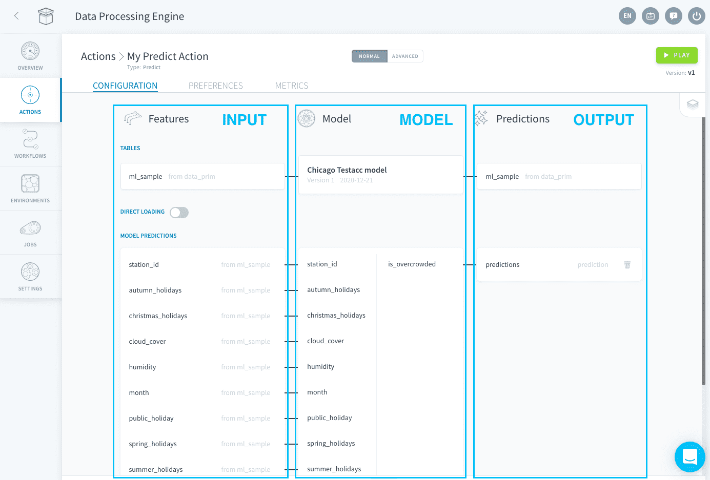
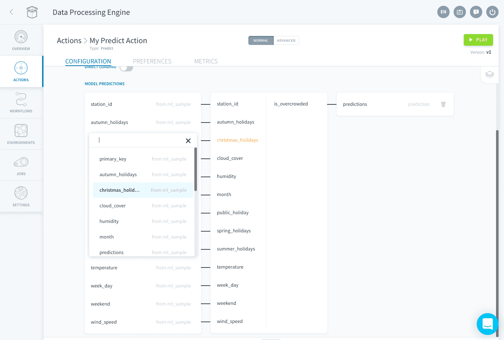
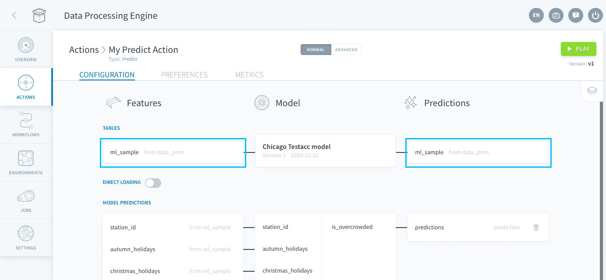
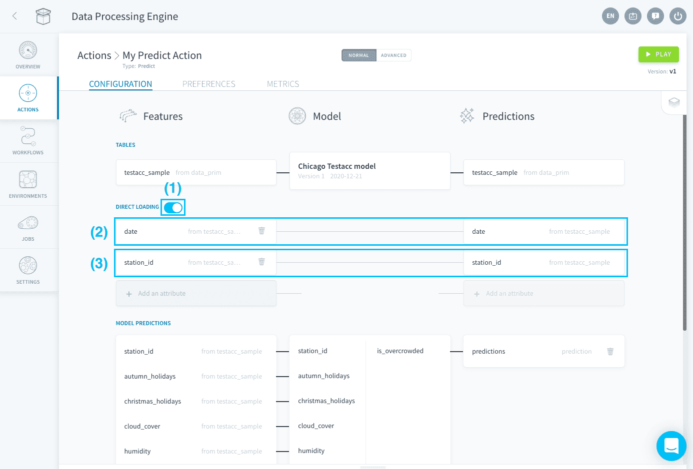
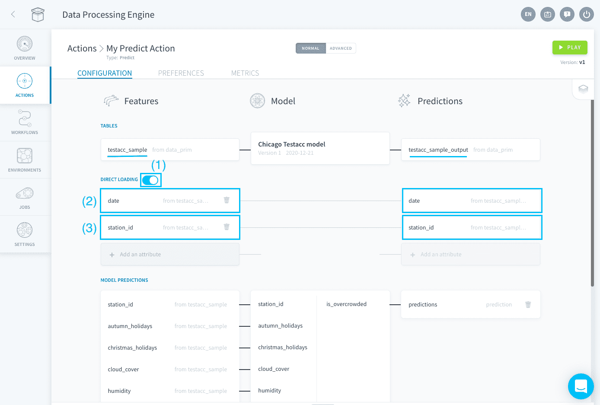
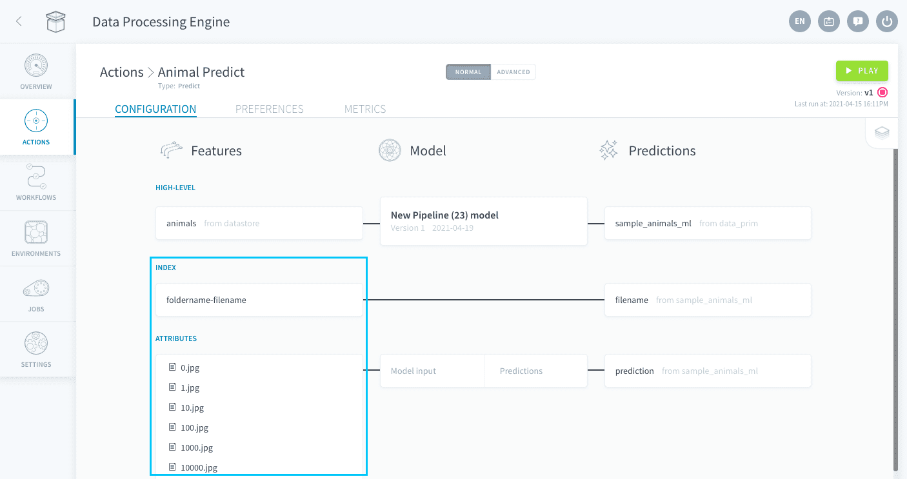
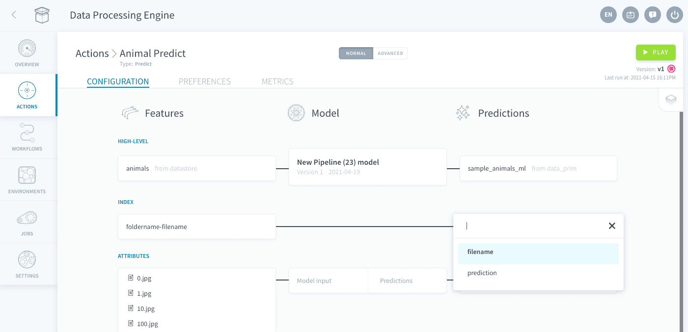
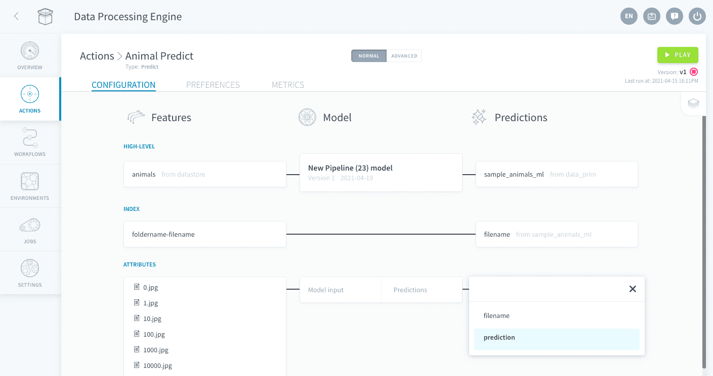

# Predict Action

Predict actions allow you to **generate AI predictions** from input data using a [Machine Learning model](en/product/ml/index). The input data must come from either a Data Manager table or a Data Store bucket. The output predictions can be written in any Data Manager table.

Predict actions are automatically created when a consumer using *Table* or *Bucket* as its input or output is added either to a [pipeline](en/product/ml/pipelines/configure/deployment/index?id=create-a-consumer) or a [standalone model](en/product/ml/models/import/index?id=deployment-settings).

!> It is currently impossible to create a Predict action directly from the Data Processing Engine. 

Predict actions are organized in three zones:
* The **input**: Features
* The **machine learning model**
* The **output**: Predictions

The Predict action looks differently whether you are using it for [structured data](/en/product/dpe/actions/predict/index?id=predict-action-for-structured-data) or for [unstructured data](/en/product/dpe/actions/predict/index?id=predict-action-for-unstructured-data).

---
## Predict action for structured data

The Predict action will take this form when when a consumer using *Table* as its input is added either to a [pipeline](en/product/ml/pipelines/configure/deployment/index?id=create-a-consumer) or a [standalone model](en/product/ml/models/import/index?id=deployment-settings). 

> This is the format you will use when the data for which you want to make predictions is structured, i.e. highly organized and formatted so that it's easily searchable in relational databases.

* [Configure the input](/en/product/dpe/actions/predict/index.md?id=configure-the-input-for-structured-data)
* [Configure the output](/en/product/dpe/actions/predict/index.md?id=configure-the-output-for-structured-data)

### Configure the input for structured data

The input is correctly configurated when **all features** from the underlying machine learning model are mapped to an attribute from the input table. Unmapped model features will be displayed in orange. To change the attribute mapped to a feature, click on the corresponding attribute and choose it from the list.

### Configure the output for structured data

The output of a predict action is the variable that the underlying machine learning is trained to produce. You can write predictions either [in the same table](/en/product/dpe/actions/predict/index.md?id=write-predictions-in-the-same-table) as the input or [a different one](/en/product/dpe/actions/predict/index.md?id=write-predictions-in-a-different-table).

#### Write predictions in the same table
To write predictions in the same table, make sure the table for **Predictions** is the same as the table for **Features**.

You must specify the primary keys of your table in the Direct Loading section so that the DPE can write your predictions in the correct row.

#### Write predictions in a different table

When writing a prediction in a different table than the input, you can either insert it in a row identified by primary keys, or append it in a table made specifically for them.

If you want to insert your predictions in a row identified by primary keys, you need to map the primary keys between the input table and the output table using the Direct Loading section.

If you want to append your predictions in a table that was made specifically for them, all attributes from this table must be physically added through the Predict Action.
* If the output table only has one attribute: the predictions will be successively appended at the end of this column
* If the output table has several attributes: they must all be loaded from the input table using the **Direct Loading** section of the Predict action. Rows that already exist in the output table won't be added again.

!> Failing to specify either the primary keys or all attributes from the output table in the Direct Loading section will result in the Data Processing Engine being incapable of correctly writing the predictions

---
## Predict action for unstructured data

The Predict action will take this form when when a consumer using *Bucket* as its input is added either to a [pipeline](en/product/ml/pipelines/configure/deployment/index?id=create-a-consumer) or a [standalone model](en/product/ml/models/import/index?id=deployment-settings). 

> This is the format you will use when the data for which you want to make predictions is unstructured, i.e. data files with no predefined format or organization.

* [Configure the input](/en/product/dpe/actions/predict/index.md?id=configure-the-input-for-unstructured-data)
* [Configure the output](/en/product/dpe/actions/predict/index.md?id=configure-the-output-for-unstructured-data)

### Configure the input for unstructured data

When an unstructured-data model is used for predictions, you are supposed to **feed it the actual unstructured objects** (images, etc.). The platform automatically 'numpyfies', standardizes and normalizes them. Make sure your model **was trained using normalized data** too.

There is nothing to configure further in the input for unstructured data, as it is automatically done when it is created.

?> Note that absolutely **all files** from the input bucket will be fed to the machine learning model. Make sure the bucket only contains files that you want to make a prediction on.

### Configure the output for unstructured data

The output of a Predict action is the variable that the underlying machine learning is trained to produce. You can write your predictions in the Data Manager table of your choice. You will need at least two columns in this table, **one to write an index** which uniquely identifies the file, and **one to write the associated prediction**.

The column in which to write the index must be specified in the Index section of the Predict Action. 

?> The value that this column will take depends on the name of each data file, and the folder it is in. It will take the format: `foldername-filename`

The column in which to write the predictions must be specified in the Attributes section of the Predict Action.

!> Prediction values will be rounded to the nearest integer.

---
###  Need help? 🆘

> If you are logging-in with an OVHcloud account, you can create a ticket to raise an incident or if you need support at the [OVHcloud Help Centre](https://help.ovhcloud.com/csm/fr-home?id=csm_index). Additionally, you can ask for support by reaching out to us on the Data Platform Channel within the [Discord Server](https://discord.com/channels/850031577277792286/1163465539981672559). There is a step-by-step guide in the [support](/en/support/index.md).
