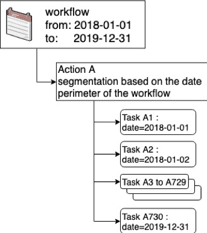
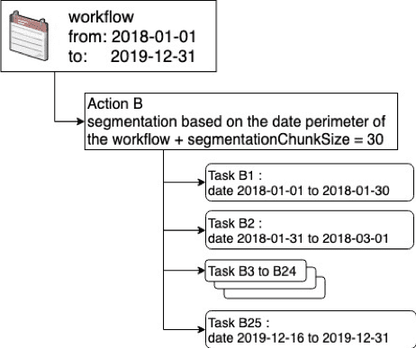

# Additional Remarks

Here are some additional tips about how DPE actions are designed in the ForePaaS system. 

- [Nomenclature](/en/product/dpe/actions/settings/advanced?id=nomenclature)
- [Learn more about the Bucket Size for segmentation/perimeter](/en/product/dpe/actions/settings/advanced?id=learn-more-about-the-bucket-size-for-segmentationperimeter)

---
## Nomenclature

**Segments**:
Subset of a data source. Segments for row / column sources can be defined based on a fixed number of lines, an attribute of the source (a date or a value) or a user account (for account based sources).
 
**Segmentation / To segment**:
Action to split an DPE action into multiple tasks that handle one or more segments.
 
**Segmentation values**:
Referenced values used to divide an action into smaller tasks.

**Segmentation type**:
Technical name in advanced mode: *segmentationValues*. Determines the process according to which the list of segmentation values are retrieved.
 
**Source Attribute / (Segmentation Variable)**:
Technical name in advanced mode: *segmentationVarName*. Determine which column in the source is used to apply the filter to the segmentation values

**Perimeter**: Filter the source of an DPE action.

**Perimeter type**: Technical name in advanced mode: *perimeterValues*. Determines how the list of perimeter values is retrieved.

**Perimeter values**: List of values to apply the scope.

**Source Attribute / (Perimeter Variable)**: Technical name in advanced mode: *perimeterVarName*. Determines which column in the source is used to apply the filter to the perimeter values.

**Bucket Size**:
Technical name in advanced mode: *segmentationChunkSize*. The number of segmentation values that each task handles.

---

## Learn more about the Bucket Size for segmentation/perimeter

As you may have read in the previous articles, at any time it is possible to **group some tasks in buckets (chunk) to manage several segments of the data source**. When the list of segments (values, date or social network accounts) is consistent, it avoids generating too many tasks.

By default, if you do not specify bucket size, the value will be 1 (i.e. x1 task = x1 segment):
* If you do not set the bucket size, each task will handle 1 segment
* If you set the bucket size to 2, each task will handle 2 segments
* If you set the bucket size to 10, each task will handle 10 segments
* Etc.

Below is an illustration of the impact of setting the bucket size to 30 compared to letting the default value to 1. Assume we’re running the segmentation based on the date of the workflow which runs from Jan 1st of 2018 to Dec 31st of 2019. 

| w/out Segmentation Chunk Size | with Segmentation Chunk Size |
|             :------------------:          |          :-----------------:           |
|             ChunkSize = 1          |          ChunkSize = 30           |
|  |  |

In the first case the DPE action will be split in 730 tasks (365 x 2), one for each day for 2 years. In the second case, the bucket size is set to 30, in which case the DPE action will only be split in 25 tasks (365 x 2 / 30) as each task handles 30 days.

?> The default bucket size segmentation value is 10,000 if it is not specified. 