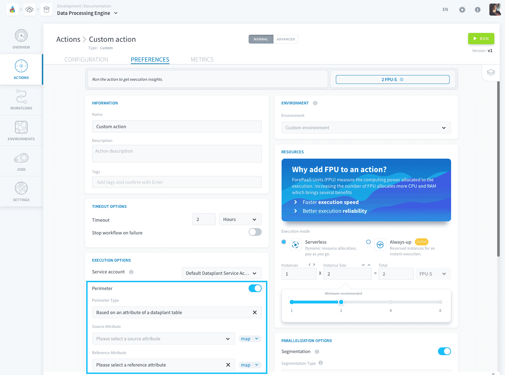
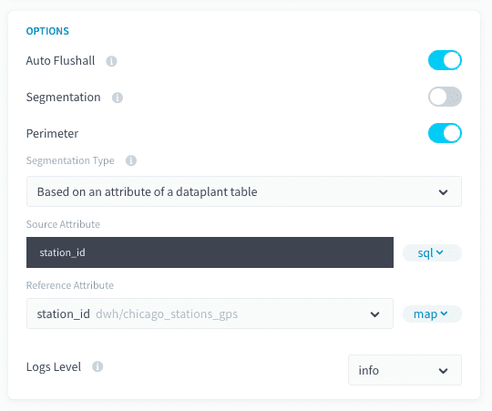
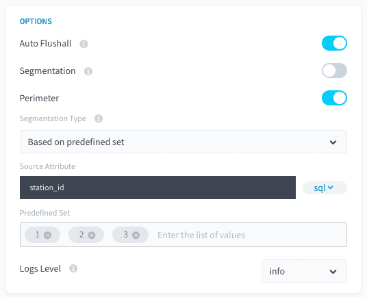
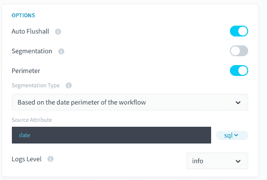

# Perimeter

When executing a data processing job, when you reach large volumes of data to process, you may need to filter the execution of an action. The *perimeter* allows you to **define a field on which to filter the scope of the data to be processed** by the action.



There are several perimeter modes available inside the ForePaaS platform depending on the data source and the type of action:

- [Based on an attribute of a Project table](/en/product/dpe/actions/settings/perimeter?id=_1-based-on-an-attribute-of-a-dataplant-table)
- [Based on a predefined set](/en/product/dpe/actions/settings/perimeter?id=_2-based-on-a-predefined-set-of-values)
- [Based on the date perimeter of the workflow](/en/product/dpe/actions/settings/perimeter?id=_3-based-on-the-date-perimeter-of-the-workflow)

---

## 1. Based on an attribute of a Project table

If you want to filter an action against a list of data present in the column of [a table from the Data Manager](/en/product/data-manager/tables/index), for example:

| Reference Table | Source Table | Destination Table |
|             ---          |          ---          |             ---            |
|  |  |   |

You want to aggregate the data of the "income" attribute contained in the source tab "orders" in the destination table "aggr_date" grouped by "date_order". The tmp_date table contains a list of dates to aggregate from 2019-01-01 to 2019-01-03.

By activating this perimeter mode, this will create a pre-stage automatically which aims to constitute the list of perimeter values contained in the table tmp_date, attribute date, and will filter the action between all the values found.

### Compatibility
This perimeter option is only compatible with the following actions and sources:

| Action Types | Source Types |
|          ---        |          ---          |
| <ul><li>Load</li><li>Aggregate</li><li>Diff</li><li>Delete_Diff</li><li>Delete</li><li>Custom</li></ul> | <div><ul><li>**Databases**: MySQL, PostgreSQL, SQLServer, Impala, Hive, BiqQuery, ElasticSearch, Cassandra, Redshift, Oracle</li></ul> |

### Configuration

To configure this perimeter option select *Based on an attribute of a dataplant table* in the "Perimeter Type" dropdown.



If you are using the advanced mode interface, you will need to add the following fields to your action JSON configuration:

```json
"perimeter": {
  "active": true,
  "type": "dwh_attributes",
  "values": "dwh/data_prim/tmp_dates/date",
  "var_name": "date_order",
  "attribute": "date",
  "attribute_type": "map"
}
``` 

---

## 2. Based on a predefined set of values

This mode lets you enter a list of values to filter a source/table attribute on.


### Compatibility
This perimeter option is only compatible with the following actions and sources:

| Action Types | Source Types |
|          ---        |          ---          |
| <ul><li>Load</li><li>Aggregate</li><li>Diff</li><li>Delete_Diff</li><li>Delete</li><li>Custom</li></ul> | <div><ul><li>**Databases**: MySQL, PostgreSQL, SQLServer, Impala, Hive, BiqQuery, ElasticSearch, Cassandra, Redshift, Oracle</li></ul> |

### Configuration
To configure this perimeter option select *Based on predefined set* in the "Perimeter Type" dropdown.



If you are using the advanced mode interface, you will need to add the following fields to your action JSON configuration:

```json
"perimeter": {
        "active": true,
        "type": "predefined_set",
        "var_name": "value_2",
        "values": [
          "10",
          "15"
        ]
      }
```
---

## 3. Based on the date perimeter of the workflow

If your source data has a date attribute, it is possible to filter the processing of your action against the dates set in your workflow.

### Compatibility
This perimeter option is only compatible with the following actions and sources:

| Action Types | Source Types |
|          ---        |          ---          |
| <ul><li>Load</li><li>Aggregate</li><li>Diff</li><li>Delete_Diff</li><li>Delete</li><li>Custom</li></ul> | <div><ul><li>**Databases**: MySQL, PostgreSQL, SQLServer, Impala, Hive, BiqQuery, ElasticSearch, Cassandra, Redshift, Oracle</li><li>**API**: Facebook, Twitter, Google Analytics, YouTube Private, YouTube Public, LinkedIn</li></ul> |

### Configuration
To configure this perimeter option select *Based on the date perimeter of the workflow* in the "Perimeter Type" dropdown.



You must switch to advanced mode to configure this option. You simply need to add the following fields to your action JSON configuration:

```json
"perimeter":{
	"active":true,
	"type":"workflow/dates",
	"var_name":"date"
}
```
---
Check-out more detail about our *Segmentation* and *Perimeter* options for DPE action in the **Additional Remarks** articles of the DPE Action settings.
{Read more about the DPE Action settings}(#/en/product/dpe/actions/settings/advanced.md)