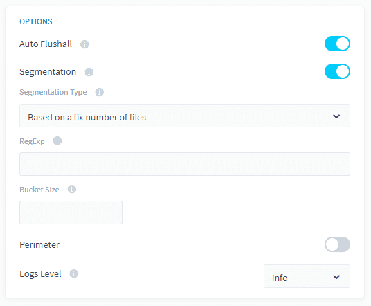

# Segmentation

When executing an [action](/en/product/dpe/actions/index) in the Data Processing Engine, it is important to think about the amount of data that will be processed. For large volumes, there is a risk to reach the maximum compute power of a worker. To be able to process these actions, you can split the execution of actions into a set of smaller tasks. This broken-down workload can then be shared [between multiple workers](/en/product/dpe/jobs/resources?id=scale-your-jobs-horizontally) concurrently.

The segmentation options allow you to **specify how to break down the data workload**. The execution will be split into **multiple tasks**, each task managing a smaller set of values at a time.

!> The segmentation options should be configured your segmentation carefully. Depending on your segmentation choices, your action could be much faster, or slower.  


There are several segmentation modes available inside the Platform depending on the data source and the type of action you are using:

1. [Based on the date perimeter of the workflow](#_1-based-on-the-date-perimeter-of-the-workflow)
2. [Based on an attribute of a Project table](#_2-based-on-an-attribute-of-a-project-table)
3. [Based on a predefined set](#_3-based-on-a-predefined-set)
4. [Based on a fix number of lines](#_4-based-on-a-fixed-number-of-lines)
5. [Based on the source's accounts](#_5-based-on-the-source39s-accounts)
6. [Based on files](#_6-based-on-files)
7. [Automatic segmentation](#_7-automatic-segmentation)

---
## 1. Based on the date perimeter of the workflow

If your source data contains a date attribute, it is possible to split the action in separate processes which will individually address a specific date or a group of dates (bucket). In this case, each task will apply a filter on the date that it needs to extract.


### Compatibility
This segmentation option is only compatible with the following actions and sources:

| Action Types | Source Types |
|          ---        |          ---          |
| <ul><li>Load</li><li>Aggregate</li><li>Diff</li><li>Delete_Diff</li><li>Delete</li><li>Custom</li></ul> | <div><ul><li>**Databases**: MySQL, PostgreSQL, SQLServer, Impala, Hive, BiqQuery, ElasticSearch, Cassandra, Redshift, Oracle</li><li>**API**: Facebook, Twitter, Google Analytics, YouTube Private, YouTube Public</li></ul> |

### Bucket Size
If your source contains a significant number of dates, it might lead to generating a multitude of small tasks and not be particularly beneficial to your action run time. This is particularly common when dealing with datetime type attributes that can record time information up to the milli-second unit.

To avoid generating too many tasks, you can make each task manage several dates at once by using the “bucket size” option. Simply set a size for your bucket to decide how many dates at a time you want your task to manage. The default “bucket size” value is 1, that is:
* If you do not set the bucket size, each task will handle 1 date
* If you set the bucket size to 2, each task will handle 2 dates
* If you set the bucket size to 10, each task will handle 10 dates
* And so on...

If you’re still unclear about what the “bucket size” does, find out more in the [“Additional Remarks” article](/en/product/dpe/actions/settings/advanced.md).

### Configuration

To configure this segmentation option select *Based on the date perimeter of the workflow* in the "Segmentation Type" dropdown, and select the attribute.


If you are using the expert mode interface, you will need to add the following fields to your action JSON configuration:

```json
      "segmentation": {
        "active": true,
        "type": "workflow_dates",
        "var_name": "id2",
        "chunksize": 1
      }
``` 

{Get further with this type of segmentation with our tutorial series 👩‍🏫}(#/en/getting-further/segmentation/workflow-dates)

---
## 2. Based on an attribute of a Project table

This option lets you segment an action using a list of values contained in the column of a [given table (usually a Reference Table) from your data model](/en/product/data-manager/tables/index). For instance, let’s consider the following case where we’re trying to set the segmentation options for an action which loads the data from the Source Table “orders” to the Destination Table “aggr_date”:

| Reference Table | Source Table | Destination Table |
|             ---          |          ---          |             ---            |
|  |  |   |

Assuming, you want to aggregate “income” data per the date of orders “date_order”. Let's say that the “tmp_date” table serves as the reference table of all dates during which there was ever an order made, e.g. it contains a list of dates from 2019-01-01 to 2019-01-03.
 
By activating this segmentation mode, it will automatically generate a pre-stage to your main stage which contains your action, which will list the unique list of dates available in order to split your action in separate tasks as describe in the diagram below:

 

By doing so, the data from your Source Table “orders” will therefore be loaded to the Destination Table “aggr_date” on day at a time.

### Compatibility
This segmentation option is only compatible with the following actions and sources:

| Action Types | Source Types |
|          ---        |          ---          |
| <ul><li>Load</li><li>Aggregate</li><li>Diff</li><li>Delete_Diff</li><li>Delete</li><li>Custom</li></ul> | <ul>**Databases**: MySQL, PostgreSQL, SQLServer, Impala, Hive, BiqQuery, ElasticSearch, Cassandra, Redshift, Oracle</ul> |

### Bucket Size
If your source contains a significant number of unique values within the attribute used for segmentation, it might lead to generating a multitude of small tasks and not be particularly beneficial to your action run time.

To avoid generating too many tasks, you can make each task manage several values of your segmentation attribute at once by using the “bucket size” option. Simply set a size for your bucket to decide how many values at a time you want your task to manage. Note that the default “bucket size” value is 1, that is:
* If you do not set the bucket size, each task will handle 1 value
* If you set the bucket size to 2, each task will handle 2 values
* If you set the bucket size to 10, each task will handle 10 values
* And so on...

If you’re still unclear about what the “bucket size” does, find out more in the [“Additional Remarks” article](/en/product/dpe/actions/settings/advanced.md). 


### Configuration

To configure this segmentation option select *Based on an attribute of a Project table* in the "Segmentation Type" dropdown.


If you are using the expert mode interface, you will need to add the following fields to your action JSON configuration:

```json
      "segmentation": {
        "active": true,
        "type": "dwh_attributes",
        "var_name": "id",
        "attribute": "name",
        "object": "s3.deldiff/delete_diff.csv",
        "attribute_type": "map",
        "chuncksize": 2
      }
```

{Get further with this type of segmentation with our tutorial series 👩‍🏫}(#/en/getting-further/segmentation/dwh-attributes)

---
## 3. Based on a predefined set

Use this mode in order to use a set of hard-coded values as your segmentation criteria. For this you must choose the column of the source table on which the segmentation will be applied & manually input the set of values. For each value entered, a task will be generated (when the bucket size is set to 1).

### Compatibility
This segmentation option is only compatible with the following actions and sources:

| Action Types | Source Types |
|          ---        |          ---          |
| <ul><li>Load</li><li>Aggregate</li><li>Diff</li><li>Delete_Diff</li><li>Delete</li><li>Custom</li></ul> | <ul>**Databases**: MySQL, PostgreSQL, SQLServer, Impala, Hive, BiqQuery, ElasticSearch, Cassandra, Redshift, Oracle</ul> |

### Bucket Size
If your source contains a significant number of unique values whithin the attribute used for segmentation, it might lead to generating a multitude of small tasks and not be particularly beneficial to your action run time.

To avoid generating too many tasks, you can make each task manage several values of your segmentation attribute at once by using the “bucket size” option. Simply set a size for your bucket to decide how many values at a time you want your task to manage. Note that the default “bucket size” value is 1, that is:
* If you do not set the bucket size, each task will handle 1 value
* If you set the bucket size to 2, each task will handle 2 values
* If you set the bucket size to 10, each task will handle 10 values
* And so on...

If you’re still unclear about what the “bucket size” does, find out more in the [“Additional Remarks” article](/en/product/dpe/actions/settings/advanced.md).


### Configuration

To configure this segmentation option select *Based on predefined set* in the "Segmentation Type" dropdown.


If you are using the expert mode interface, you will need to add the following fields to your action JSON configuration:

```json
      "segmentation": {
        "active": true,
        "type": "predefined_set",
        "var_name": "id",
        "chunksize": 1,
        "values": [
          "1"
        ]
      }
```

{Get further with this type of segmentation with our tutorial series 👩‍🏫}(#/en/getting-further/segmentation/predefined-set)

---
## 4. Based on a fixed number of lines

This segmentation mode allows you to split the loading of the data from a source simple using a fixed number of rows defined by the bucket size variable.

Each task will handle a specific number rows equal to the "bucket size" .
* If the bucket size is set to 1000, each task will extract 1000 rows.
* If the bucket size is set to 50000, each task will extract 50000 rows.
* Etc …

### Compatibility
This segmentation option is only compatible with the following actions and sources:

| Action Types | Source Types |
|          ---        |          ---          |
| <ul><li>Load</li></ul> | <ul><li>**Files**: CSV Files, Excel Files</li><li>**Datastore**: Big Query, AWS S3</li><li>**Databases**: MySQL, PostgreSQL, SQLServer, Impala, Hive, BiqQuery, ElasticSearch, Cassandra, Redshift, Oracle, SQLServer</li></ul> |

### Configuration

To configure this segmentation option select *Based on a fix number of lines* in the "Segmentation Type" dropdown.


If you are using the expert mode interface, you will need to add the following fields to your action JSON configuration:

```json
      "segmentation": {
        "active": true,
        "type": "lines",
        "chunksize": 1000
      }
```

!> This segmentation type can be used with database sources such as SQLServer, PostgreSQL, etc. However, in these cases, **make sure that the Project is granted access to all the attributes of the table** otherwise your SELECT queries might get rejected for lack of authorization when attempting to segment an action.


{Get further with this type of segmentation with our tutorial series 👩‍🏫}(#/en/getting-further/segmentation/chunk-source)

---
## 5. Based on the source's accounts

For [sources](/en/product/data-catalog/sources/index) like social media which are user account specific, it is possible to configure multiple accounts for the same source within the [Data Catalog](/en/product/data-catalog/index). You can then leverage these accounts to split a DPE action using that source in several tasks,  where each task will retrieve the data from one or more accounts.

### Compatibility
This segmentation option is only compatible with the following actions and sources:

| Action Types | Source Types |
|          ---        |          ---          |
| <ul><li>Load</li></ul> | <ul><li>**API**: Facebook, Twitter, Google Analytics, YouTube Private, YouTube Public, LinkedIn</li></ul> |

### Bucket Size
If your source contains a significant number of accounts, it might lead to generating a multitude of small tasks and not be particularly beneficial to your action run time.

To avoid generating too many tasks, you can make each task manage several accounts at once by using the “bucket size” option. Simply set a size for your bucket to decide how many accounts at a time you want your task to manage. Note that the default “bucket size” value is 1, that is:
* If you do not set the bucket size, each task will handle 1 account
* If you set the bucket size to 2, each task will handle 2 accounts
* If you set the bucket size to 10, each task will handle 10 accounts
* And so on...

If you’re still unclear about what the “bucket size” does, find out more in the [“Additional Remarks” article](/en/product/dpe/actions/settings/advanced.md).

### Configuration

To configure this segmentation option select *Based on the date perimeter of the workflow* in the "Segmentation Type" dropdown.


If you are using the expert mode interface, you will need to add the following fields to your action JSON configuration:

```json
      "segmentation": {
        "active": true,
        "type": "accounts",
        "chunksize": 1000
      }
```

{Get further with this type of segmentation with our tutorial series 👩‍🏫}(#/en/getting-further/segmentation/accounts)

---
## 6. Based on files

For sources with the same structure in a distant source folder, this segmentation mode allows the DPE to automatically find all files in a folder, then create tasks with a specific number of files. It will replace the source file in “load_from.source” actions for each files. 

### Compatibility
This segmentation option is only compatible with the following actions and sources:

| Action Types | Source Types |
|          ---        |          ---          |
| <ul><li>Load</li></ul> | <ul><li>S3 (file upload, datastore, AWS, etc..)</li><li>FTP</li><li>SFTP</li></ul> |

### Bucket Size
If your source contains a significant number of files , it might lead to generating a multitude of small tasks and not be particularly beneficial to your action run time.

To avoid generating too many tasks, you can make each task manage several files at once by using the “bucket size” option. Simply set a size for your bucket to decide how many accounts at a time you want your task to manage. Note that the default “bucket size” value is 1, that is:
* If you do not set the bucket size, each task will handle 1 file
* If you set the bucket size to 2, each task will handle 2 files
* If you set the bucket size to 10, each task will handle 10 files
* And so on...

If you’re still unclear about what the “bucket size” does, find out more in the [“Additional Remarks” article](/en/product/dpe/actions/settings/advanced.md).


### Configuration

To configure this segmentation option select *Based on files* in the "Segmentation Type" dropdown.



If you are using the expert mode interface, you will need to add the following fields to your action JSON configuration:

```json
      "segmentation": {
        "active": true,
        "type": "files",
        "values": ["a.*"],
        "chunksize": 10
      }
```

{Get further with this type of segmentation with our tutorial series 👩‍🏫}(#/en/getting-further/segmentation/files)

---
## 7. Automatic Segmentation
With this option, you do not need to worry about configuring your segmentation settings, it will be automatically configured for you. Unfortunately this option isn't available with all [Data Sources](/en/product/data-catalog/sources/index.md) or all [Action types](/en/product/dpe/actions/index.md?id=available-action-types). 

Below a list of supported Data Sources for the supported Actions as well as an explanation on how many workers to set for the [Jobs](/en/product/dpe/job/index).

**Supported Data Sources with the Table to files Action**
- PostgreSQL: maximum number of workers is not limited.

**Supported Data Sources with the Load Action**
- [Apache Kafka](/en/product/data-catalog/sources/connectors/kafka/index.md): maximum of one worker per topic partition.


!> Note that **you need to increase the number of instances for the automatic segmentation to take effect**.  You can increase instances until they match the maximum number of workers allowed. For instance, if you have 3 partition's in the Kafka topic of your Load Action, you can set up to 3 workers for that action. If you set less than the 3 instances, for instance 2, one of the workers will take care of 2 partitions. This is set in the [Resources configuration](/en/product/dpe/jobs/resources/index.md) and by [scaling the computing power horizontally](/en/product/dpe/jobs/resources?id=scale-your-jobs-horizontally) you will increase the number of instances.


---
Check-out additional information about our *Segmentation* and *Perimeter* options for DPE action in the **Additional Remarks** articles of the DPE Action settings.
{Read more about the DPE Action settings}(#/en/product/dpe/actions/settings/advanced.md)