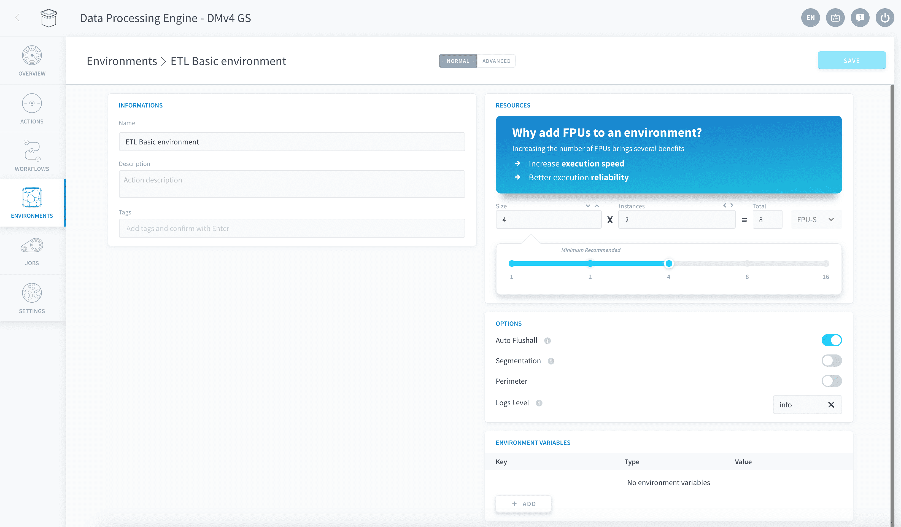
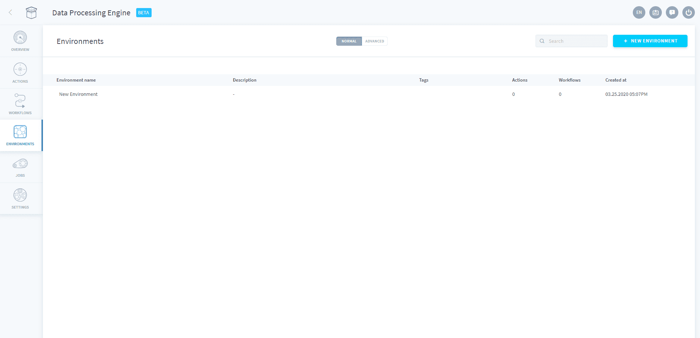
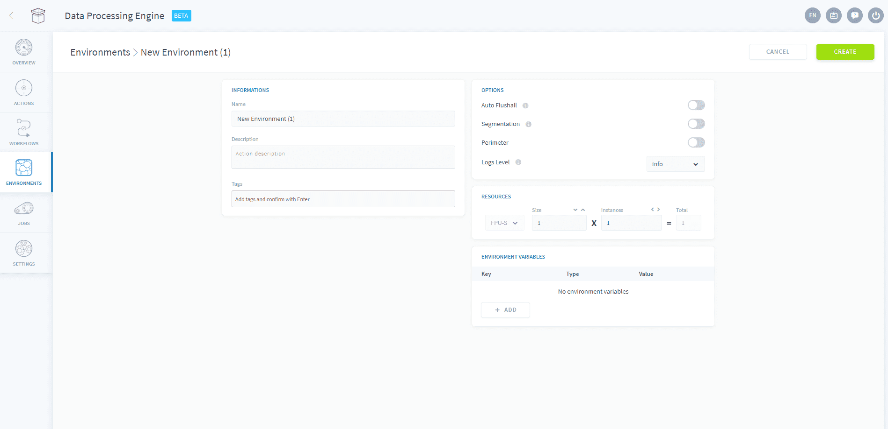

# Environments

Environments allow you to save and re-use quickly a set of [configurations and execution preferences](/en/product/dpe/actions/settings/index) in actions and workflows.

*Figure 1: The environment panel*

Environments are not permanent. At any time you can [change a jobs environment](/en/product/dpe/actions/settings/index) even if one had already been applied.

> If you make changes to any of the environments parameters, the changes will be reflected in all the actions and workflows to which the environment is assigned.

* [Create an environment](/en/product/dpe/environments/index?id=create-an-environment)

---
## Create an environment

When you first access the **Environment** tab, you will be greeted with a blank canvas for you to fill your custom environments.

Click on **New environment** and a reduced version of the [preferences](/en/product/dpe/actions/settings/index) section will appear. 

From here, select your preferred *resources*, *options* and *environment variables*. Don't forget to give your environment a name and a description.

{How to configure the execution preferences}(#/en/product/dpe/actions/settings/index)

---
###  Need help? 🆘

> At any step, you can ask for support by reaching out to us on the Data Platform Channel within the [Discord Server](https://discord.com/channels/850031577277792286/1163465539981672559). you can also find a step by step guide towards joining our discord server in the [support](/en/support/index.md) section.