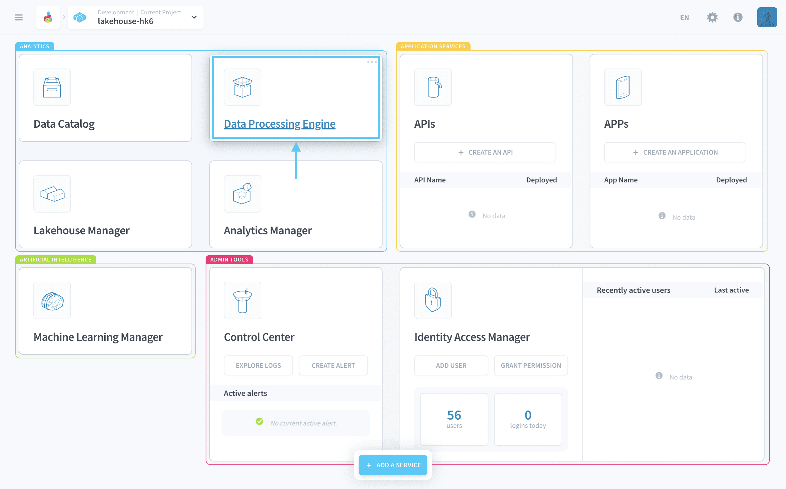

# Data Processing Engine

The Data Processing Engine is the component that lets you **create and run data pipelines from the raw sources to the storage engines inside the platform**. 

Everything is automated, from the management and deployment to the scalability to help you focus on the business logic of your data Project rather than its logistics.

---

## How does the Data Processing Engine work?
The Data Processing Engine (DPE) lets you carry out complex orchestrated operations on your data, such as extracting it & loading it from a source to the platform or transform any data stored in the Project.

### How to set up data processing pipelines?

The automation of your data processing is carried out using the following DPE features:

* **Actions**: An [action](/en/product/dpe/actions/index) is a unitary operation on the data. It can be launched manually, set up to run on schedule or triggered through an API call.  
* **Workflows**: [Workflows](/en/product/dpe/workflows/index) are your basic data processing pipelines on the Platform. Each workflow is a sequence of one or more actions organized in stages, with a given execution order. They can either be launched manually, set up to run on schedule or triggered through an API call.
* **Environments**: An [environment](/en/product/dpe/environments/index) is a shared set of execution settings for an action/workflow. Environments are used to store template configurations such as resource allocation, perimeter and/or segmentation options.

### How to execute data pipelines?

The **Data Processing Engine is entirely job-based**. A [job](#/en/product/dpe/jobs/index.md) is a unitary execution of any workflow or action. Every job has its own dedicated set of resources. You are limited to run only a certain amount of jobs in parallel due to quotas.

In the background, when an action or workflow is triggered, **the Platform automatically builds & runs a worker with the resources selected**. Once the job is finished, the worker will automatically shut down allowing the platform to only use the resources during the execution time of the job. Contrarily to *long-running orchestration* during which the resource is up all the time, *job-based orchestration* means the resources are only up during the execution time allowing a true "pay-as-you-go" approach, more scalable for individual executions & cheaper for larger data Projects.

?> Note that you can still configure a specific action or workflow to be in a [long-running environment](/en/product/dpe/actions/settings/index?id=always-up), meaning resources for the workers are up all the time.

Each execution of an action or a workflow is **identified by a** [**service account**](/en/product/iam/users/service-accounts), which is associated to the action or the workflow. The service account can be granted specific [IAM roles](/en/product/iam/users/roles) that let control which resources the job execution can access.

{Learn more about actions}(#/en/product/dpe/actions/index.md)
{Learn more about workflows}(#/en/product/dpe/workflows/index.md)
{Learn more about environments}(#/en/product/dpe/environments/index.md)
{Learn more about jobs}(#/en/product/dpe/jobs/index.md)

---
###  Need help? 🆘

> At any step, you can create a ticket to raise an incident or if you need support at the [OVHcloud Help Centre](https://help.ovhcloud.com/csm/fr-home?id=csm_index). Additionally, you can ask for support by reaching out to us on the Data Platform Channel within the [Discord Server](https://discord.com/channels/850031577277792286/1163465539981672559). There is a step-by-step guide in the [support](/en/support/index.md) section.