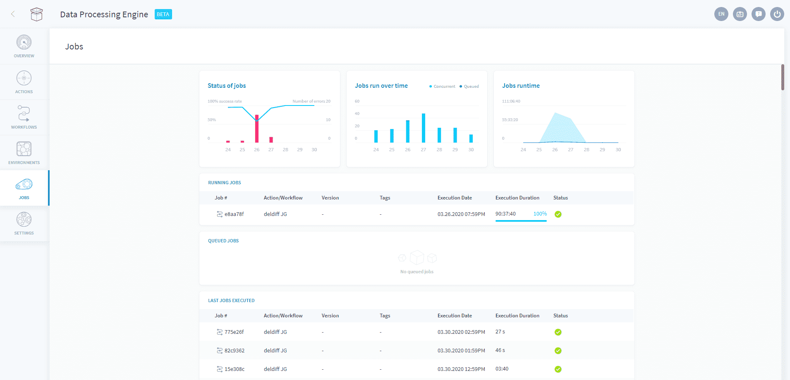

# Jobs

Each job represents **a single execution of a workflow or an action**. They all have their dedicated environment specifying the [allocated resources](/en/product/dpe/jobs/resources), [segmentation](/en/product/dpe/actions/settings/segmentation), [perimeter](/en/product/dpe/actions/settings/perimeter) and environment variables for the execution. This processing environment can be customized in the [action/workflow preferences](/en/product/dpe/actions/settings/index).

?> The Data Processing Engine (DPE) uses a **job-based orchestration approach**. This means that when an action or workflow is launched, the platform automatically builds & runs a container with the environment you defined. Once the job is finished, the container will automatically shut down - allowing the platform to only use the resources during the execution time of the job. 

Launched jobs can be in one of 3 states:
* [Running](/en/product/dpe/jobs/index?id=running-jobs)
* [Queued](/en/product/dpe/jobs/index?id=queued-jobs)
* [Finished](/en/product/dpe/jobs/index?id=finished-jobs)

### Running jobs
This widget displays all the jobs currently running. You can hover over a job and click on the **logs** icon to see the job logs live.

> To prevent large amounts of resources being used all at once, [quotas](/en/product/dpe/settings?id=quotas) are set in the Data Processing Engine. Please reach out to our support team if you have a need for higher quotas.

### Queued Jobs
!> This feature is deactivated by default. Please reach out to our support team if you have a need for queuing jobs, or if you hit the quota for maximum parallel executions.

When the limit of parallel running jobs has been reached but more jobs have been ordered to run, the overage of jobs is put in a queue. The queued jobs will be run in the order displayed on the screen, from top to bottom, as soon as a running job finished.

### Finished Jobs

You can see a history of all jobs executed in the Data Processing Engine in the past 30 days. Hover over a job in this table and click on the **stats** icon to see the details of the job execution - including CPU and RAM usage over time.

Those job executions can be either successful, failed, or manually interrupted.

{Learn more about job preferences}(#/en/product/dpe/actions/settings/index)