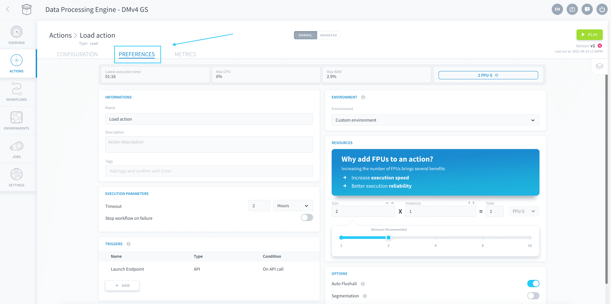
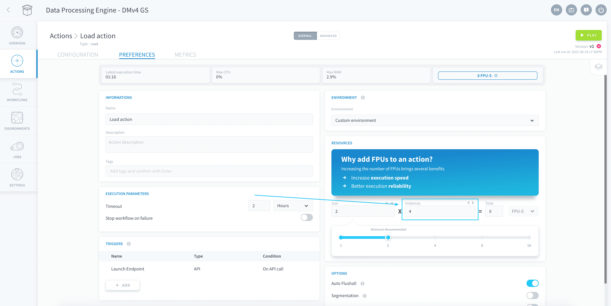

# Resources

The Platform is designed to scale easily as the requirements of your data Project evolve. 

In the Data Processing Engine, each individual action or workflow can be **scaled both horizontally and vertically**, meaning you can parallelize processing tasks and add more computing power to each indefinitely.

* [Scale your jobs horizontally](/en/product/dpe/jobs/resources?id=scale-your-jobs-horizontally)
* [Scale your jobs vertically](/en/product/dpe/jobs/resources?id=scale-your-jobs-vertically)

---
## Scale your jobs horizontally

You can **parallelize the workload** of your action or workflow by selecting the number of parallel instances in which your job will be ran. Typically, multiple instances will be used for the following processes:
- Using [segmentation](/en/product/dpe/actions/settings/segmentation) for a job
- Running workflows with multiple actions in the same [stage](/en/product/dpe/workflows/configuration?id=stages)
- Running multiple [concurrent](/en/product/dpe/actions/settings/index.md?id=concurrent-executions)
 occurrences of the same [Always-up action/workflow](/en/product/dpe/actions/settings/index?id=always-up) 

?> Failure to allocate multiple instances for the above processes will simply have the broken-down tasks executed back-to-back on the single instance.

To change the amount of parallel instances allocated to an action or a workflow, go to its **Preferences** tab. 

Change the number of instances in the Resources panel.

---
## Scale your jobs vertically

You can allocate **more computing power** to an action or a workflow by increasing the number of Data Platform Units (DPU) of each computing instance. The DPU is a unit of processing capability, representing access to a certain amount of CPU and memory, as such:

* **DPU**: - corresponds to approximately *1 CPU* and *2 GB of RAM*, based on hardware availability. 

?> By default, newly created actions or workflows are allocated 2 DPU.

To change the amount of DPU allocated to an action or a workflow, go to its **Preferences** tab. 

Use the slider to set the desired DPU size of [each parallel instance](/en/product/dpe/jobs/resources?id=scale-your-jobs-horizontally) for the execution. 

The final total amount of DPU allocated to a DPE job is the number of parallel instances times the DPU size of each.

?> If you are using the [Always-up execution mode](en/product/dpe/actions/settings/index.md), you still are allowed to update your resources. The update will come into effect shortly after you change your settings and your workflows/actions will not be interrupted in the process.

---
###  Need help? 🆘

> At any step, you can create a ticket to raise an incident or if you need support at the [OVHcloud Help Centre](https://help.ovhcloud.com/csm/fr-home?id=csm_index). Additionally, you can ask for support by reaching out to us on the Data Platform Channel within the [Discord Server](https://discord.com/channels/850031577277792286/1163465539981672559). There is a step-by-step guide in the [support](/en/support/index.md) section.