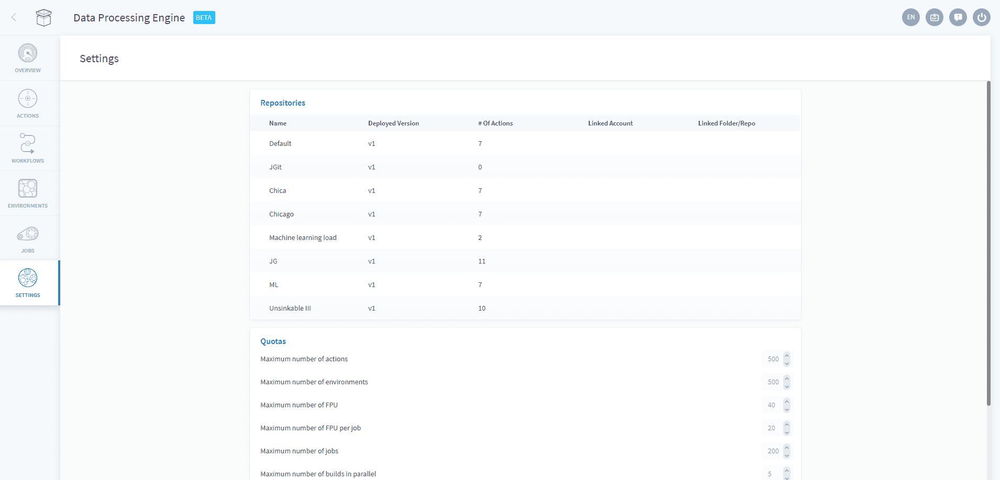

# Settings

The settings tab allows you to manage your Data Processing Engine [repositories](/en/product/dpe/settings?id=repositories) and [quotas](/en/product/dpe/settings?id=quotas).

---
## Repositories

The *Repositories* panel gives a broad overview of each of your action repositories, allowing not only a quick overview of each one, but also the means to edit each repository such as changing the linked Git account.

---
## Quotas

The quotas sections allows you to request more resources for your Data Processing Engine, as needed. 

