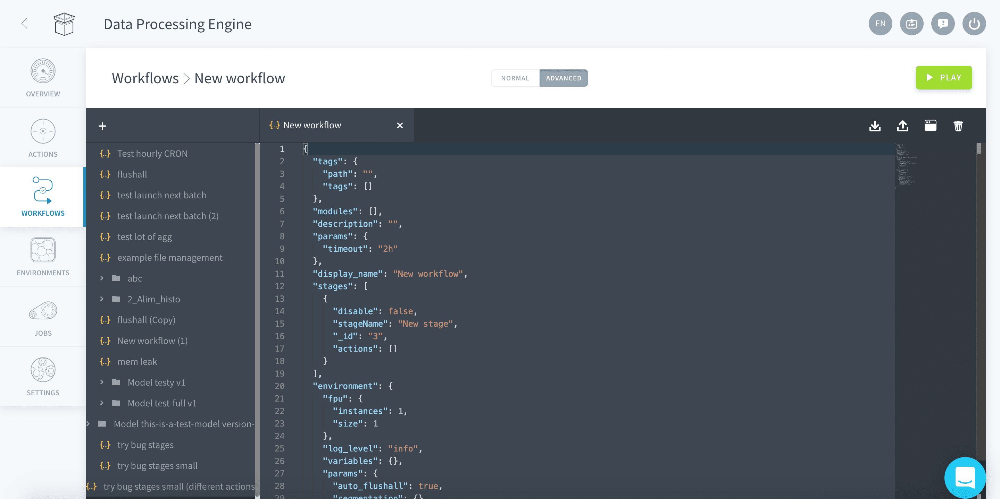

# Configure a workflow in the Advanced mode

Workflows can also be configured directly using a JSON configuration. To access the JSON configuration for a new workflow, click on the *Expert* tab of the "New Workflow" or "Edit Workflow" window.




* [Discover the JSON configuration](/en/product/dpe/workflows/advanced-mode?id=discover-the-json-configuration)
  * [Workflow parameters reference](/en/product/dpe/workflows/advanced-mode?id=workflow-parameters-reference)
  * [Example of JSON configuration](/en/product/dpe/workflows/advanced-mode?id=example-json-configuration)
  * [Date perimeter parameters](/en/product/dpe/workflows/advanced-mode?id=date-perimeter-parameters)
  * [Stage parameters](/en/product/dpe/workflows/advanced-mode?id=stage-parameters)
* [Override configurations](/en/product/dpe/workflows/advanced-mode?id=override-configurations)
  * [Action configurations](/en/product/dpe/workflows/advanced-mode?id=action-configurations)
  * [Configuration priorities](/en/product/dpe/workflows/advanced-mode?id=configuration-priorities)
* [Workflow timeout](/en/product/dpe/workflows/advanced-mode?id=workflow-timeout)

---

## Discover the JSON configuration

Users can type directly in the JSON editor to configure a Workflow. The JSON configuration includes more options than the ones available via the GUI. 

### Workflow parameters reference

In alphabetical order, the parameters are the following:

| Parameter  | Type    | Description |
| :--- | :--- | :--- | 
| display_name | String | Allows to set a name of the workflow |
| description | String | Allows to set a description to the workflow |
| workflow | Table | List of stages with their associated actions |
| logLevel | String | Log level value defines the minimum log level for this workflow. It can take one of the following value *debug*, *info*, *notice*, *warning*, *error* or *critical* |
| auto_flushall | Boolean | Condition to append or not the Flush All routine at the end of the workflow. This is a maintenance routine which refreshes all caches in the data flow (QB, API and APP) |
| dateMin | String | Absolute lower limit of the date perimeter |
| dateMax | String | Absolute higher limit of the date perimeter |
| days | JSON Object | Minimum and maximum values for the relative dates of the perimeter value |

### Example JSON configuration

Below is the JSON configuration of a typical workflow. It has 2 stages with respectively 2 actions in "Stage 1" and 2 action in "Stage 2".

```json
{
  "params": {
     "log_level": "info"
  },
  "auto_flushall": true,
  "display_name": "flushall",
  "description": "routine maintenance workflow",
  "stages": [
    {
      "stageName": "Stage 1",
      "actions": [
        {"action_conf": "5c9bba68555fb219eb000020"},
        {"action_conf": "5c9bba68555fb2190000ll99"}

      ]
    },
    {
      "stageName": "Stage 2",
      "actions": [
        {"action_conf": "5c9bba68555hghjgjhgjhgjh"}
      ]
    }
  ]
}
```

### Date perimeter parameters

To define the date perimeter you do so using an **absolute** date limit (e.g. set in time) or a **relative** date limit (e.g. calculated off the curent date). 

To define an **absolute** date perimeter use the *dateMin* & *dateMax* parameters and enter the dates as string using the format YYYY-MM-DD. For instance, this would let you recompute a workflow between specific dates in the past.

```json
{
  ...
  "dateMin": "2019-04-25",
  "dateMax": "2019-04-25"
}
```

To define a **relative** date perimeter use the *days* parameters and enter distance from the current date in days of the lower & upper limits. For instance, this would be used in a daily workflow that would need to only affect data from "the day before yesterday" and "today". The number corresponds to the number of days to subtract from today's date.

```json
{
  ...
  "days": {
    "min": "2",
    "max": "0"
  }
}
```

###  Stage parameters

The parameters of stages can also be modified directly from the user interface.

| Parameter  | Type    | Description |
| :--- | :--- | :--- | 
| stageName | String | Allows to name each stages |
| disable (Stages) | Boolean | Allows to enable / disable specific stages within a workflow |
| action_conf | String | Corresponds to the action unique ID which you can find when accessing individual action's information. |
| disable (Actions) | Boolean | Allows to enable / disable specific actions within a stage |

```json
{
  "display_name": "flushall",
  …
  "workflow": [
    {
      "disable": false,
      "stageName": "update_metas_lite",
      "actions": [
        {
          "action_conf": "update_metas_lite",
          "disable": false
        }
      ]
    …
  ]
}
```

---

## Override configurations

### Action configurations

Overriding action configurations lets you reuse the same action in several workflows with different execution parameters without affecting the actions' configurations themselves. For instance lets assume that you have set the perimeter of an action, with a specific set of values: `"perimeterValues":["1","2"]`

You can reuse this same action with different perimeter values in the same workflow as follow:
```json
{
  "logLevel": "info",
  "auto_flushall": true,
  "display_name": "flushall",
  "workflow": [
    {
      "stageName": "Stage 1",
      "actions": [
        {"action_conf": "5c9bba68555fb219eb000020", "perimeterValues": ["1","2"]},
        {"action_conf": "5c9bba68555fb219eb000020", "perimeterValues": ["8"]}
      ]
    }
  ]
}
```
> This specific example is meaningless but shows you how you can easily define different configurations for the same actions in a single workflow.

### Configuration priorities

Configurations can be overriden at the 3 different levels: workflow, stages or actions. The most granular level of configuration applies to all sub-objects. For instance configurations set at the stage level will be overriden by any configurations set at the action level. Let's use the following example to illustrate the priority order:

```json
{
  "logLevel": "info",
  "perimeterValues": ["0"],
  "auto_flushall": true,
  "display_name": "flushall",
  "workflow": [
    {
      "stageName": "Stage 1",
      "perimeterValues": ["1"],
      "actions": [
        {"action_conf": "abc", "perimeterValues": ["2"]},
        {"action_conf": "efg"}

      ]
    },
    {
      "stageName": "Stage 2",
      "actions": [
        {"action_conf": "hij"}
      ]
    }
  ]
}
```

Following the JSON configuration above, the perimeter values for the different actions run in the workflow will be as follow:

| Action ID  | perimeterValue | Explanation |
| :--- | :--- | :--- | 
| abc | 2 | The action *abc* has perimeterValues set at the action level which overrides any other perimeterValues. |
| efg | 1 | The action *efg* has no perimeterValues set at the action level which means it uses the perimeterValues set for the stage it is contained in, in this case *Stage 1*. |
| hij | 0 | The action *hij* & *Stage 2* both don't have any perimeterValues set, so the perimeterValues which will be applied is the one of the workflow. |

---

## Workflow timeout

If an action within a workflow takes more time than expected, it is possible to set a timeout option to the workflow gets interrupted. The timeout duration is set as the value of the *workflow_timeout* parameter in a human readable format such as `"worfklow_timeout":"1h 10m"`

Values are cumulative from one time unit to another. Supported time units include:

| Time Unit | Description |
| :--- | :--- | 
| w | weeks |
| d | days |
| h | hours |
| m | minutes |
| s | seconds |

Below a JSON configuration example using the workflow timeout option:
```json
{
  "logLevel": "info",
  "auto_flushall": true,
  "worfklow_timeout":"59m 50s",
  "display_name": "flushall",
  "workflow": [
    {
      "stageName": "Stage 1",
      "actions": [
        {"action_conf": "5c9bba68555fb219eb000020"},
        {"action_conf": "5c9bba68555fb2190000ll99"}

      ]
    }
  ]
}
```

---
###  Need help? 🆘

> At any step, you can ask for support by reaching out to us on the Data Platform Channel within the [Discord Server](https://discord.com/channels/850031577277792286/1163465539981672559). you can also find a step by step guide towards joining our discord server in the [support](/en/support/index.md) section.