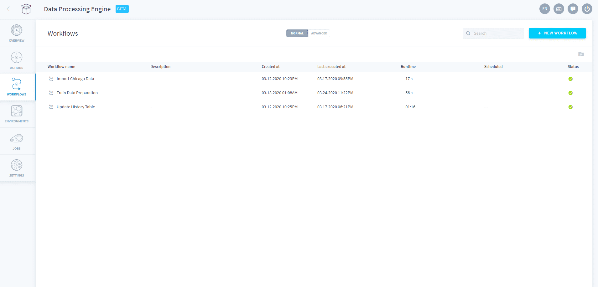

# Workflows

Workflows are basically your orchestrated ETL and data processing pipelines on the Platform. A workflow is an organizational structure in the Data Processing Engine which represents **a sequence of [actions](/en/product/dpe/actions/index)** which can be:
* Run manually or through an API call
* Scheduled to run at a given time (CRON)

---
## Create a workflow

The Platform offers a simple point-and-click interface to orchestrate your actions into scheduled workflows.

{Learn how to configure a workflow}(#/en/product/dpe/workflows/configuration)

You can also go under the hood by using our integrated IDE in the Advanced mode.

{Learn how to configure a workflow using the Advanced mode}(#/en/product/dpe/workflows/advanced-mode)

---
## Manage workflows

In the workflows screen, you can quickly see which workflows are being run, have successfully ran or have encountered errors during their execution. 

By hovering on the *More* icon (i.e. "...") on each line of a workflow, you can also easily:
* **Delete** a workflow
* **Edit** an existing workflow
* **Run** a workflow
* **Inspect the logs** of a workflow

When the number of workflows increases, you can organise the view using *Folders* or look for a specific workflow using the search bar on the top right of the screen. To add workflows into folders, simply drag & drop a workflow inside a given folder.

---
###  Need help? 🆘

> At any step, you can create a ticket to raise an incident or if you need support at the [OVHcloud Help Centre](https://help.ovhcloud.com/csm/fr-home?id=csm_index). Additionally, you can ask for support by reaching out to us on the Data Platform Channel within the [Discord Server](https://discord.com/channels/850031577277792286/1163465539981672559). There is a step-by-step guide in the [support](/en/support/index.md) section.