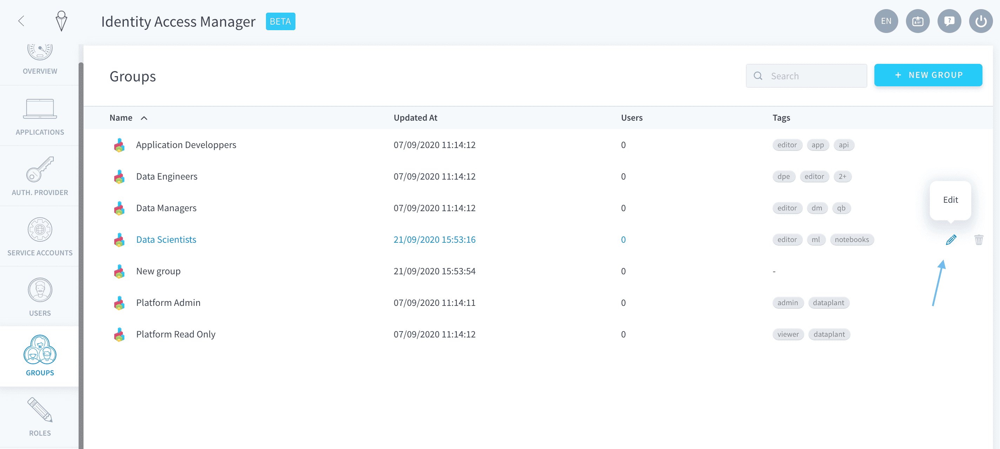
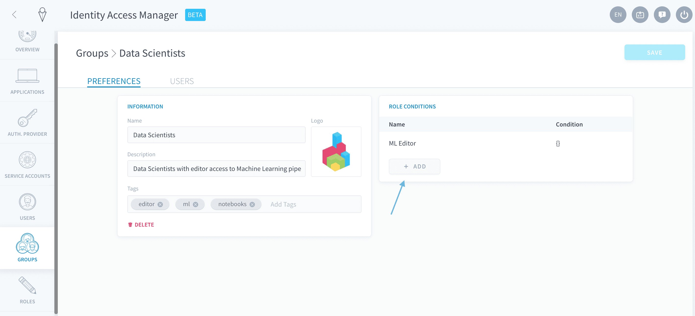
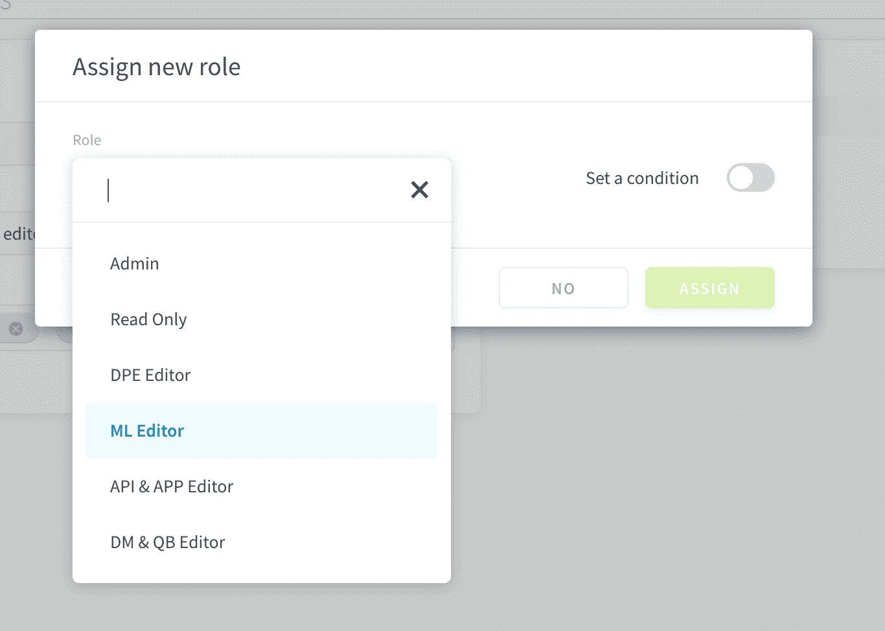

# Roles and conditions


---
## How to bind a role to a user, service account or group

### From the Identity Access Manager
The process is identical for users, service account, and groups. To bind a role to any of them, simply go to their respective tab in the Identity Access Manager.

Select the user/service account/group you want to modify, and click on the **Edit** ✏️ button at the end of the row.



Click on **Add** in the Role Conditions box.



Choose the role you want to bind in the dropdown menu. You can also set a condition on the role binding ([see below](/en/product/iam/roles/index?id=How-to-set-up-a-condition-on-a-role-binding)).



Click on **Create**, then on **Save**.

### From API


```sh
# {type} should be replaced by "users,service_accounts or groups"
# {id} should be replaced by the id of the user, service account or group you want to edit
# {roleId and anotherRoleId} should be the id of the roles to add

## REMEMBER that it will replace all the roles of the edited object. It won't keep other roles already there, so be careful not to remove existing roles.

curl --request PUT \
  --url '/{type}/{id}' \
  --header 'content-type: application/json' \
  --data '{
    "roles": [{
      "role":"{roleId}"
    },{
      "role":"{anotherRoleId}"
    }]
}'
```


---
## How to set up a condition on a role binding
Conditions are **filters that you can set on the permissions of a role** while you are binding it to a user / service account / group.
  
Adding no condition on a role-binding will give full access without any restriction to the permissions of this role. Adding a condition on the objects to which the permission relates will filter the provided access only to the desired objects. 

> For example, if you bind a role with permission `iam.user.read` without any condition to a user, they will get access to the whole list of users.  
However, if you add a condition such as `tag:"my-tag"`, this role only gives the user read-access to the list of users that have the tag _"my-tag"_

### Basic filtering
`TODO: That feature is in preview mode, in IAM it's not implemented`

#### From API
```sh
# {aTag}: Should be replaced by a tag applied to users you want to filter in

curl --request PUT \
  --url '/{type}/{id}' \
  --header 'content-type: application/json' \
  --data '{
    "roles": [{
      "role":"{roleId}",
      "condition":{
        "tag" :"{aTag}"
      }
    }]
}'
```

> You can replace *tag* by any other field present in the filtered object.  
If the field does not exist in the object definition, it will be ignored.  

### Advanced filtering

`TODO: That feature is not implemented`

```sh
# {aTag} : Should be replaced by a tag apply to users

curl --request PUT \
  --url '/{type}/{id}' \
  --header 'content-type: application/json' \
  --data '{
    "roles": [{
      "role":"{roleId}",
      "condition":{
        "tag" : {
          "$eq": "{aTag}"
        }
      }
    }]
}'
```

#### List of possible operations

You can add one or multiple operations at the same time.

| OperationId | Description | Operation | Sample |
|---|---|---|---|
| $lte | Lower than equal | <= {value} | { "$lte" : 3 } |
| $gte | Greater than equal | >= {value} | { "$gte" : 3 } |
| $lt | Lower | < {value} | { "$lt" : 3 } |
| $gt | Greater | > {value} | { "$gt" : 3 } |
| $eq | Equal | === {value} | { "$eq" : 3 } |
| $in | In | {value}.includes() | {"$in":[1,2,3,4]} |
| $notin | Not In | !{value}.includes() | {"$notin":[1,2,3,4]} |
| $exist | exist | {value} !== null | {"$exist":true } |
| $regexp | Regexp comparaison | .match(new Regexp({value})) | {"$regexp":"afolder/.*" } |
