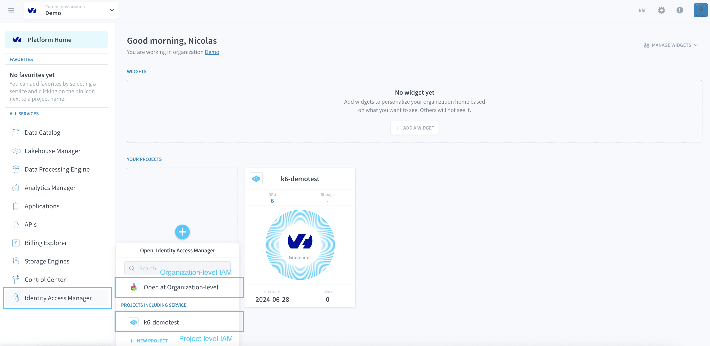

# Identity Access Manager

The Identity Access Manager (IAM) is the component used to **manage access-rights within Data Platform**. It exists as two separate and almost entirely independent modules, one at the **Organization-level** and one at the **Project-level**, for each [Organization](/en/product/organisations/index) and each [Project](/en/product/project/index) respectively. 

?> While the Organization IAM centralizes the management your Organization members' high-level access rights, the Project IAM allows you to manage not only fine-grained resource access for team members but also your end-users and their authentication to your Project's applications. 

In the [Organization IAM](/en/product/iam/orga-iam/index) you will be able to:
* Set-up **authentication providers** to enable single-sign-on to your Data Platform [Organization](/en/product/organisations/index) via external solutions.
* Enforce multi-factor authentication (MFA) in your Organization
* Manage Organization members **access-rights to the Organization-level resources** and settings.

In the [Project IAM](/en/product/iam/project-iam/index) you will be able to:
* Use a very granular role-based access control system (RBAC) to **manage team members and end-users access-rights to the [Project](/en/product/project/index)'s resources and data**.
* Define login pages for deployed **applications**.
* Set-up **authentication providers** to enable login to application via external solutions.

{Learn more about the specificities of the Organization-level IAM}(#/en/product/iam/orga-iam/index.md)

 

{Learn more about the specificities of the Project-level IAM}(#/en/product/iam/project-iam/index.md)

---
## Users and roles

The Identity Access Manager lets you manage your access rights thanks to three different levels: 
* **users/service accounts**: they are either team members working on your Project or end-users of your applications
* **groups**: they represent teams, each having its specific members and set of roles
* **roles**: they are the access rights, which can be given either a user/service account or to a group

{Learn more about users and roles}(#/en/product/iam/users/index.md)

---
## Authentication Providers

In the **Auth. Provider** tab, you can set-up & configure additional providers on top of the ones available by default. This allows you to connect to external directories of users, such as your company's active directory.

Each authentication provider requires a specific configuration depending on the type of provider selected, whether its an SSO provider such as *SAML*, *JWT* or *OpenID* or a multi-factor authentication (MFA) provider such *Google Authenticator* or *SMS*.

>the Platform offers **3 providers by default** - *the Platform IDs*, *Project IDs* and *API/Secret Keys* - which will be added to all new applications. When adding new providers, make sure to edit your applications' authentication configurations to make the provider is available to users in the login menu of the application.

This tab is also where [multi-factor authentication (MFA)](/en/product/iam/project-iam/auth-provider/index?id=enable-multi-factor-authentication-mfa) is managed. MFA is only available for the *Project ID* authentication method. For external authentication providers, the best practice is to directly use the MFA features of the external provider.

{Set-up authentication providers}(#/en/product/iam/project-iam/auth-provider/index.md)

---
## Applications

Any deployed application in a Project will be visible in the **Applications** tab of a Project-level IAM. Through that tab you will be able to define a specific login page for the applications, in particular this means:
* Changing the application login information such as the page design & access URL
* Choosing authentication modes by selecting from the authentication providers list

{Manage applications login pages}(#/en/product/iam/project-iam/application/index.md)

---
##  Need help? 🆘

> At any step, you can create a ticket to raise an incident or if you need support at the [OVHcloud Help Centre](https://help.ovhcloud.com/csm/fr-home?id=csm_index). Additionally, you can ask for support by reaching out to us on the Data Platform Channel within the [Discord Server](https://discord.com/channels/850031577277792286/1163465539981672559). There is a step-by-step guide in the [support](/en/support/index.md) section.