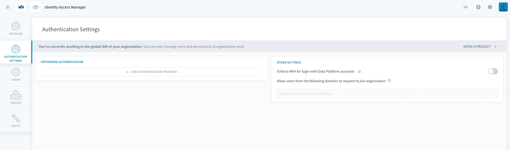
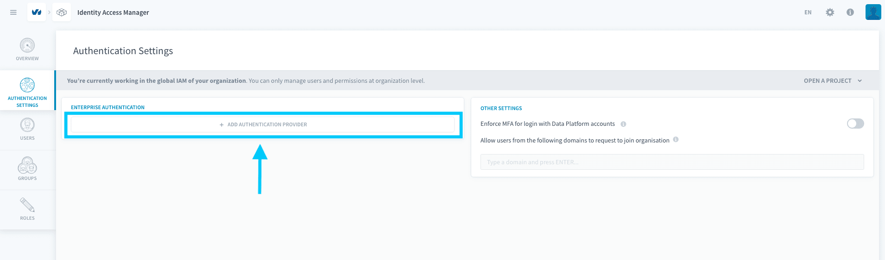
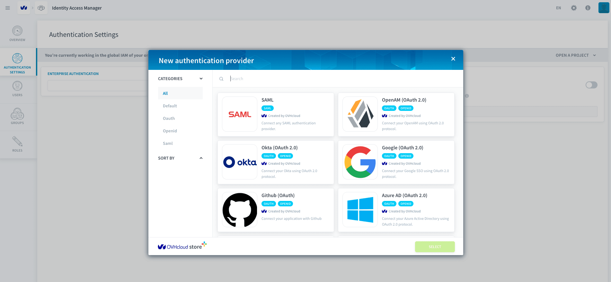
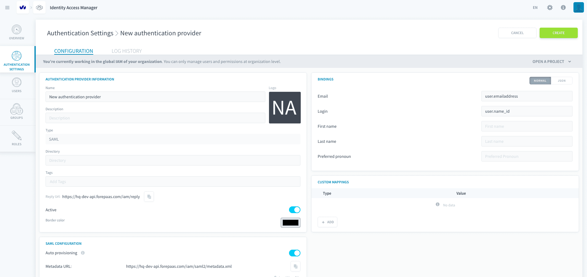
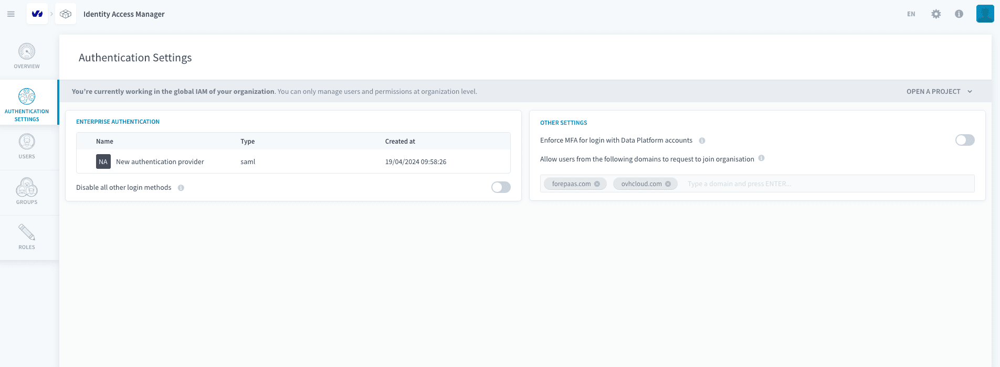
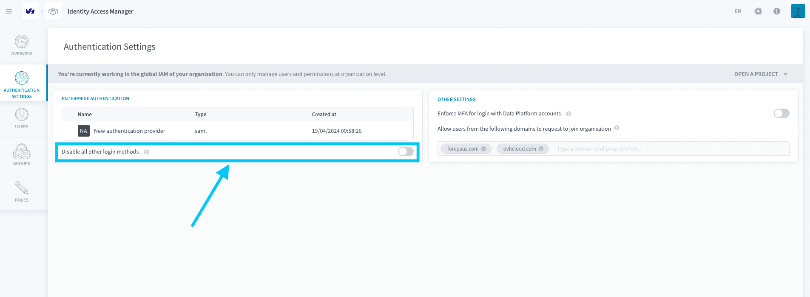
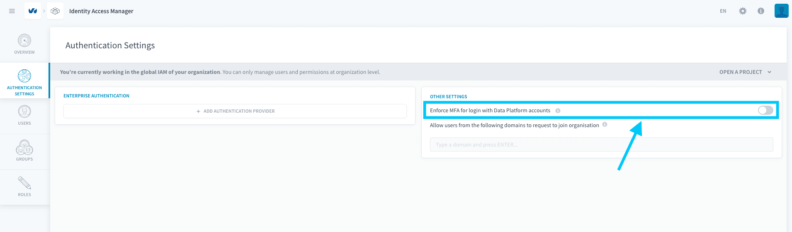
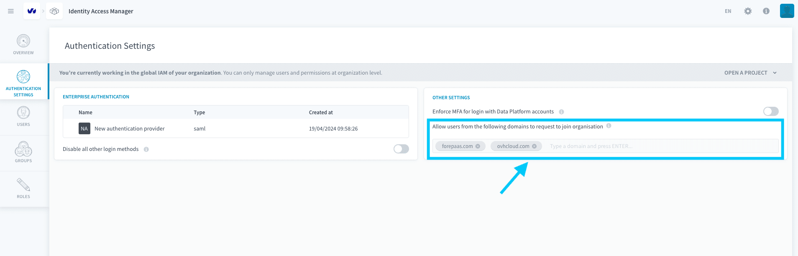

# Authentication Settings

In the Authentication Settings tab you can set global authentication and login requirements and configurations for users of the organization.

* [Setting up a Single-Sign-On provider](#setting-up-a-single-sign-on-provider)
* [Enforcing Multi-Factor Authentication](#enforcing-multi-factor-authentication)
* [Allow users to request to join organization](#allow-users-to-request-to-join-organization)

---

## Setting up a Single-Sign-On provider

### Setup

You can configure an external Single-Sign-On provider that can be used instead of their Data Platform account to validate the credentials of all users upon login.

To do so, first click on **+ Add Authentication provider** under the *Enterprise Authentication* section.

Next, choose a [compatible authentication provider](/en/product/iam/project-iam/auth-provider/index.md?id=list-of-authentication-providers) from our list.

After confirming your choice, you will have to configure your provider.

Once your provider is configured, it is operational ready-to-use.

### Enforcing SSO-login for all users

If your security needs require all your organization users to login using your enterprise SSO, you can enforce this login method by activating the *disable all other login methods* option.

!> Note that if you do not configure your provider properly and then disable all other login options, you will lock all unauthenticated users out of the platform. Therefore, be sure to properly configure your provider before disabling the other login methods.

---

## Enforcing Multi-Factor Authentication

You can also require all users to setup and use Multi-Factor-Authentication (MFA) work on projects by checking the *Enforce MFA for all Data Platform accounts* option. 

Activating this option will require all organization users to verify a phone number of their choice before working on any project on Data Platform.

---

## Allow users to request to join organization

To avoid having to add many users that share the same email domain (e.g. your company's email domain), you can add a domain as *allowed to request to join*. Do this by typing the desired domain in the box indicated below and clicking on ENTER.

---
##  Need help? 🆘

> At any step, you can create a ticket to raise an incident or if you need support at the [OVHcloud Help Centre](https://help.ovhcloud.com/csm/fr-home?id=csm_index). Additionally, you can ask for support by reaching out to us on the Data Platform Channel within the [Discord Server](https://discord.com/channels/850031577277792286/1163465539981672559). There is a step-by-step guide in the [support](/en/support/index.md) section.