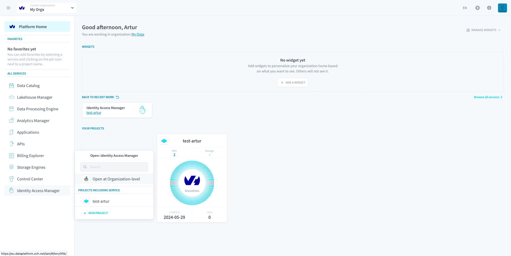
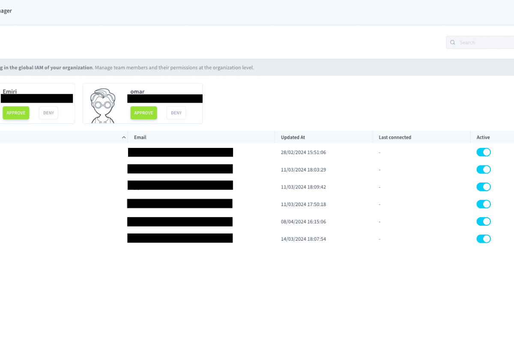

# Organization IAM

The Organization IAM is where you can manage all authentication requirements for members of your organization as well as their level of access to the organization's resources.

In the Organization IAM you will be able to:
* Set-up **authentication providers** to enable single-sign-on to your Data Platform Organization via external solutions.
* Enforce multi-factor authentication (MFA)
* Manage Organization members **access rights to the Organization-level resources and settings**.

You can **access this service from the sidebar**, as shown in the picture below:

- [What resources are managed by the Organization IAM](#resources-managed-by-the-organization-iam)
  - [Link between Project IAM and Organization IAM](#link-between-project-iam-and-organization-iam)
  - [Other Organization IAM permissions](#other-organization-iam-permissions)
- [Authentication Settings](#authentication-settings)
- [Users, Groups and Roles](#users-groups-and-roles)
  - [Accept or deny user requests to join your organization](#accept-or-deny-user-requests-to-join-your-organization)

---
## Resources managed by the Organization IAM

When using the Organization IAM, you will create roles and groups with permissions to access the following resources:

- [Storage Engine Instances](/en/product/project/storage-engine/index.md)
- [Billing Settings](/en/product/billing/index.md)
- [Control Center organization-level resources (alerts, logs, panels, consumers, etc)](/en/product/cc/index.md)
- [Organization IAM users, roles and groups](/en/product/iam/users/index.md)
- [Organization's Projects deployed services and admins](#link-between-project-iam-and-organization-iam)

### Link between Project IAM and Organization IAM

While the Organization IAM provides manages access to projects within the organization, it does not allow management of access-rights of the resources within a project. In other words, the Organization IAM provides IT admins with a high-level access-rights management of the projects.

Below are the project-related permissions in the Organization IAM:
    
- *Projects | Project | Admin*: special permission that makes user become admin of the Project's IAM.
- *Projects | Project | List*: ability to view a list of existing projects in the organization and their basic information.
- *Projects | Project | Get*: ability to view basic information about a project 
- *Projects | Project | Create*: ability to create a project.
- *Projects | Project | Update*: ability to update services inside a project.
- *Projects | Project | Delete*: ability to delete a project.

!> Note that the **Project Admin permission is the only permission to overlap between both IAMs**. A user that has the *Project Admin* permission in the Organization IAM has the *Admin* permission in the underlying Project IAM(s).

### Other Organization IAM permissions

Beyond the Project permissions, the access-rights to the following resources are managed in the Organization IAM via read, write and delete permissions:

- Organisation IAM
  - *Users*
  - *Roles*
  - *Groups*
  - *Authentication Settings*
- Control Center (organization-level)
  - *Monitoring*
  - *Alert*
  - *Job*
  - *Logs*

The only exception to this rule are the [Storage Engines](/en/product/project/storage-engine/index) whose permissions work slightly differently:

- **Create**: Create a storage engine
- **Read**: See the storage engine(s) of the organization
- **Update**: Change the amount of DPU allocated to the storage engine(s)
- **Delete**: Delete the storage engine(s)

---

## Authentication Settings

In the **Authentication Settings** tab, you can set-up & configure additional login requirements for all the users in the organization. To enforce security you can for instance delegate authentication to your third-party enterprise Single-Sign-On provider and require all users to verify their credentials on it to access the platform. Additionally, you can require all users to use multi-factor authentication to use projects or even allow users from a given email domain to request to join the organization.

{Authentication Settings}(#/en/product/iam/orga-iam/auth-methods.md)

---

## Users, Groups and Roles

The Organisation IAM uses the same role-based access-rights control system of the [Project IAM](/en/product/iam/project-iam/index.md): permissions are granted by giving users roles and adding them to groups.

{Learn more about Users, Groups and Roles}(#/en/product/iam/users/index.md)

### Accept or deny user requests to join your organization

It is possible for people with the **same email domain as any existing member** in an organization to request to join this organization when they first sign up. *Admins* of the organization will have to manually accept the person into the organization after they requested to join.

To manage requests, click on the *Users* tab. At the top of the list of users in your organization, you will see all the people that have requested to join. 

You can accept or deny their request from here. If you accept, they will be added in your organization as simple *users* with no permission.

---
##  Need help? 🆘

> At any step, you can create a ticket to raise an incident or if you need support at the [OVHcloud Help Centre](https://help.ovhcloud.com/csm/fr-home?id=csm_index). Additionally, you can ask for support by reaching out to us on the Data Platform Channel within the [Discord Server](https://discord.com/channels/850031577277792286/1163465539981672559). There is a step-by-step guide in the [support](/en/support/index.md) section.