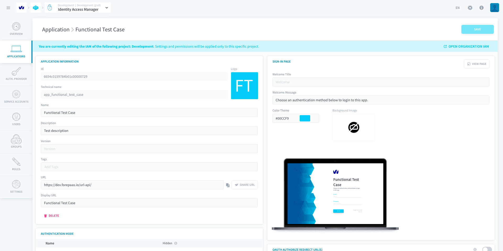

# Applications authentication protocols

When an application is deployed on the platform, it is automatically created in the Identity Access Manager as a separate entity for which you can manage the **authentication protocols**. Applications include:

- **Your analytics applications**: individual AI applications that can be deployed from the [APP Manager](/en/product/app-manager/index), as well as consumers that you can connect in the [Analytics Manager](/en/product/am/consumers/index). This typically includes user-friendly interfaces to expose the data such as dashboards, reporting, or alerting tools.

- **Identity Access Manager**: accessible as an independent URL, `https://project-name.eu.dataplatform.ovh.net/iam`, the Identity Access Manager external application is used when you need users (say the administrator of a given application) to manage its user base without having to access the Platform.

For each deployed application, the platform lets you configure:
- [Application information](#application-information)
- [Authentication mode(s)](#authentication-mode) that are visible on the sign-in page
- [The style of the sign-in page](#sign-in-page-visuals): welcome message, background image, color theme, etc.

---

## Application information

- **ID**: the ID of the application in the IAM 
- **Name**: the name of the application shown by default in its login page
- **Version**: version of the application currently deployed (not required, only for custom use cases)
- **Description**: description of the application
- **Tags**: tags of the application
- **URL**: Base URL of the application.
- **"Share URL" button**: Send by email the URL of the application to the selected users or groups of users. 

?> Please note that you can edit the template in the Identity Access Manager *Settings > Email > Application invitation > Edit*

- **Display URL**: Title of the application used in the email sent by the "Share URL" button

---

## Authentication Mode

This list allows you to manage which authentication methods are displayed on the sign-in page of the application. 

!> This is a pure visibility configuration and not a way to avoid users from logging into the application through certain authentication modes.

{Manage authentication methods of an application}(#/en/product/iam/project-iam/application/login)

---

## Sign-in page visuals

The visual style of your sign-in page includes the following elements: 

- **Welcome title**: edit the welcome message on the sign-in page. if empty, it will show the application name instead. 
- **Welcome message**: the message under the welcome title
- **Color Theme**: default primary CSS color for the sign-in page
- **Background image**: adds a background image to the sign-in page.

---
##  Need help? 🆘

> At any step, you can create a ticket to raise an incident or if you need support at the [OVHcloud Help Centre](https://help.ovhcloud.com/csm/fr-home?id=csm_index). Additionally, you can ask for support by reaching out to us on the Data Platform Channel within the [Discord Server](https://discord.com/channels/850031577277792286/1163465539981672559). There is a step-by-step guide in the [support](/en/support/index.md) section.
