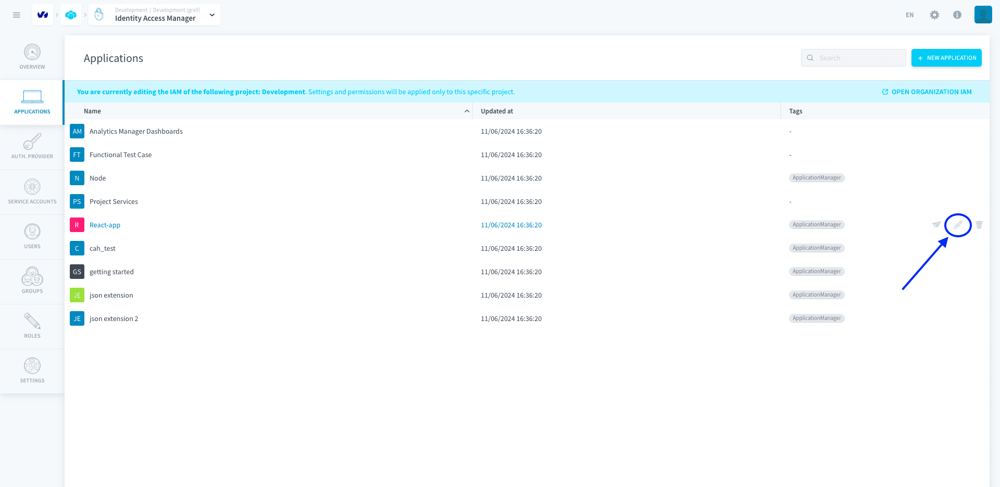
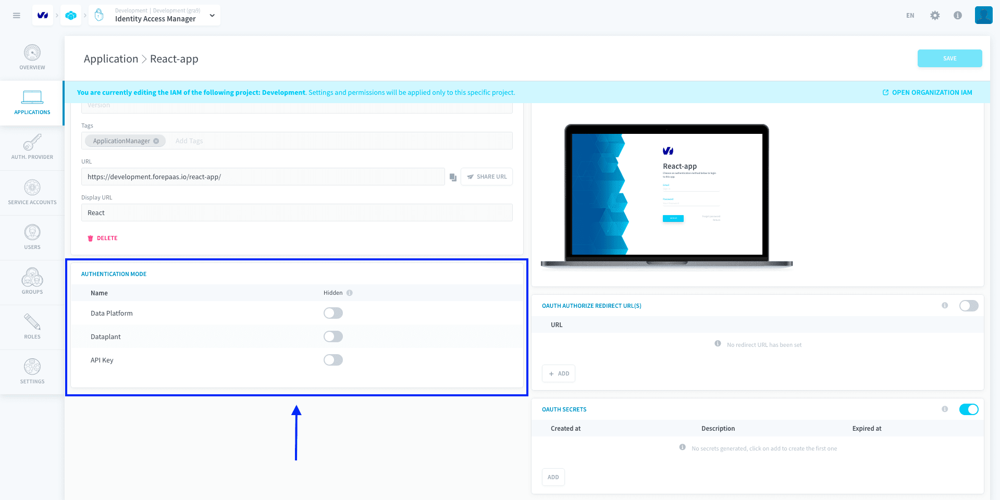
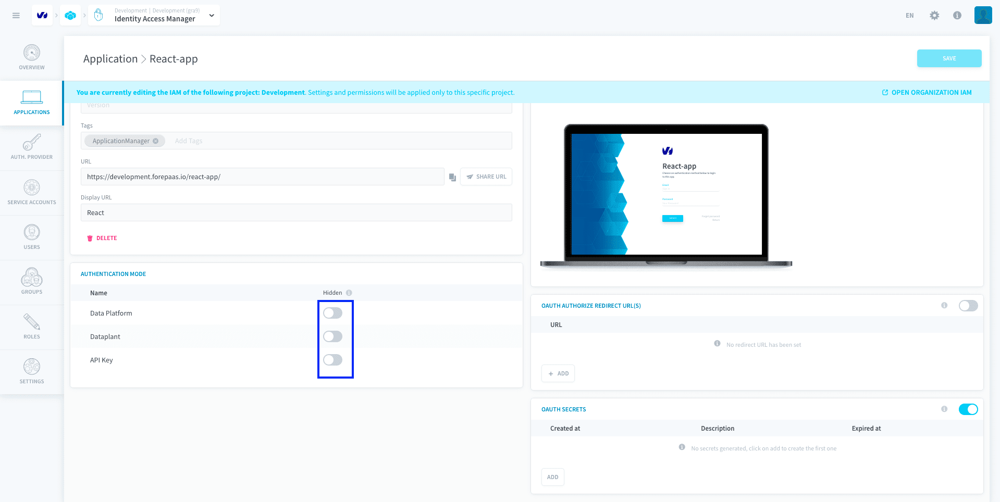
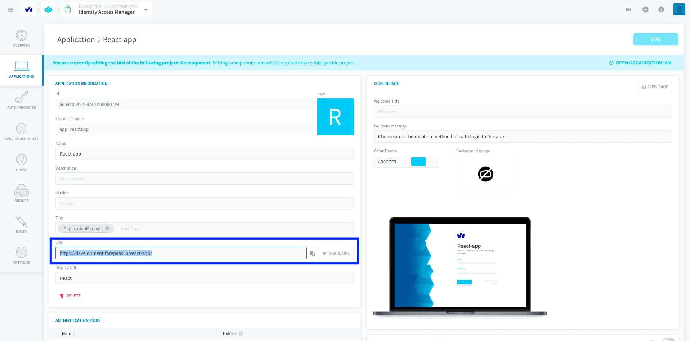
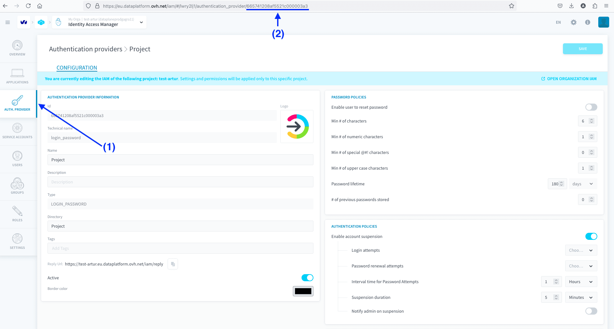

# Authentication page of an application

The authentication page is an important part of your Platform application: it is the page on which users will log in in order to reach the content of the app. 

The [Auth. Provider](/en/product/iam/project-iam/auth-provider/index) tab in your IAM lets you configure which authentication methods can be used in your Project. Authentication methods can then be [displayed or hidden](#display-an-authentication-provider-on-an-application-login-page) to visually customize your login page.

* [Display an authentication provider on an application login page](#display-an-authentication-provider-on-an-application-login-page)
* [Link to a specific authentication method](#link-to-a-specific-authentication-provider)

--- 
## Display an authentication provider on an application login page

Click on **Applications** and edit the desired application.

Locate the panel **Authentication Mode**

Add your new provider if it doesn't appear automatically. Make sure the authentication providers of your choice are not set as *hidden*. Those who are will not be visible from the application's login page.

!> It is not possible to **deactivate** an authentication provider for a specific application. For instance, a user who is already logged in through Azure AD will still be able to access the application even if Azure AD is set as hidden on the application login page.

---
## Link to a specific authentication provider

You can generate URL links to reach a specific authentication page for your application, even if you have several authentication providers active on your Project. You will need:
- your app URL
- your authentication method's ID 

You can get your app URL in the IAM settings of your application:

You can get your authentication provider's ID by going to its settings page in the IAM and looking at the URL:

To reach a specific authentication page for your application, use the URL link:  

?> **your-app-URL**#/?auth_mode_id=**your-auth-method-ID**

!> This link is currently only valid for applications created from the [App Manager](/en/product/app-manager/index), not for the 'Project' application.

> 💡 Shortcuts:
- Another ID for the [*the platform account*](/en/product/iam/auth-provider/index.md?id=forepaas) authentication method is `king`
- Another ID for the [*Project*](/en/product/iam/auth-provider/index.md?id=dataplant) authentication method is `password`

---
##  Need help? 🆘

> At any step, you can create a ticket to raise an incident or if you need support at the [OVHcloud Help Centre](https://help.ovhcloud.com/csm/fr-home?id=csm_index). Additionally, you can ask for support by reaching out to us on the Data Platform Channel within the [Discord Server](https://discord.com/channels/850031577277792286/1163465539981672559). There is a step-by-step guide in the [support](/en/support/index.md) section.
