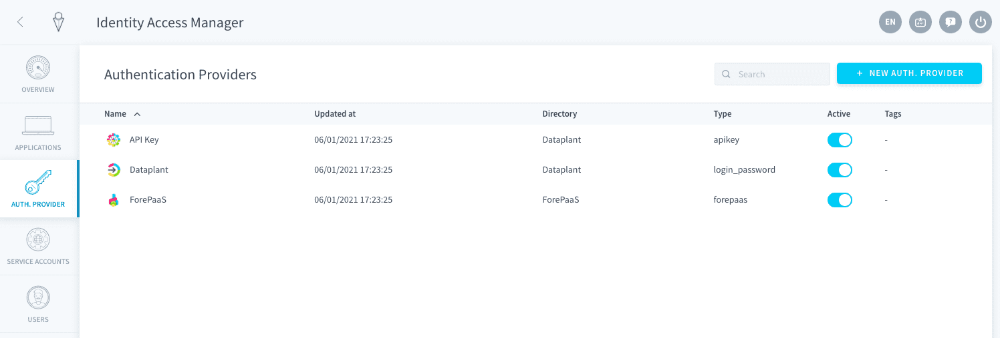
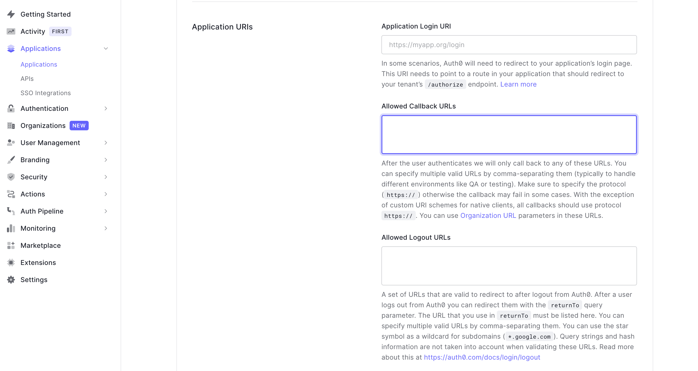

# Set up SSO authentication with Auth0

Is your company identity management handled on [Auth0](https://auth0.com/)? If you want to use it to login to your Data Platform apps, this guide is for you.

Open the IAM and click on **Auth. Provider**.



If you haven't done so already, [add a new](/en/product/iam/project-iam/auth-provider/index.md?id=add-an-authentication-provider) *Auth0* authentication provider on Data Platform. Else, just edit it.

The configuration is done in two parts. First you need to [configure the rights on Auth0](#configuration-on-auth0) and then [configure the authentication provider in the Data Platform Identity Access Manager](#configuration-on-the-platform-identity-access-manager).


---
## Configuration on Auth0

You need to register ForePaaS as an application on your Auth0 environment. Go there: https://manage.auth0.com/dashboard.


The configuration on Auth0 consists of 4 easy steps:
* [Register the Identity Access Manager on Auth0](#step-1-register-the-identity-access-manager-on-auth0)
* [Retrieve the Domain](#step-2-retrieve-the-domain)
* [Retrieve the Client ID](#step-3-retrieve-the-client-id)
* [Retrieve the Client Secret](#step-4-retrieve-the-client-secret)


### Step 1. Register the Identity Access Manager on Auth0

?> Note that the interface of Auth0 may change over time, and screenshots could be outdated. Please refer to the [Auth0 documentation portal](https://auth0.com/docs) if you are unable to find some of the features listed below.

You need to register an application inside of Auth0. This works with any app you would like to connect to Auth0 but in this case, you are going to register the Data Platform IAM directly.

In the sidebar, select **Applications**. Then click on *Create application*. 

  


Select *Regular Web Application*.

  

Open the **Settings** of the newly created application.

  


#### *Callback URL*
Scroll down to the **Allowed Callback URLs** section in the Settings page of the applicaiton.



In the URL field, copy and paste the **Reply URL** field in the new authentication provider you added on Data Platform (it is the same for the entire Data Platform IAM).


### Step 2. Retrieve the Domain

The Domain is the equivalent of your tenant id on Auth0. You can find it in the Settings of the application: look for the **Domain** section.


?> Note that this Domain will be required later on during the IAM configuration.


### Step 3. Retrieve the Client ID

The Client ID is specific to your application. You can find it in the Settings of the application: look for the **Client ID** section.


?> Note that this Client ID will be required later on during the IAM configuration.


### Step 4. Retrieve the Client Secret

The Client Secret is specific to your application. You can find it in the Settings of the application: look for the **Client Secret** section.


?> Note that this Client Secret will be required later on during the IAM configuration.


### Summary
If you have properly followed all the previous steps, you should have this list of information.

```
Domain (Step 2): xxxxxxxxxx.auth0.com
Client ID (Step 3): XXXXXXXXXXXXXXXXXXXXXXXXXXXXXXXX
Client Secret (Step 4): XXXXXXXXXXXXXXXXXXXXXXXXXXXXXXXX
```
> If you want to further customize the configuration of your new application from the Auth0 portal, we recommend you check out [Auth0's documentation](https://auth0.com/docs/get-started/create-apps/regular-web-apps).


---
## Configuration on the Platform Identity Access Manager
You now have to configure your new authentication provider in your Data Platform Identity Access Manager.


### Fill in the basic information

- **Name / Description**: This is the internal name and description for your new authentication method
- **Directory**: This is a unified tag for all accounts that will be created from this directory. For example, you can input *Auth0*
- **Tags**: This offers more tagging options. They are completely optional
- **Reply URL**: This is the Data Platform URL where your authentication provider redirects to
- **Active**: This specifies whether this authentication provider can be used to login or not


### Fill in Auth0 configuration

Now locate the **Auth0 Configuration** panel.


Fill in the information collected on Auth0 in the previous section, as such:
- **Domain**: *Domain* (retrieved in [step 2](#step-2-retrieve-the-domain) of the configuration on Auth0)
- **Client ID**: *Client ID* (retrieved in [step 3](#step-3-retrieve-the-client-id) of the configuration on Auth0)
- **Client Secret**: *Client Secret* (retrieved in [step 4](#step-4-retrieve-the-client-secret) of the configuration on Auth0)
- **Scope**: This represents how much information Data Platform will be able to access from your Auth0. This field is optional: the default value is `openid email profile`


### Fill in the bindings rules

The **Bindings** panel allows you to customize the mapping of the fields between Auth0 and Data Platform. 

Email, login, first and last name are mapped by default.


Bindings can be overriden if you need to save additional information from Auth0 into your Data Platform Identity Access Manager, like the job title. 

The easiest way to configure bindings is to retrieve a response from a login of an user by following these steps:
  
*1* - Do a sample login to any Data Platform application using your newly configured Auth0 authentication provider.  
*2* - Open the **Log History** page of the IAM authentication provider (here Auth0).


*3* - Open the latest log: the original response from Auth0 will look like this:  

```json

{
  "given_name": "John",
  "family_name": "Smith",
  "nickname": "jsmith",
  "name": "John jsmith",
  "picture": "https://lh3.googleusercontent.com/a/AATXAJwHYHTaalrHB9puNg1bjfCuKIuZPqVFMUcma5e5=s96-c",
  "locale": "fr",
  "updated_at": "2021-10-01T15:14:35.524Z",
  "email": "jsmith@xyz.com",
  "email_verified": true,
  "iss": "https://dev-m4zopi2a.us.auth0.com/",
  "sub": "google-oauth2|112554878744",
  "aud": "****",
  "iat": 1633101540,
  "exp": 1633137540,
  "user": {
    "sub": "google-oauth2|112554878744",
    "given_name": "John",
    "family_name": "Smith",
    "nickname": "jsmith",
    "name": "John Smith",
    "picture": "https://lh3.googleusercontent.com/a/AATXAJwHYHTaalrHB9puNg1bjfCuKIuZPqVFMUcma5e5=s96-c",
    "locale": "fr",
    "updated_at": "2021-10-01T15:14:35.524Z",
    "email": "jsmith@pataplatform.com",
    "email_verified": true
  }
}

```
*4* - On top of the default email, login, first and last name, any additional property from Auth0 can be saved as a custom `configuration.XXX` field on Data Platform by using the "JSON" mode. 


For example, you can add a *fullname* property on Data Platform from the `name` field from Auth0:  

```json
{
  "login": "email",
  "email": "email",
  "pronoun": "",
  "firstname": "given_name",
  "lastname": "family_name",
  "configuration.fullname": "name"
}
```

> Test the result of your bindings by checking the logs of further test connections in Log History: the *Computed Result* section of each login will show what properties have been saved in ForePaaS.


### Custom mappings

The **Custom mappings** panel allows you to automatically assign all users logged in through this authentication provider to a role or a group.


[Learn how to set up custom mappings.](/en/product/iam/project-iam/auth-provider/custom-mapping)


### Set live
You are all set configuring your Auth0 connector! If you haven't done it already, click on **Create** - else make sure to **Save**.

In the Authentication Providers list, you now see your new method. Make sure you set it as *active*.


Make sure this new authentication method [is visible](/en/product/iam/application/login.md?id=display-an-authentication-provider-on-an-application-login-page) for the applications of your choice. You should now see an Auth0 option on your application's login page. By clicking on it, you will be redirected to the Auth0 login screen, or directly into the app if you are already logged into your account.


[Make Auth0 visible on your apps' login page](/en/product/iam/application/login.md?id=display-an-authentication-provider-on-an-application-login-page)


---
##  Need help? 🆘

> At any step, you can create a ticket to raise an incident or if you need support at the [OVHcloud Help Centre](https://help.ovhcloud.com/csm/fr-home?id=csm_index). Additionally, you can ask for support by reaching out to us on the Data Platform Channel within the [Discord Server](https://discord.com/channels/850031577277792286/1163465539981672559). There is a step-by-step guide in the [support](/en/support/index.md) section.