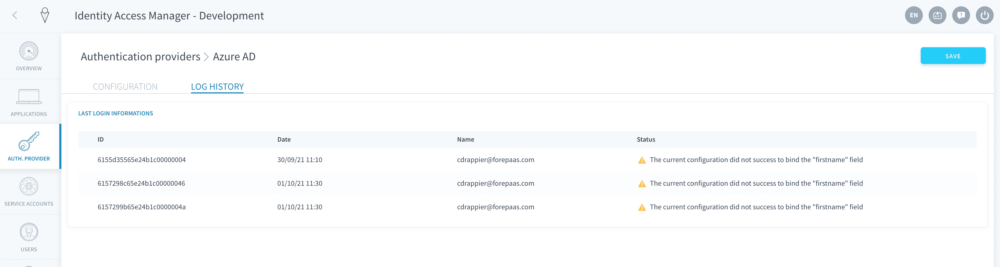

# Set up SSO authentication with Azure AD

Do you have an Azure Active Directory in your company? If you want to use it to login to your Data Platform apps, this guide is for you.

Open the IAM and click on **Auth. Provider**.


If you haven't done so already, [add a new](/en/product/iam/project-iam/auth-provider/index.md?id=add-an-authentication-provider) *Azure AD* authentication provider. Else, just edit it.

The configuration is done in two parts. First you need to [configure the rights on Microsoft Azure](#configuration-on-azure) and then [configure the authentication provider in the Data Platform Identity Access Manager](#configuration-on-the-data-platform-identity-access-manager).

---
## Configuration on Azure

You need to register Data Platform on the Azure console. Go there: https://portal.azure.com.

The configuration on Azure consists of five easy steps:
* [Retrieve the Tenant ID](#step-1-retrieve-the-tenant-id)
* [Register the Identity Access Manager](#step-2-register-the-identity-access-manager)
* [Retrieve the Client ID](#step-3-retrieve-the-client-id)
* [Retrieve the Client Secret](#step-4-retrieve-the-client-secret)
* [Enable basic permissions from Azure AD](#step-5-enable-basic-permissions-from-azure-ad)

### Step 1. Retrieve the Tenant ID

?> Note that the interface of Azure Active Directory may change over time, and screenshots could be outdated. Please refer to the [Azure AD documentation portal](https://docs.microsoft.com/en-us/azure/active-directory/) if you are unable to find some of the features listed below.

The *Tenant ID* is the ID of your Azure company environment. To find it, select **Azure Active Directory** in the list of Azure Services. Then, in the sidebar click on "Properties".


?> Note that this ID will be required later on during the IAM configuration. 

### Step 2. Register the Identity Access Manager
You then need to register an application inside of Microsoft Azure AD. This works with any app you would like to connect to Azure but in this case, you are going to register the Data Platform IAM directly.

In the sidebar, select **App Registrations**. Then click on *New registration*. 
  

#### *Name*
The name is purely descriptive: it will be useful to find your configuration within your Azure AD. 


#### *Supported account types*
This parameter specifies which Azure AD directories you'll be able to use to authenticate on the Data Platform IAM. It is recommended to select *Accounts in this organizational directory only* in order that only your AD can log in to your Data Platform IAM.

  

#### *Redirect URL*
Select *Web*. 


In the URL field, copy and paste the **Reply URL** field in the new authentication provider you added on Data Platform (it is the same for the entire Data Platform IAM).

  

Once this is done, click on **Register**.

  

### Step 3. Retrieve the Client ID
The *Client ID* is the user ID of your newly added application (i.e. the Data Platform IAM). You can find it on its Overview page: look for *Application (client) ID*.

  

?> Note that this Client ID will be required later on during the IAM configuration. 

### Step 4. Retrieve the Client Secret
On the page of your IAM application, click on **Certificates & secrets** in the sidebar. Click on *New client secret*.

  

Fill in the description and expiration date of your choice and click on **Add**.

  

Once the client secret is created, copy and save its **Value**.

 

?> Please note that your Client Secret will be required later on during your IAM configuration.

### Step 5. Enable basic permissions from Azure AD
On the page of your IAM application, click on **API permissions** in the sidebar. Click on *New permission* and select *Microsoft Graph*.

 

Select *Delegated permissions*.

 

Two permissions must be added in order for the entire feature-set of Azure AD authentication provider on Data Platform to work.
* **profile**: this permission is needed if you need to get user information from Azure AD using the [UserInfo endpoint](#fill-in-azure-configuration).
* **Group.Read.All**: this permission is needed if you need to get the list of groups from your Azure AD for a [custom mapping](#custom-mappings)

Find them in the list and add them both.

 

 

Finally, click on **Grant admin consent for your-app** and confirm.

 

When all permissions have been correctly added, your screen should look like this.

 


### Summary
If you have properly followed all the previous steps, you should have this list of information.

```
Tenant ID (Step 1): XXXXXXXX-XXXX-XXXX-XXXX-XXXXXXXXXXXX
Client ID (Step 3): XXXXXXXX-XXXX-XXXX-XXXX-XXXXXXXXXXXX
Client Secret (Step 4): XXXXXXXXXXXXXXXXXXXXXXXXXXXXXXXX
```
> If you want to further customize the configuration of your new application from the Azure portal, we recommend you check out [Azure AD's documentation](https://docs.microsoft.com/en-us/azure/active-directory/manage-apps/what-is-application-management).

---
## Configuration on the Data Platform Identity Access Manager
You now have to configure your new authentication provider in your Data Platform Identity Access Manager.


### Fill in the basic information

- **Name / Description**: This is the internal name and description for your new authentication method
- **Directory**: This is a unified tag for all accounts that will be created from this directory. For example, you can input *Azure*
- **Tags**: This offers more tagging options. They are completely optional
- **Reply URL**: This is the Data Platform URL where your authentication provider redirects to
- **Active**: This specifies whether this authentication provider can be used to login or not
- **Debug Mode**: When this is turned on, this enables you to see the authentication logs in the [Control Center](/en/product/cc/index).


### Fill in Azure configuration

Now locate the **Azure Configuration** panel.


Fill in the information collected on Azure in the previous section, as such:
- **Tenant ID**: *Tenant ID* (retrieved in [step 1](#step-1-retrieve-the-tenant-id) of the configuration on Azure)
- **Client ID**: *Client ID* (retrieved in [step 3](#step-3-retrieve-the-client-id) of the configuration on Azure)
- **Client Secret**: *Client Secret Value* (retrieved in [step 4](#step-4-retrieve-the-client-secret) of the configuration on Azure)
- **Scope**: This represents how much information Data Platform will be able to access from your Azure AD. This field is optional: if left blank it will use the value `openid email profile`
- **Enable user info endpoint on AzureAD**: This endpoint will allow the IAM to do an extra `GET https://graph.microsoft.com/v1.0/users/me` call on Azure AD Graph API, the result of which will add a sub-object "user" in addition to the standard OpenID field in the response. This allows you to get additional information on users, like the job title.


### Bindings

The **Bindings** panel allows you to customize the mapping of the fields between Azure AD and Data Platform. 

Email, login, first and last name are mapped by default.


Bindings can be overriden if you need to save additional information from Azure AD into your Data Platform Identity Access Manager, like the job title. 

The easiest way to configure bindings is to retrieve a response from a login of an user by following these steps:

*1* - Do a sample login to any Data Platform application using your newly configured Azure AD authentication provider.  
*2* - Open the **Log History** page of the IAM authentication provider (here Azure AD).



*3* - Open the latest log: the original response from Azure AD will look like this: 


```json

{
  "aud": "3a0f2280-36e3-457b-a72a-d74fca8a0eae",
  "iss": "https://sts.windows.net/058c4703-07ad-4c14-87e5-e08241c8cb8f/",
  "iat": 1628084238,
  "nbf": 1628084238,
  "exp": 1628088138,
  "amr": [
    "pwd"
  ],
  "email": "test@forepaas.com",
  "family_name": "Smith",
  "given_name": "John",
  "idp": "https://sts.windows.net/82b3359c-9391-4d7c-a0f2-816751a97641/",
  "ipaddr": "62.23.151.245",
  "name": "John Smith",
  "oid": "db6723ba-d536-4c72-bfb4-c089d88fe7d8",
  "rh": "0.ARAAA0eMBa0HFEyH5eCCQcjLj4AiDzrjNntFpyrXT8qKDq4QAOw.",
  "sub": "3H2vG1r81UmzHRIp74IHcYjONOSMZf4gQ12M_ELMorY",
  "tid": "058c4703-07ad-4c14-87e5-e08241c8cb8f",
  "unique_name": "test@forepaas.com",
  "uti": "GO1KbxWFg0ChEVKPUDqhAA",
  "ver": "1.0",
  "memberships": [
    {
      "@odata.type": "#microsoft.graph.group",
      "id": "7d232d98-c942-4405-9380-a644b6db1eb7",
      ...
      "description": "TestGroup",
      "displayName": "My Group",
    },...
  ]
}

```

*4* - On top of the default email, login, first and last name, any additional property from Azure AD can be saved as a custom `configuration.XXX` field on Data Platform by using the "JSON" mode. 


For example, you can add a *fullname* property on Data Platform from the `name` field from Azure AD:  

```json
{
  "login": "email",
  "email": "email",
  "pronoun": "",
  "firstname": "given_name",
  "lastname": "family_name",
  "configuration.fullname": "name"
}
```

> Test the result of your bindings by checking the logs of further test connections in Log History: the *Computed Result* section of each login will show what properties have been saved in Data Platform.


### Custom mappings

The **Custom mappings** panel allows you to automatically assign all users logged in through this authentication provider to a role or a group.


[Learn how to set up custom mappings.](#/en/product/iam/project-iam/auth-provider/custom-mapping)


### Set live
You are all set configuring your Azure AD! If you haven't done it already, click on **Create** - else make sure to **Save**.

In the Authentication Providers list, you now see your new method. Make sure you set it as *active*.


Make sure this new authentication method [is visible](/en/product/iam/application/login.md?id=display-an-authentication-provider-on-an-application-login-page) for the applications of your choice. You should now see an Azure AD option on your application's login page. By clicking on it, you will be redirected to the Azure login screen, or directly into the app if you are already logged into your account.


[Make Azure AD visible on your apps' login page](/en/product/iam/application/login.md?id=display-an-authentication-provider-on-an-application-login-page)


---
## Struggling to set it up by yourself❓

> At any step, you can create a ticket to raise an incident or if you need support at the [OVHcloud Help Centre](https://help.ovhcloud.com/csm/fr-home?id=csm_index). Additionally, you can ask for support by reaching out to us on the Data Platform Channel within the [Discord Server](https://discord.com/channels/850031577277792286/1163465539981672559). There is a step-by-step guide in the [support](/en/support/index.md) section.
