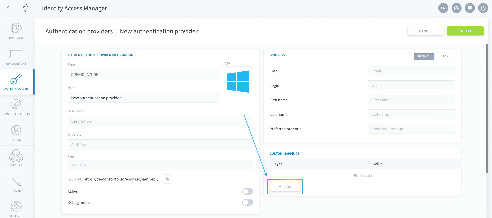
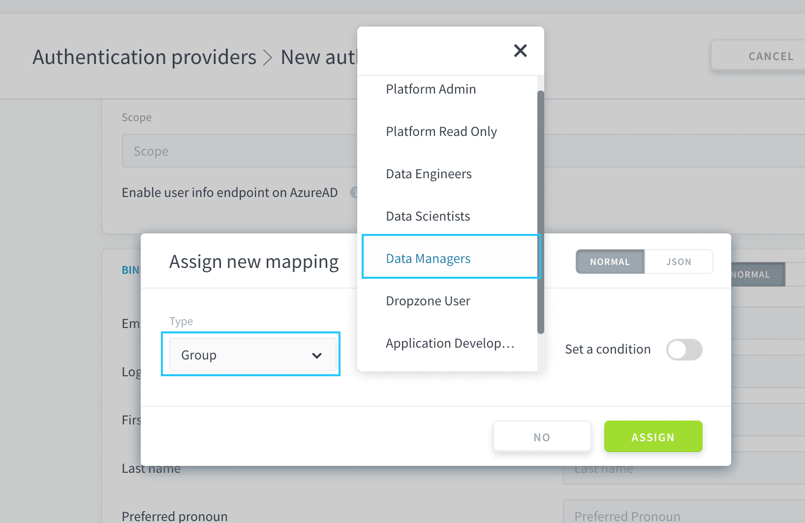
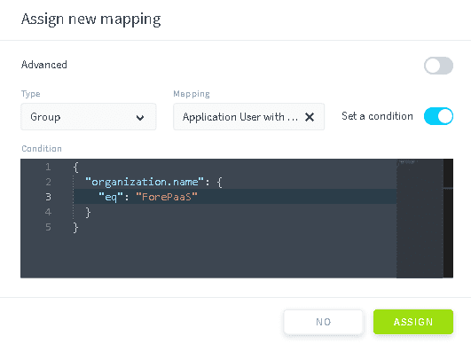
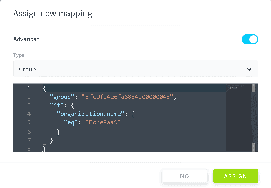
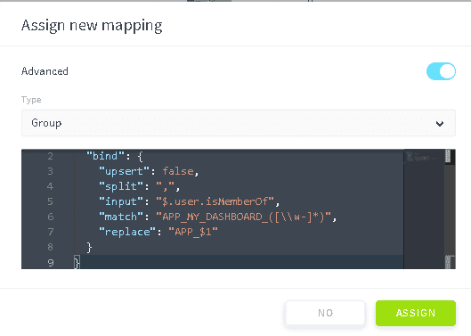

# Set up custom mapping for authentication provider

Custom mappings allow you to automatically assign existing [Data Platform groups](/en/product/iam/users/groups.md) or [roles](/en/product/iam/users/roles.md) (or auto-create them if they don't exist) to users signing in through that authentication provider.

> In the **Log History** section, [JSONPath formatting](https://jsonpath.com/) can be used to select from the response object returned after a successful authentication, and configure the custom mappings below.

Click on **Add** in the Custom Mapping panel to set up a new mapping.




* [Set up custom mapping using the normal mode](#normal-mode)
* [Set up custom mapping using the JSON mode](#json-mode)

---
## Normal mode

With the normal mode, you can assign **existing** [groups](/en/product/iam/users/groups.md) or [roles](/en/product/iam/users/roles.md) to users signing in from the authentication provider.

To do this, choose between *Role* and *Group*, and select the role/group from the selection.



By default, it will assign the role/group to all new users imported from the authentication provider, but you can set a condition on the binding.



Conditions are **based on fields coming from the authentication providers response**.  
An example of condition is:

```json
{
    "user.jobTitle": {
        "eq": "Admin"
    }
}
```
This condition will look the field *user.jobTitle* in the authentication response for any new user signing in from the authentication provider, and check if the value is equal to *Admin*. If true, it will bind the role/group to that user, otherwise it won't.

Conditional operators are:
* `eq`: Equal to the value
* `ne`: Not equal to the value
* `in`: In the set of value
* `nin`: Not in the set of value
* `lt`, `lte`, `gt`, `gte`: Lower than, Lower or equal to, Greater than, Greater or equal to 
* `regexp`: Will try to match the auth response field with the value (regex)


---
## JSON mode
With the JSON mode, you can dynamically [assign](#assign-existing-rolesgroups) or [create](#dynamically-find-or-create-rolesgroups) groups or roles for users signing in from the authentication provider. Switch to the JSON mode in the header of the window to activate it.

### Assign existing roles/groups

The binding of **existing** groups/roles with conditions is carried out using the *if* keyword.



```json
{
  "group": "_identifier_of_the_group",
  "if": {
    "organization.name": { 
      "eq": "ForePaaS"
    }
  }
}
```

### Dynamically find or create roles/groups

You can dynamically define bound resources using the option `bind`. It takes in 5 possible parameters:

- `upsert`: false/true
  - if *true*: It will autogenerate groups/roles if they don't already existing in the Identity Access Manager
  - if *false*: It will only bind to existing groups/roles
- `input`: It's a JSON path accessor to get the list of "resources to bind"
- `split`: In some cases, you could have such a field in the answer: "group1,group2,group3". By inputting "," it will automatically split the list using the commas as separator
- `match`: [see below](#use-the-match-parameter)
- `replace`: [see below](#use-the-replace-parameter)

#### Use the *match* parameter
You can take only some groups matching a **specific regex pattern**.

For example, if the authentication provider has the following groups: *PRIVATE_ADMIN*, *IAM_APP_GROUP1*, *IAM_APP_GROUP2*, then the following configuration will only create the 2 groups starting by "IAM_APP".

```json
{
    "input": "$.memberships[*].displayName",
    "match": 'IAM_APP_.*'
}
```
With that configuration I will only get the 2 group starting by IAM_APP

#### Use the *replace* parameter
The `replace` parameter can only be used if there is a "match" pattern set. It allows you to **rename the groups created**, using [regex capturing groups](https://javascript.info/regexp-groups): 

```json
{
    "input": "$.memberships[*].displayName",
    "match": 'IAM_APP_(.*)',
    "replace": '$1'
}
```
In the previous example, it will create groups called "GROUP1" and "GROUP2" in the Identity Access Manager instead of the full name.


#### Three examples

For instance, you can bind organizations' name to IAM groups:

```json
{
  "bind": {
    "upsert": false, // if set to true, it will create the field automatically
    "input": "$.organizations[*].name", // JSON path accessor to input elements
    "split": null // Optional, if set, it will try to split every value with the value in delimiter
    "match": ".*", // Optional, it will match the value found in input with that regexp
    "replace": "$0" // Optional, it will replace the input with that pattern before setting it as name for group/role.
  }
}
```

This configuration will automatically create new groups from user's memberships:
```json
{
  "bind": {
    "upsert": true,
    "input": "$.memberships[*].displayName"
  }
}
```

This example configuration:



* looks for `$.user.isMemberOf` field
* splits values using comma (`,`)
* for each value:
  * checks if it matches a regular expression starting with `APP_MY_DASHBOARD_` and capturing the end
  * replaces by `APP_` and the captured value
  * as `upsert` is false, checks whether that group does exist in IAM and bind users to that group

```json
{
  "bind": {
    "upsert": false,
    "split": ",",
    "input": "$.user.isMemberOf",
    "match": "APP_MY_DASHBOARD_([\\w-]*)",
    "replace": "APP_$1"
  }
}
```


---
##  Need help? 🆘

> At any step, you can create a ticket to raise an incident or if you need support at the [OVHcloud Help Centre](https://help.ovhcloud.com/csm/fr-home?id=csm_index). Additionally, you can ask for support by reaching out to us on the Data Platform Channel within the [Discord Server](https://discord.com/channels/850031577277792286/1163465539981672559). There is a step-by-step guide in the [support](/en/support/index.md) section.
