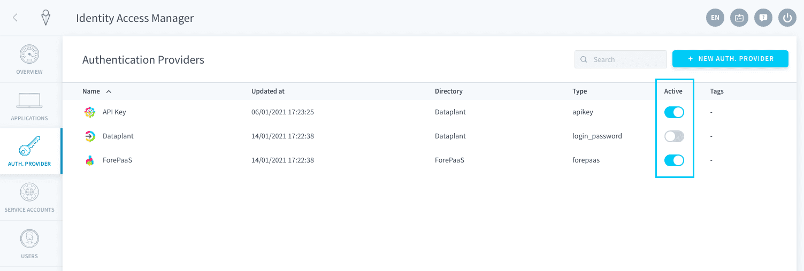
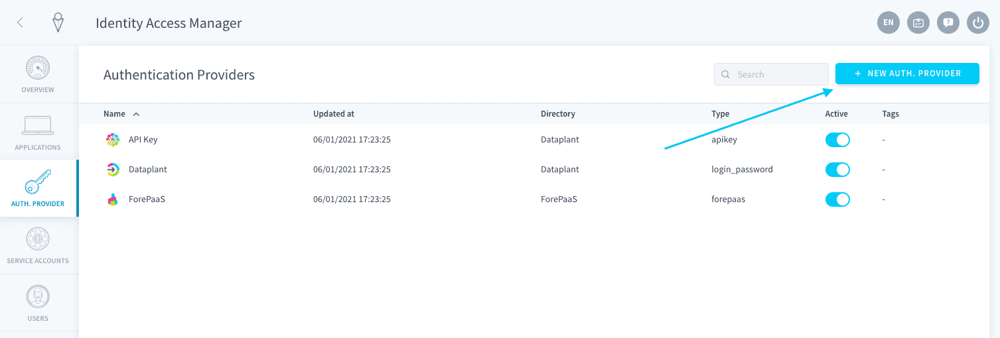
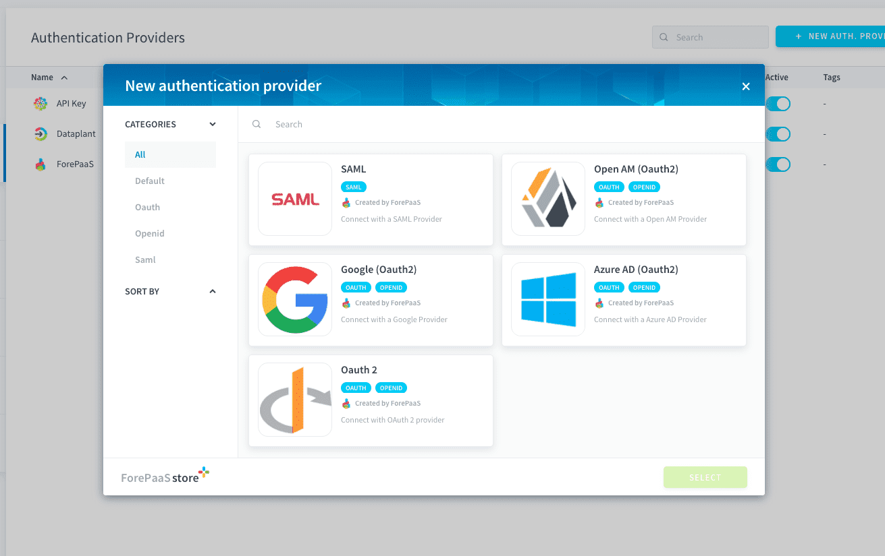
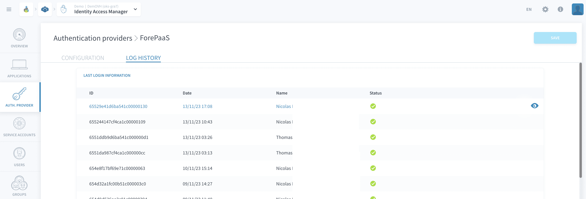
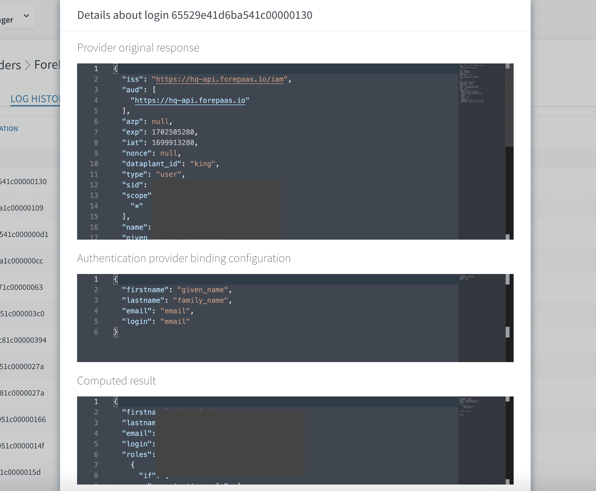
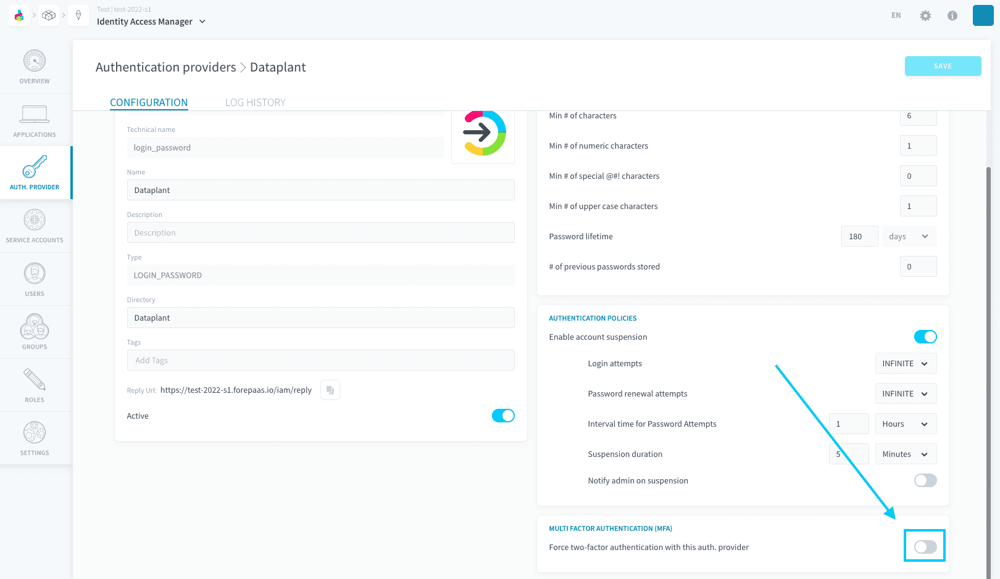
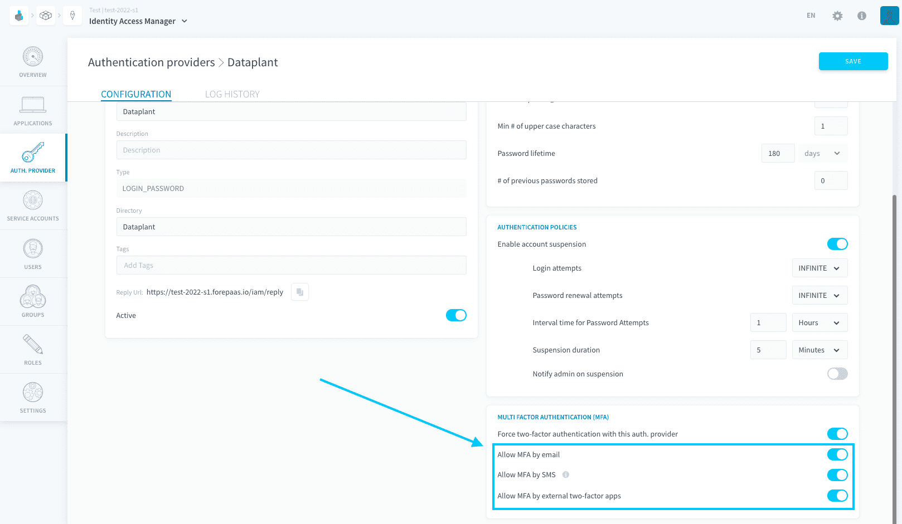

# Authentication providers

The Identity Access Manager (IAM) lets you configure the authentication methods used to login to **your Project and your applications**.

You can set any authentication provider as active or inactive. Setting an authentication provider as inactive means that it can no longer be used to authenticate to a Project or an application.



* [Default Data Platform authentication providers](#default-data-platform-authentication-providers)
* [Add an authentication provider](#add-an-authentication-provider)
  * [List of available external authentication providers](#list-of-authentication-providers)
  * [Automatically map roles/groups from your authentication provider](#automatically-map-rolesgroups-from-your-authentication-provider)
  * [Troubleshoot authentications from your external authentication provider](#troubleshoot-authentications-from-your-external-authentication-provider)
* [Authentication policies](#authentication-policies)
* [Enable multi-factor authentication (MFA)](#enable-multi-factor-authentication-mfa)


---
## Default Data Platform authentication providers

Data Platform offers 3 default authentication providers in every Project: [**Data Platform**](#data-platform), [**Project**](#project), and [**API key**](#api-key).

### Data Platform

This is the main authentication provider for the Data Platform. It lets you use your [Data Platform account](/en/product/organisations/create-account) that you created when you first joined the platform. 

> It is hosted in the Cloud Management Platform, which serves all organizations and Projects that you are part of.


### Project

This is a simple sign-in-by-email method provided by the [Project IAM](/en/product/iam/project-iam/index.md) for all applications deployed on this Project. It provides an easy method to invite end-users to your applications without having them create an account on Data Platform. 

> It is hosted in the Project itself, which means all user information is stored within the Project itself and not shared with other Projects.


### API key

API keys are usually used to let users connect using [API and secret keys](/en/product/iam/users/api-secret-key). Their main purpose is for advanced or custom configuration using [Data Platform APIs](/en/technical/api-reference/index). 

!> This authentication method must be active for external users or applications to connect to the Project via API.


---
## Add an authentication provider

Click on the *+New auth. provider* button. 



### List of authentication providers

Data Platform supports 7 external [single sign-on](https://en.wikipedia.org/wiki/Single_sign-on) providers:

| Provider | Type | Description |
| :---- | :---- | :---- |
| **Azure AD** | OAuth 2.0 | Active Directory (AD) is a directory service that Microsoft developed for the Windows domain networks. |
| **Okta** | OAuth 2.0 | Okta provides cloud software that helps companies manage and secure user authentication into applications. |
| **Auth0** | OAuth 2.0 | Auth0 is a cloud-based identity authentication platform for application developers. |
| **Google** | OAuth 2.0 | Google SSO is the authentication protocol of Google. |
| **Open AM** | OAuth 2.0 | OpenAM is an open-source access management, entitlements and federation server platform supported by the Open Identity Platform Community. |
| **Open ID** | OAuth 2.0 | OpenID is an open standard and decentralized authentication protocol promoted by the non-profit OpenID Foundation. |
| **SAML 2.0** | SAML 2.0 | Security Assertion Markup Language 2.0 (SAML 2.0) is a version of the SAML standard for exchanging authentication and authorization data between security domains.  |




You can then configure your new authentication provider. The configuration depends on the provider.

{Learn how to plug in your Azure AD}(#/en/product/iam/auth-provider/azure_ad)
{Learn how to plug in your Okta}(#/en/product/iam/auth-provider/okta)
{Learn how to plug in your Auth0}(#/en/product/iam/auth-provider/auth0)

### Automatically map roles/groups from your authentication provider

Automatically map groups or roles on Data Platform using permissions that were already set up in your authentication provider.

{Configure custom mapping of groups/roles}(#/en/product/iam/auth-provider/custom-mapping)


### Troubleshoot authentications from your external authentication provider

?> This feature is only available for [external authentication providers](/en/product/iam/auth-provider/index.md?id=list-of-authentication-providers), and for the [Data Platform authentication provider](#data-platform).

It is possible to troubleshoot the external authentication provider configuration by logging the requests to the external server and the responses received from the server. By viewing what the identity provider sends back for each login request and how it is interpreted by Data Platform, this allows you to detect errors in a configuration such as the user information or the [mapping](/en/product/iam/auth-provider/index?id=automatically-map-rolesgroups-from-your-authentication-provider).

Login logs are available in the *Log history* tab of an existing authentication provider.



Opening a specific login will display:
- the raw response received from the external authentication server
- the configuration used by Data Platform to map user information to data sent by the external server
- the result that is interpreted using the two aforementioned payloads: this is the final user information in the IAM as computed from the external authentication server. 



---
## Authentication Policies

This section describes how to configure the authentication policies for account suspension due to multiple failed attempts. The settings are designed to enhance the security of user accounts by defining thresholds and actions to take when those thresholds are exceeded.

| **Setting**                        | **Description**                                                                                     | **Options/Default**            |
|------------------------------------|-----------------------------------------------------------------------------------------------------|--------------------------------|
| **Enable Account Suspension**      | This toggle enables or disables the account suspension feature.                                     | Enabled (On)                   |
| **Login Attempts**                 | Specifies the number of failed login attempts allowed before the account is suspended.              | Infinite (∞)                   |
| **Password Renewal Attempts**      | Specifies the number of failed password renewal attempts allowed before the account is suspended.   | Infinite (∞)                   |
| **Interval Time for Password Attempts** | Defines the time window for considering the number of failed password attempts.                        | 1 Hour (default), adjustable   |
| **Suspension Duration**            | Defines the duration for which the account remains suspended after reaching the failed attempts threshold. | 5 Minutes (default), adjustable   |
| **Notify Admin on Suspension**     | This toggle enables or disables email notifications to the administrator when an account is suspended. | Disabled (Off) by default      |

---
## Enable multi-factor authentication (MFA)

Multi-factor authentication (MFA) is a feature which forces users to go through a second method of authentication in addition to their usual method. The available authentication methods are:
- a code sent by email
- a code sent by SMS
- a code retrieved on a two-factor app (e.g. Google Authenticator, Microsoft Authenticator, etc..)

!> MFA enforcement at project-level is only available for the [Dataplant](/en/product/iam/auth-provider/index?id=dataplant) authentication method. In other words, if the user is logged in through their [Data Platform account (Data Platform ID)](#data-platform) (or any other registered authentication provider in the project) they will bypass the MFA requirement in the project (as the MFA enforcement should be delegated to the third-party system in this case).

> It is possible for an admin of an organization to enforce MFA on the [Data Platform ID](/en/product/iam/auth-provider/index?id=dataplant) authentication method for a whole organization, by turning on the option in the [organization settings](/en/product/organisations/orga_settings?id=settings). For single sign-on from other authentication providers, the MFA enforcement should be delegated to the third-party system.

To enforce MFA in your Project for the [Dataplant](/en/product/iam/auth-provider/index?id=dataplant) authentication method, open the *Dataplant* authentication provider, find the panel "Multi factor authentication (MFA)" and turn it on.



Choose the methods you will allow your users to authenticate with. 

Methods have the following requirements:
- **Email**: none
- **SMS**: a phone number must be registered on the [user's page](/en/product/iam/users/users.md) for this option to be enabled
- **External two-factor apps**: a 2FA app code **must be generated** by an administrator from the [user's IAM page](/en/product/iam/users/users.md) for this option to work. Users will NOT be able to self-generate a code from the app they are logging to.



After you save, any user logging in via their *Dataplant ID* will always need to authenticate through a second method.

!> If the Dataplant ID is used for one or more [Data Platform apps](/en/product/app-manager/index), you must update the *CAM/IAM* extension of all your apps or your users will no longer be able to login.

### Migrate an app to IAM 1.4.0

#### 1 - Update the version of *client-authority-manager* module

- Open `./forepaas.json` file (root level of app)
- Edit "client-authority-manager" : "XXX" to "client-authority-manager" : "1.4.0"
- **Reload** modules in App Manager Overview above **Versions**. If you work locally, use  
command `npx git+https://gitlab.forepaas.com/open-sources/fppm.git install -f``
- Check version update by opening `./forepaas/client-authority-manager/forepaas.json` and looking at `version`

#### 2 - Add new translation to i18n configuration

- Edit `./config/i18n/en.json`
- Add these lines:

```json
"authentication.mfa.authenticator": "Use authenticator app",
"authentication.mfa.authenticator.code_label": "Enter the code from the two-factor app on your mobile device. If you’ve lost your device, please contact your admin to regenerate an authentication code",
"authentication.mfa.authenticator.send": "Activate",
"authentication.mfa.code": "XXXXXX",
"authentication.mfa.description": "Two-factor authentication is required to reach this page.",
"authentication.mfa.description2": "Please select one of the methods below to authenticate.",
"authentication.mfa.email": "Send me an email",
"authentication.mfa.email.code_label": "Enter the code you received by email",
"authentication.mfa.email.resend": "Resend email",
"authentication.mfa.email.send": "Send email",
"authentication.mfa.email.send.success": "An email containing an authentication code has been sent to you",
"authentication.mfa.no-phone": "You don’t have a registered phone number. Please ask your admin to add your phone number to your user info to be able to use this method.",
"authentication.mfa.send.authenticator": "An email containing a QR code has been sent to you. Please scan it with your external two-factor app to activate MFA for Data Platform.",
"authentication.mfa.sms": "Send me an SMS",
"authentication.mfa.sms.code_label": "Enter the code you received by SMS",
"authentication.mfa.sms.resend": "Resend SMS",
"authentication.mfa.sms.send": "Send SMS",
"authentication.mfa.sms.send.success": "An SMS containing an authentication code has been sent to you"
```

- Edit `./config/i18n/fr.json`
- Add these lines

```json
"authentication.mfa.authenticator": "Utiliser une app Authenticator",
"authentication.mfa.authenticator.code_label": "Saisissez le code de l'application à deux facteurs sur votre appareil mobile. Si vous avez perdu votre appareil, veuillez contacter votre administrateur pour régénérer un code d'authentification",
"authentication.mfa.authenticator.send": "Activer",
"authentication.mfa.code": "XXXXXX",
"authentication.mfa.description": "Une authentification à deux facteurs est requise pour accéder à cette page.",
"authentication.mfa.description2": "Veuillez sélectionner l'une des méthodes ci-dessous pour vous authentifier.",
"authentication.mfa.email": "M'envoyer un email",
"authentication.mfa.email.code_label": "Entrez le code que vous avez reçu par email",
"authentication.mfa.email.resend": "Réenvoyer email",
"authentication.mfa.email.send": "Envoyer email",
"authentication.mfa.email.send.success": "Un email contenant un code d’authentification vient de vous être envoyé.",
"authentication.mfa.no-phone": "Vous n'avez pas de numéro de téléphone enregistré. Veuillez demander à votre administrateur d'ajouter votre numéro de téléphone à vos informations utilisateur pour pouvoir utiliser cette méthode.",
"authentication.mfa.send.authenticator": "Un email contenant un code QR vous a été envoyé. Veuillez le scanner avec votre application externe pour activer l’authentification a multiple facteurs pour Data Platform.",
"authentication.mfa.sms": "M'envoyer un SMS",
"authentication.mfa.sms.code_label": "Entrez le code que vous avez reçu par SMS",
"authentication.mfa.sms.resend": "Renvoyer SMS",
"authentication.mfa.sms.send": "Envoyer SMS",
"authentication.mfa.sms.send.success": "Un SMS contenant un code d’authentification vient de vous être envoyé."
```


---
##  Need help? 🆘

> At any step, you can create a ticket to raise an incident or if you need support at the [OVHcloud Help Centre](https://help.ovhcloud.com/csm/fr-home?id=csm_index). Additionally, you can ask for support by reaching out to us on the Data Platform Channel within the [Discord Server](https://discord.com/channels/850031577277792286/1163465539981672559). There is a step-by-step guide in the [support](/en/support/index.md) section.

