# Set up SSO authentication with Okta

Are you using [Okta](https://www.okta.com/) for your identity and user management and want to use it to login to your Data Platform apps? Just follow this guide to get started in no time.

Open the IAM and click on **Auth. Provider**.


If you haven't done so already, [add a new](/en/product/iam/project-iam/auth-provider/index.md?id=add-an-authentication-provider) *Okta* authentication provider on Data Platform. Else, just edit it.

The configuration is done in two parts. First you need to [configure the rights on Okta](#configuration-on-okta) and then [configure the authentication provider in the Data Platform Identity Access Manager](#configuration-on-the-data-platform-identity-access-manager).


---
## Configuration on Okta

You need to register Data Platform as an application on your Okta environment. Open your Okta environment.


The configuration on Okta consists of 4 easy steps:
* [Register the Identity Access Manager on Okta](#step-1-register-the-identity-access-manager-on-okta)
* [Retrieve the Domain](#step-2-retrieve-the-domain)
* [Retrieve the Client ID](#step-3-retrieve-the-client-id)
* [Retrieve the Client Secret](#step-4-retrieve-the-client-secret)


### Step 1. Register the Identity Access Manager on Okta

?> Note that the interface of Okta may change over time, and screenshots could be outdated. Please refer to the [Okta documentation portal](https://help.okta.com/en/prod/Content/index.htm) if you are unable to find some of the features listed below.

You need to register an application inside of Okta. This works with any app you would like to connect to Okta but in this case, you are going to register the Data Platform IAM directly.

In the sidebar, select **Applications**. Then click on *Create App Integration*. 

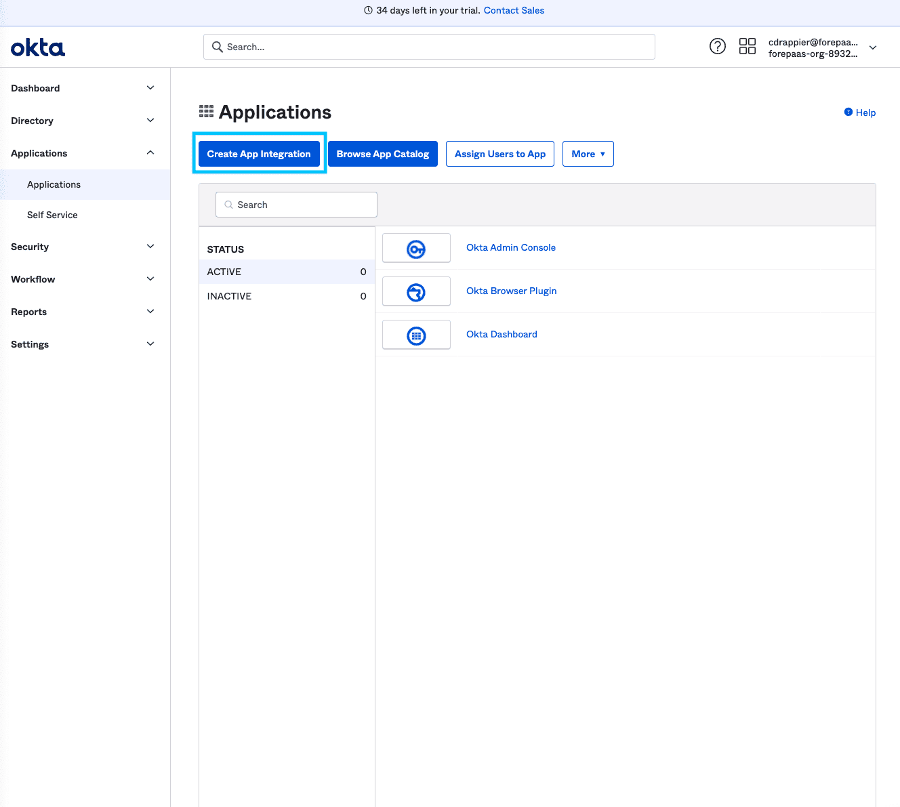  


Select *OIDC (OpenID Connect)* as the method and *Web Application* as the application type.

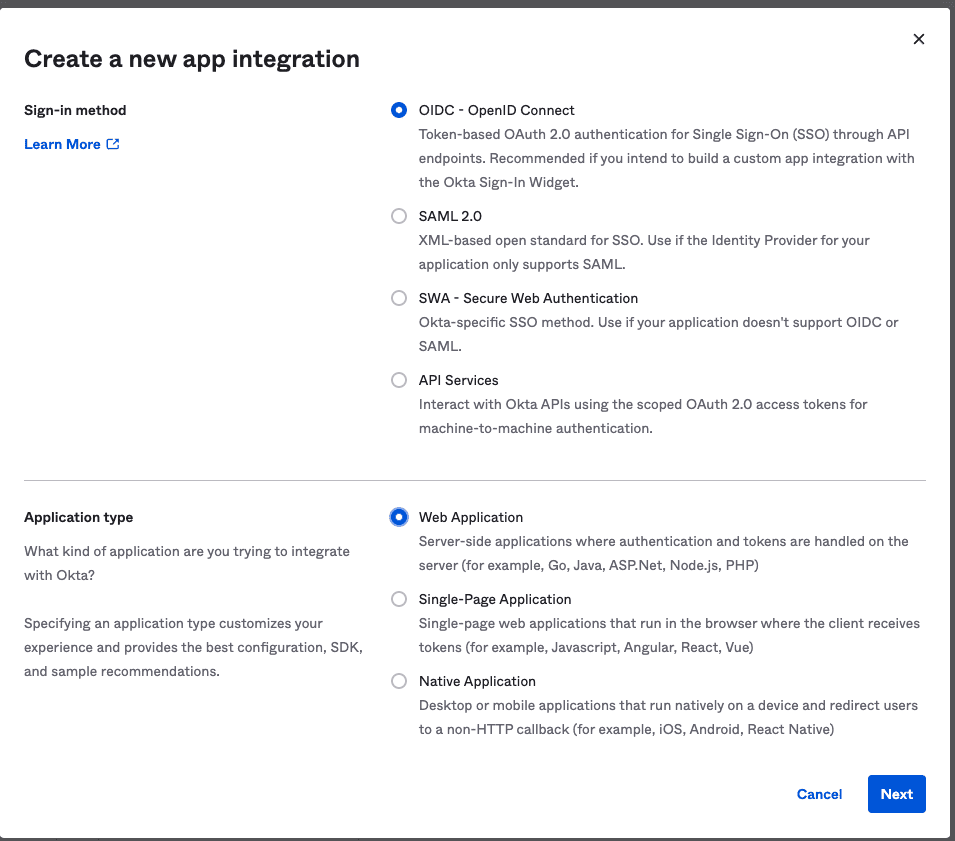  

Press **Next**.

#### *Callback URL*

Give the name of your choice to this new application and make sure that the Grant Type is *Authorization Code*.

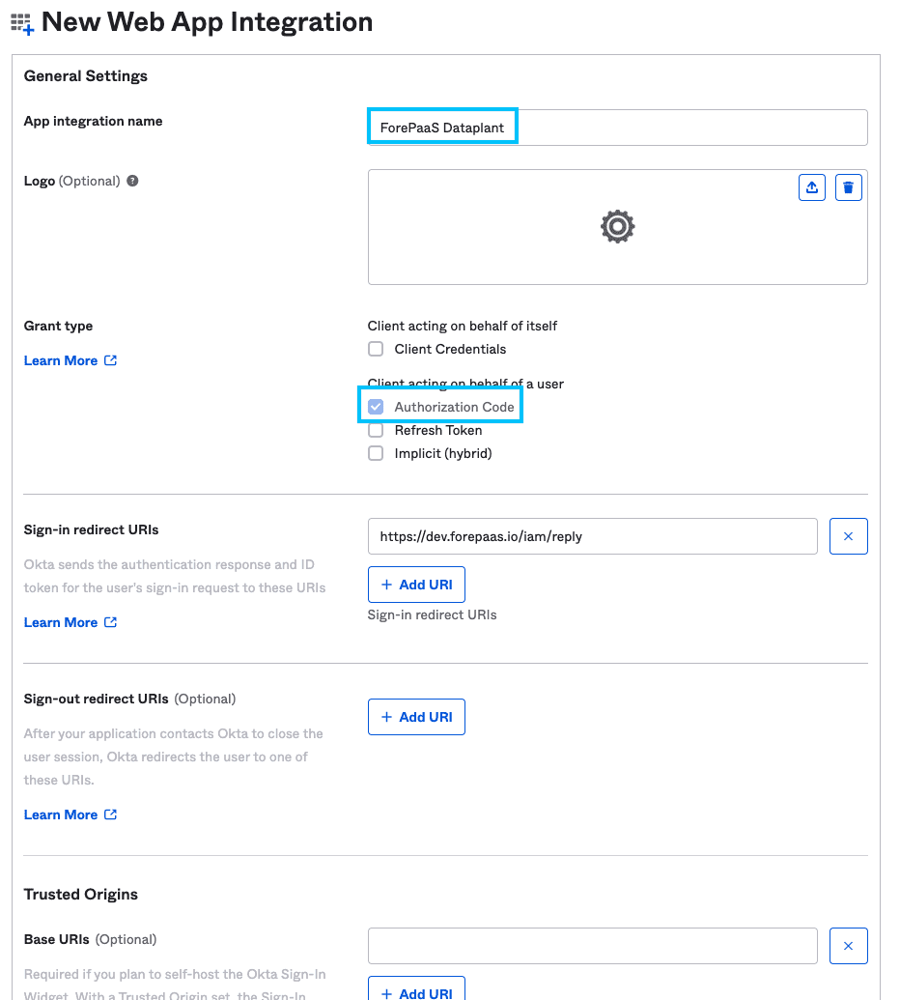  

Scroll down to the **Sign-in Redirect URIs** section.

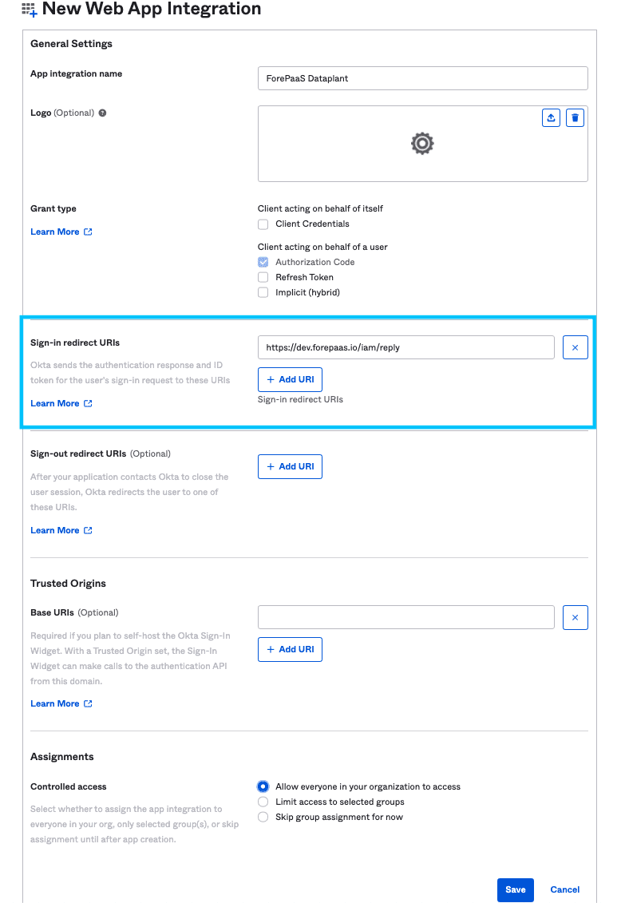

In the URL field, copy and paste the **Reply URL** field in the new authentication provider you added on Data Platform (it is the same for the entire Data Platform IAM).

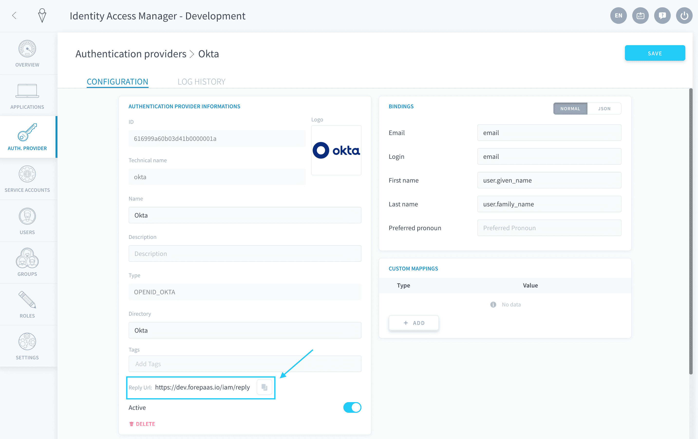

Save the new application integration.


### Step 2. Retrieve the Domain

The Domain is the equivalent of your tenant id on Okta. You can find it in the General Settings of the application: look for the **Okta domain** section.

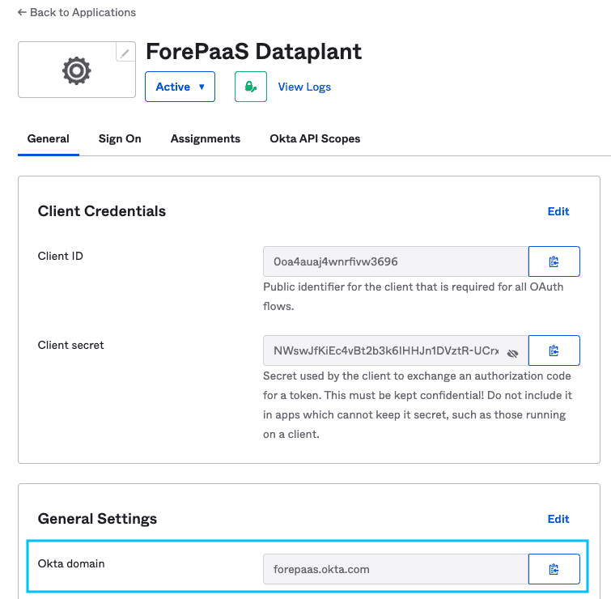

?> Note that this Domain will be required later on during the IAM configuration.


### Step 3. Retrieve the Client ID

The Client ID is specific to your application. You can find it in the Client Credentials of the application: look for the **Client ID** section.

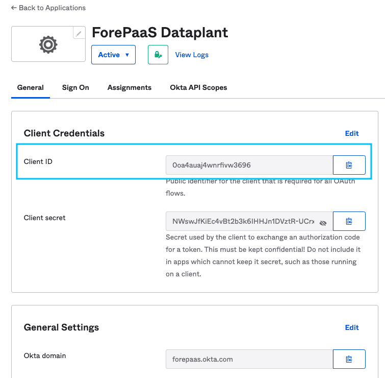

?> Note that this Client ID will be required later on during the IAM configuration.


### Step 4. Retrieve the Client Secret

The Client Secret is specific to your application. You can find it in the Client Credentials of the application: look for the **Client secret** section.

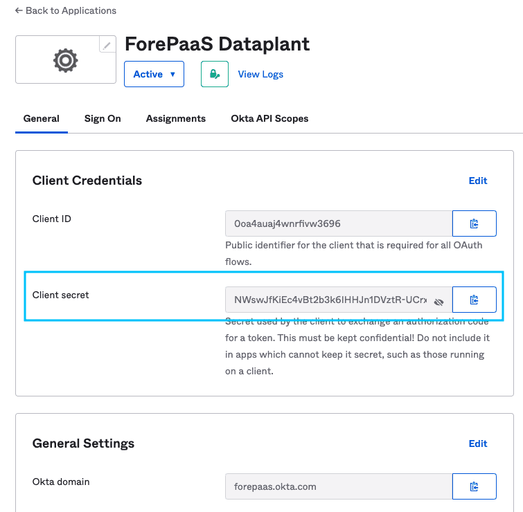

?> Note that this Client Secret will be required later on during the IAM configuration.


### Summary
If you have properly followed all the previous steps, you should have this list of information.

```
Okta domain (Step 2): xxxxxxxxxx.okta.com
Client ID (Step 3): XXXXXXXXXXXXXXXXXXXXXXXXXXXXXXXX
Client secret (Step 4): XXXXXXXXXXXXXXXXXXXXXXXXXXXXXXXX
```
> If you want to further customize the configuration of your new application from the Okta portal, we recommend you check out [Okta's documentation](https://developer.okta.com/).


---
## Configuration on the Data Platform Identity Access Manager
You now have to configure your new authentication provider in your Data Platform Identity Access Manager.

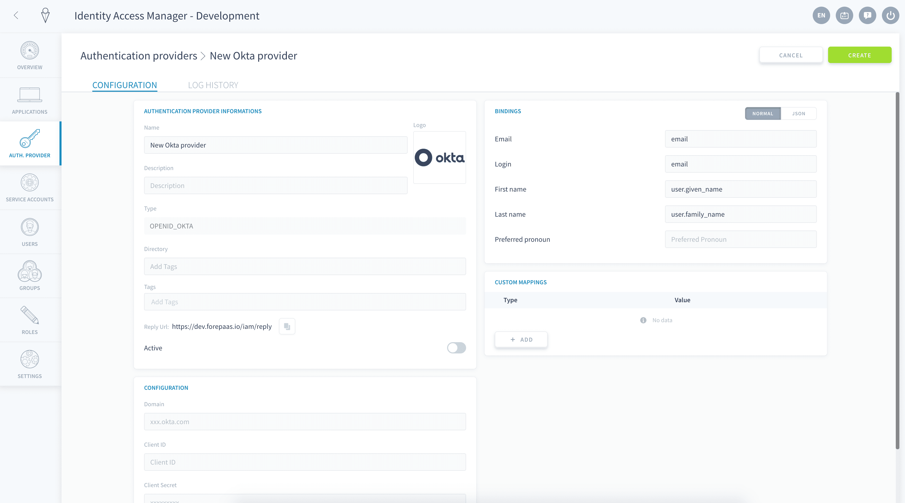


### Fill in the basic information

- **Name / Description**: This is the internal name and description for your new authentication method
- **Directory**: This is a unified tag for all accounts that will be created from this directory. For example, you can input *Okta*
- **Tags**: This offers more tagging options. They are completely optional
- **Reply URL**: This is the Data Platform URL where your authentication provider redirects to
- **Active**: This specifies whether this authentication provider can be used to login or not


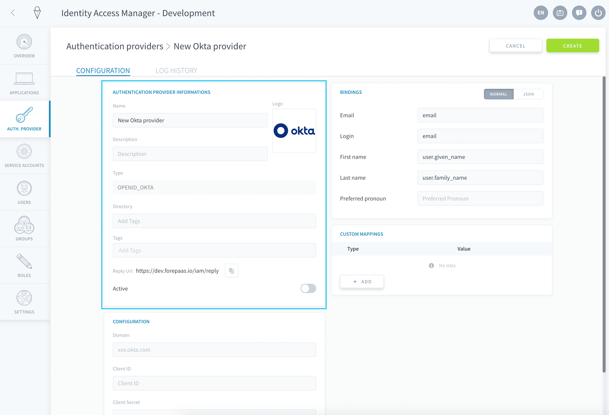


### Fill in Okta configuration

Now locate the **Okta Configuration** panel.

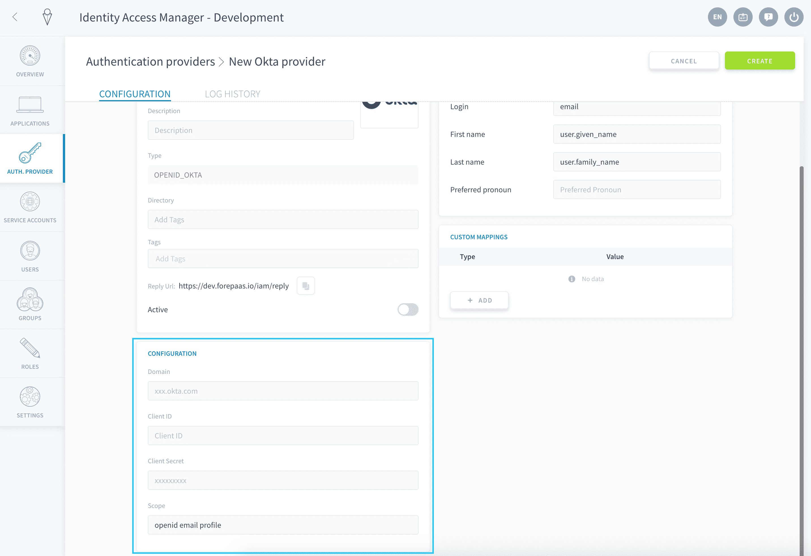

Fill in the information collected on Okta in the previous section, as such:
- **Domain**: *Okta domain* (retrieved in [step 2](#step-2-retrieve-the-domain) of the configuration on Okta)
- **Client ID**: *Client ID* (retrieved in [step 3](#step-3-retrieve-the-client-id) of the configuration on Okta)
- **Client Secret**: *Client secret* (retrieved in [step 4](#step-4-retrieve-the-client-secret) of the configuration on Okta)
- **Scope**: This represents how much information Data Platform will be able to access from your Okta. This field is optional: the default value is `openid email profile`


### Fill in the bindings rules

The **Bindings** panel allows you to customize the mapping of the fields between Okta and Data Platform. 

Email, login, first and last name are mapped by default.

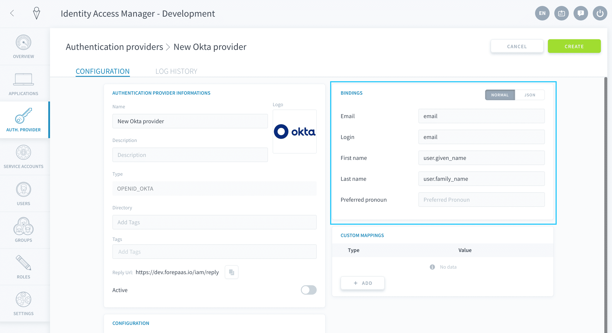

Bindings can be overriden if you need to save additional information from Okta into your Data Platform Identity Access Manager, like the job title. 

The easiest way to configure bindings is to retrieve a response from a login of an user by following these steps:
  
*1* - Do a sample login to any Data Platform application using your newly configured Okta authentication provider.  
*2* - Open the **Log History** page of the IAM authentication provider (here Okta).

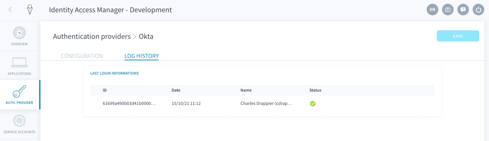

*3* - Open the latest log: the original response from Okta will look like this:  

```json

{
  "sub": "00u4au2tpeFfNw3uR696",
  "name": "John Smith",
  "email": "jsmith@forepaas.com",
  "ver": 1,
  "iss": "https://forepaas.okta.com",
  "aud": "4j63bjk34b6jk3b",
  "iat": 1634310728,
  "exp": 1634314328,
  "jti": "ID.TRhY73q_LejPMKVxrt936nLTLaayJJgPMni78ww0ouQ",
  "amr": [
    "mfa",
    "pwd",
    "otp"
  ],
  "idp": "00o4au2o4QD29JO5Q696",
  "preferred_username": "jsmith@forepaas.com",
  "auth_time": 1634310281,
  "at_hash": "OExX1fo9d8vq-z2-vZtkIg",
  "user": {
    "sub": "00u4au2tpeEfNw3uR696",
    "name": "John Smith",
    "locale": "en-US",
    "email": "jsmith@forepaas.com",
    "preferred_username": "jsmith@forepaas.com",
    "given_name": "John",
    "family_name": "Smith",
    "zoneinfo": "America/Los_Angeles",
    "updated_at": 1634310506,
    "email_verified": true
  }
}

```
*4* - On top of the default email, login, first and last name, any additional property from Okta can be saved as a custom `configuration.XXX` field on Data Platform by using the "JSON" mode. 

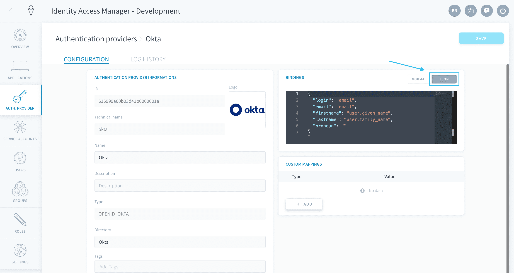

For example, you can add a *fullname* property on Data Platform from the `name` field from Okta:  

```json
{
  "login": "email",
  "email": "email",
  "pronoun": "",
  "firstname": "user.given_name",
  "lastname": "user.family_name",
  "configuration.fullname": "name"
}
```

> Test the result of your bindings by checking the logs of further test connections in Log History: the *Computed Result* section of each login will show what properties have been saved in Data Platform.


### Custom mappings

The **Custom mappings** panel allows you to automatically assign all users logged in through this authentication provider to a role or a group.

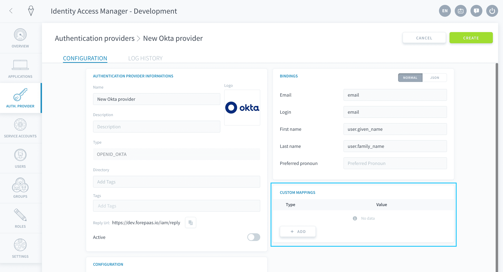

[Learn how to set up custom mappings.](/en/product/iam/project-iam/auth-provider/custom-mapping)


### Set live
You are all set configuring your Okta connector! If you haven't done it already, click on **Create** - else make sure to **Save**.

In the Authentication Providers list, you now see your new method. Make sure you set it as *active*.

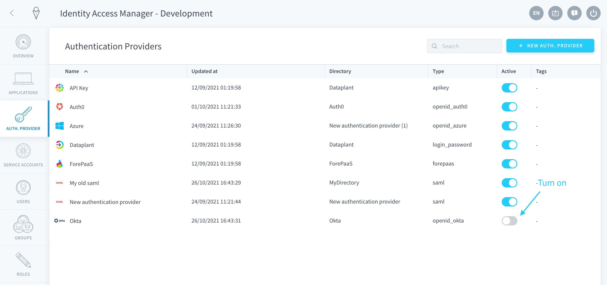

Make sure this new authentication method [is visible](/en/product/iam/application/login.md?id=display-an-authentication-provider-on-an-application-login-page) for the applications of your choice. You should now see an Okta option on your application's login page. By clicking on it, you will be redirected to the Okta login screen, or directly into the app if you are already logged into your account.

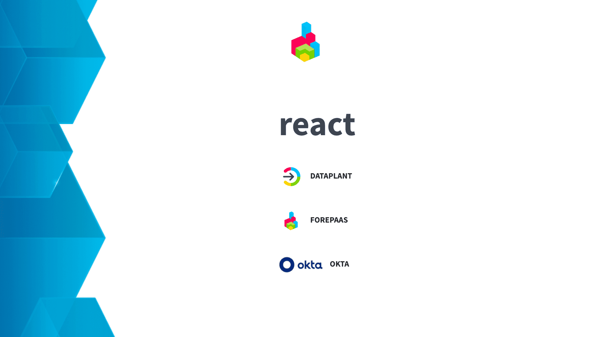

[Make Okta visible on your apps' login page](/en/product/iam/application/login.md?id=display-an-authentication-provider-on-an-application-login-page)


---
## Struggling to set it up by yourself❓

That's fine, tell us how we can help. Get in touch on our support portal or reach out at support@forepaas.com.