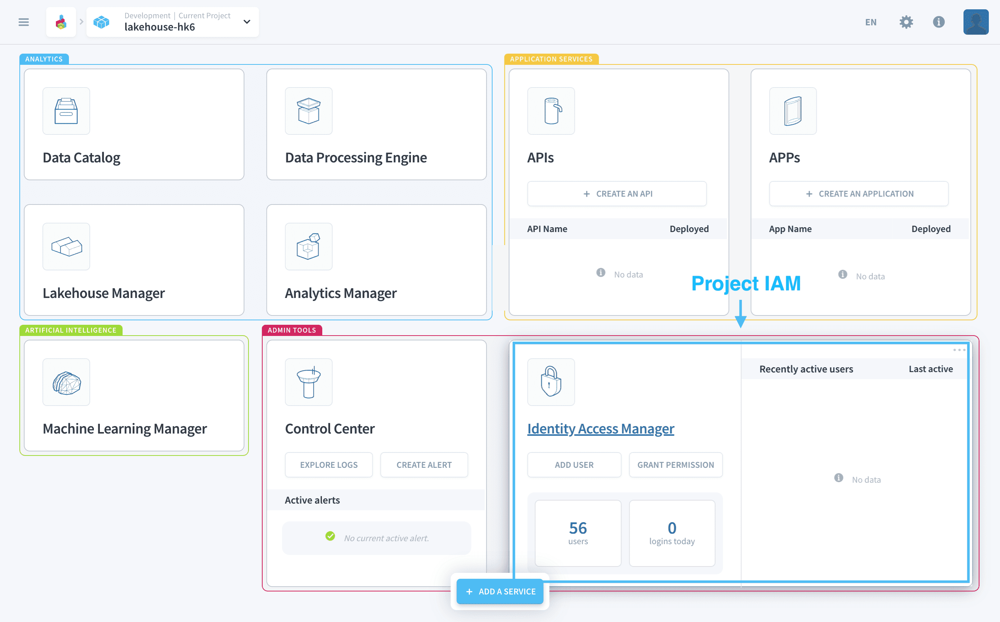

# Project IAM

The Project IAM centralizes the management of your **team member access to project resources** and **your end-users and their authentication** to your Project's applications. 

In the Project IAM you will be able to:
* Define login pages for deployed **applications**.
* Set-up **authentication providers** to enable login to the Project via external solutions.
* Use our very granular access control system to [manage team members and end-users access-rights to the Project's resources](/en/product/iam/users/index.md).

---
## Applications

Any deployed application in the Platform will be visible in the **Applications** tab. Through that tab you will be able to define a specific login page for the applications, in particular this means:
* Changing the application login information such as the page design & access URL
* Choosing authentication modes by selecting from the authentication providers list

{Manage applications login pages}(#/en/product/iam/project-iam/application/index.md)

---
## Authentication Providers

In the **Auth. Provider** tab, you can set-up & configure additional providers on top of the ones available by default. This allows you to connect to external directories of users, such as your company's active directory.

Each authentication provider requires a specific configuration depending on the type of provider selected, whether its an SSO provider such as *SAML*, *JWT* or *OpenID* or a multi-factor authentication (MFA) provider such *Google Authenticator* or *SMS*.

>The Platform offers **3 providers by default** - *the platform Platform IDs*, *Project IDs* and *API/Secret Keys* - which will be added to all new applications. When adding new providers, make sure to edit your applications' authentication configurations to make the provider is available to users in the login menu of the application.

This tab is also where [multi-factor authentication (MFA)](/en/product/iam/auth-provider/index?id=enable-multi-factor-authentication-mfa) is managed. MFA is only available for the *Project ID* authentication method. For external authentication providers, the best practice is to directly use the MFA features of the external provider.

{Set-up authentication providers}(#/en/product/iam/project-iam/auth-provider/index.md)

---
##  Need help? 🆘

> At any step, you can create a ticket to raise an incident or if you need support at the [OVHcloud Help Centre](https://help.ovhcloud.com/csm/fr-home?id=csm_index). Additionally, you can ask for support by reaching out to us on the Data Platform Channel within the [Discord Server](https://discord.com/channels/850031577277792286/1163465539981672559). There is a step-by-step guide in the [support](/en/support/index.md) section.