# Groups

Groups enable you to assign the same [roles](/en/product/iam/users/roles) to multiple [users](/en/product/iam/users/users) or [service accounts](/en/product/iam/users/users?id=manage-your-dataplant-service-accounts) at once.

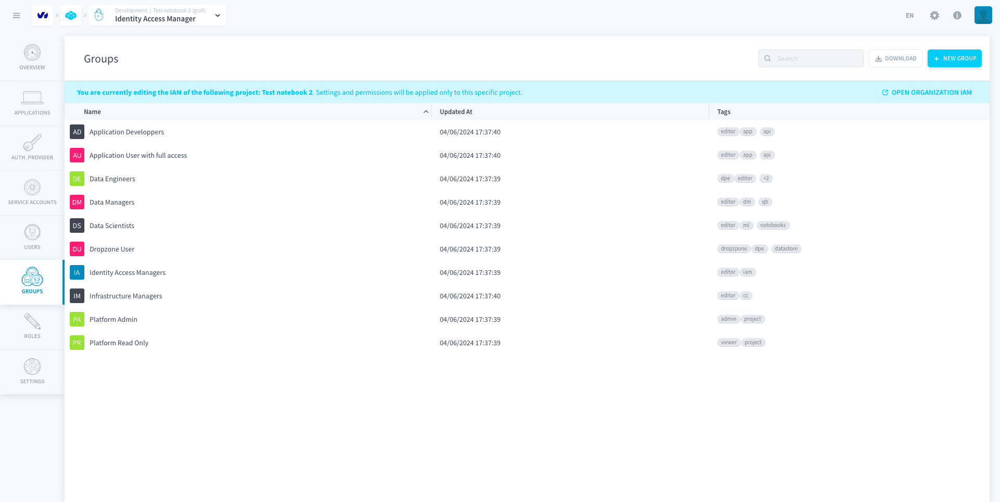

By default, some groups are pre-generated by Data Platform for you to use directly. These are called **default groups** and they **cannot be deleted**. 

For example, the default group *Data Engineers* in the [Project IAM](/en/product/iam/project-iam/index.md) gives its members editor roles for the [Data Processing Engine](/en/product/dpe/index.md), the [Lakehouse Manager](/en/product/lakehouse-manager/index.md) and the [Analytics Manager](/en/product/am/index.md).

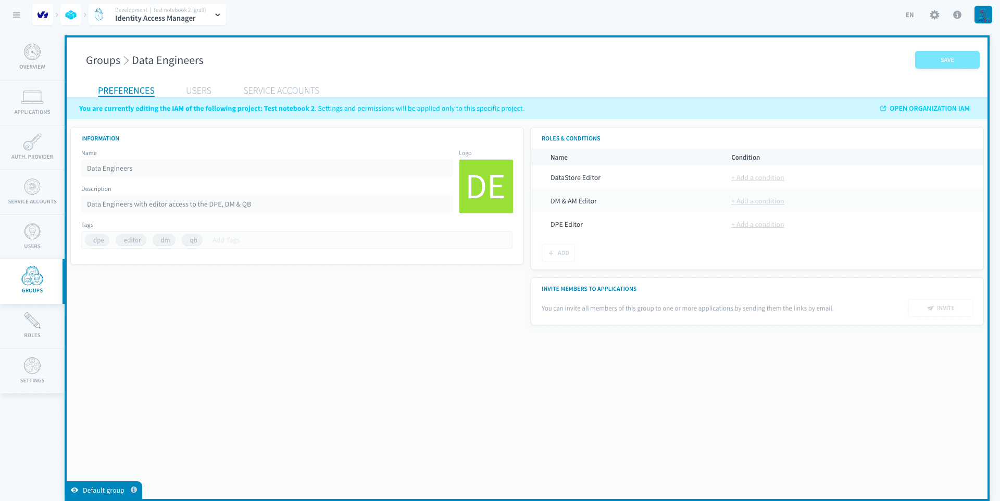

* [Create a group](/en/product/iam/users/groups.md?id=create-a-group)
* [Assign users or service accounts to a group](/en/product/iam/users/groups.md?id=assign-users-or-service-accounts-to-a-group)

?> Note that Groups **exist both in the Project and Organization IAMs**. The screenshots in this article have been taken in the Project IAM, but the steps are the same in the Organization IAM.

---
## Create a group

To create a group, head to the *Groups* tab of the Identity Access Manager. Click on **New group**.

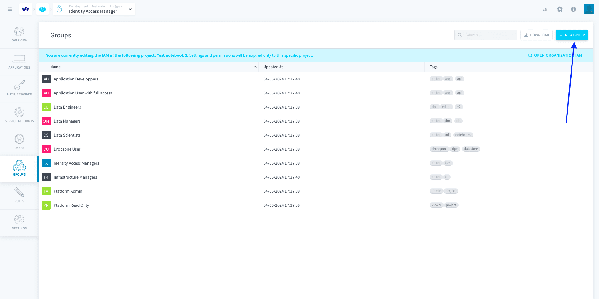

Give your group a name. You can also add a description and tags to help you manage your groups more easily.

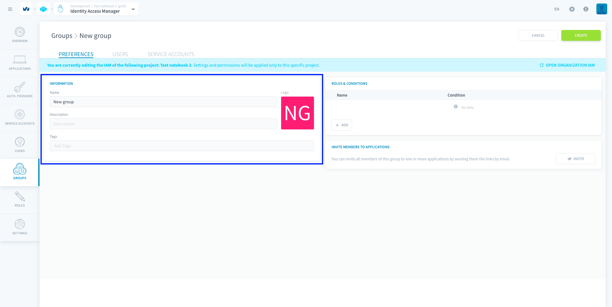

### Assign roles to a group

You can either give additional roles to the group right now, or at any time after it's been created.

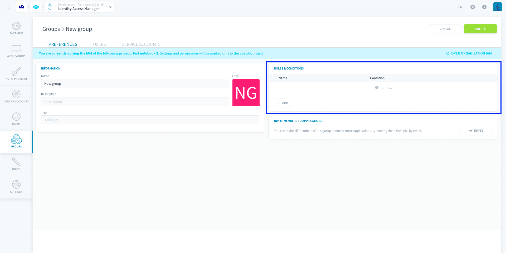

{Learn how to assign a role to a group}(#/en/product/iam/users/roles?id=bind-a-role-to-a-user-service-account-or-group)

### Finish creating your group

You can either [assign users](/en/product/iam/users/groups.md?id=assign-users-or-service-accounts-to-a-group) to the group right now, or at any time after it's been created.

To finish creating your group, press **Create**.

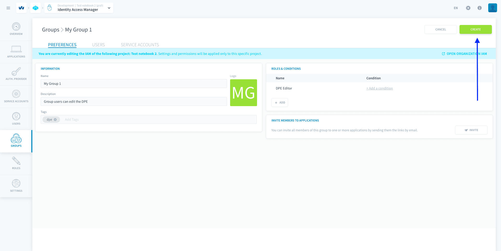

---
## Assign users or service accounts to a group

To add users or service accounts into a group, open the group and head to the corresponding tab.

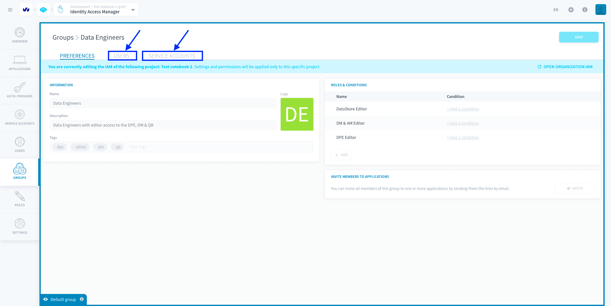

You can see the list of users / service accounts who are currently part of the group. **Users, like service accounts, can be in multiple groups**: they wind up having all the roles associated to any group they are part of.

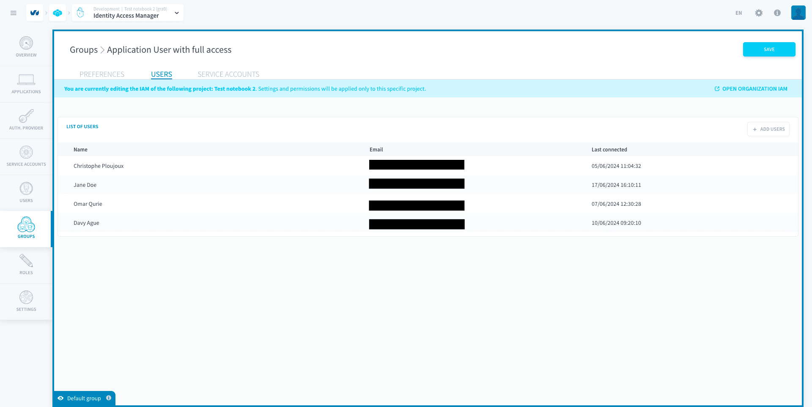

To add users / service accounts into the group, click on **Add** then select all the Project users / service accounts that you want to add to the group.

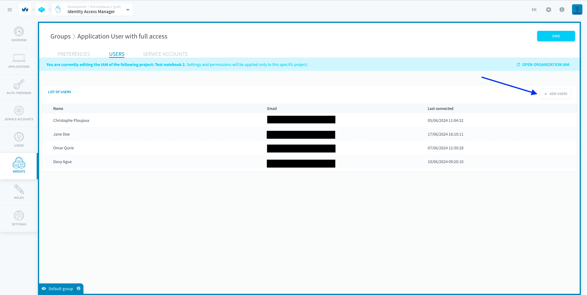
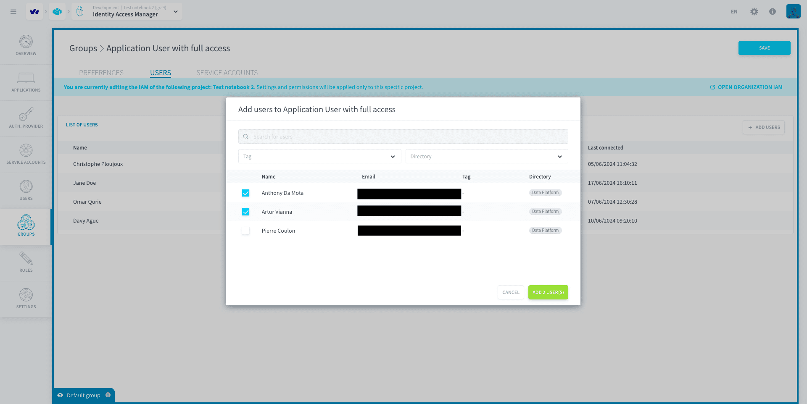

> You can also check which groups a specific user is part of by heading to the [user page](/en/product/iam/users/users) in the Identity Access Manager.

You can remove users / service accounts from a group by clicking on the **trash** icon.

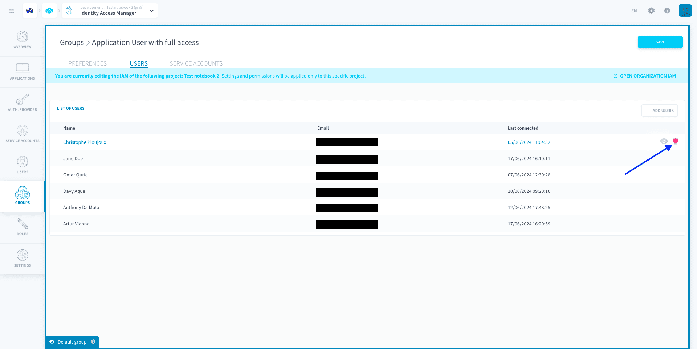

---
##  Need help? 🆘

> At any step, you can ask for support by reaching out to us on the Data Platform Channel within the [Discord Server](https://discord.com/channels/850031577277792286/1163465539981672559). you can also find a step by step guide towards joining our discord server in the [support](/en/support/index.md) section.