# Roles and conditions

Data Platform uses a [role-based access control](https://en.wikipedia.org/wiki/Role-based_access_control) approach to manage rights in Projects. **Roles** are a set of permissions that can be attributed either to a user, a service account (only in Project IAM) or a group, in order to grant them access to resources or data in your Project/Organization. **Conditions** allow to be more fine-grained and grant access only if specified conditions are met - such as if the request is made during the work hours, or if the requested resource has a certain tag.

Each user or service account has the total sum of all the permissions given to them 1) individually through roles, and 2) given to the groups they belong to.

* [Roles overview](#roles)
  * [Pre-made roles](#pre-made-roles)
  * [Create a role](#create-a-role)
  * [Bind a role to a principal](#bind-a-role-to-a-user-service-account-or-group)
* [Conditions overview](#conditions)
  * [Conditions attributes](#condition-attributes)
  * [Conditions operators](#condition-operators)
  * [Examples](#examples)
  * [Add a condition when binding a role](#add-a-condition-when-binding-a-role)

?> Note that Roles **exist both in the Project and Organization IAMs**. The screenshots in this article have been taken in the Project IAM, but the steps are the same in the Organization IAM.

---
## Roles

There are two types of roles in IAM:
- Pre-made roles: which provide access for popular combinations of services and resources in a Project or Organization. These are managed by Data Platform.
- Custom roles: which provide fine-grained access based on a user-specified list of permissions.

### Pre-made roles

Data Platform comes with many pre-made IAM roles designed to help you grant the typical permissions for any Project or Organisation easily.

For instance, here is the list of pre-made roles in the Project IAM, starting with the most popular ones:
- *Admin*: gives full admin access to the entire Project
- *Application User*: gives access to query the [custom APIs](/en/product/api-manager/index) of the Project, typically from an [application](/en/product/app-manager/index). This is typically the role that you would grant to your end-users that need to access your apps, controlling data access using [a role condition](#add-a-role-condition-on-specific-data-values)
- *Analytics Consumer*: this is typically given to users who will run analytics using an [external consumer](/en/product/am/consumers/index). The role gives read access to data sources and tables, and the ability to create and run queries on them.
- *Dashboard Editor*: gives permissions to create queries and dashboards in the [Analytics Manager](/en/product/am/index)
- *Dashboard Viewer*: gives permissions to access the read-only version of dashboards in the [Analytics Manager](/en/product/am/index)
- *Read-only*: gives read-access to all resources on the Project
- *AM Admin*: gives full admin access to all resources in the [Analytics Manager](/en/product/am/index)
- *API & App Editor*: gives full admin access to all [custom APIs](/en/product/api-manager/index) and [applications](/en/product/app-manager/index)
- *Control Center Editor*: gives full admin access to all resources in the [Control Center](/en/product/cc/index)
- *LM & AM Editor*: gives full admin access to all resources in the [Lakehouse Manager](/en/product/lakehouse-manager/index) (except Buckets) and the [Analytics Manager](/en/product/am/index)
- *DPE Editor*: gives full admin access to all resources in the [Data Processing Engine](/en/product/dpe/index)
- *DataStore Editor*: gives full admin access to all resources in the [Buckets](/en/product/lakehouse-manager/buckets/index)
- *Identity Access Manager Editor*: gives full admin access to all resources in the [Identity Access Manager](/en/product/iam/index)
- *ML Editor*: gives full admin access to all resources in the [Machine Learning Manager](/en/product/ml/index)

?> Note that the list of default roles is different for the Organisation IAM since the permissions and typical use cases are different.

### Create a role
#### From the Identity Access Manager interface
In the Identity Access Manager, open the **Roles** tab. Click on **New Role** at the top-right of the screen.

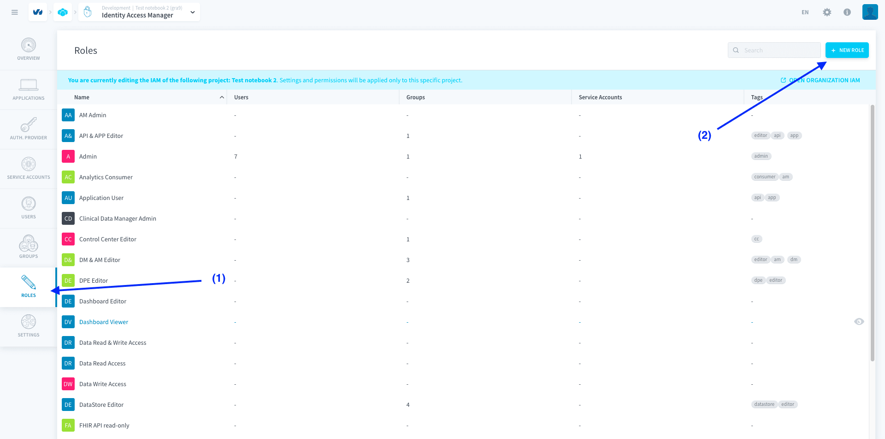


Roles are defined by the atomic *permissions* they contain, which are rights on specific resources.  
After you fill out the picture, name, description and tags of your role, click on **Add Permission** to add a new permission to the role.

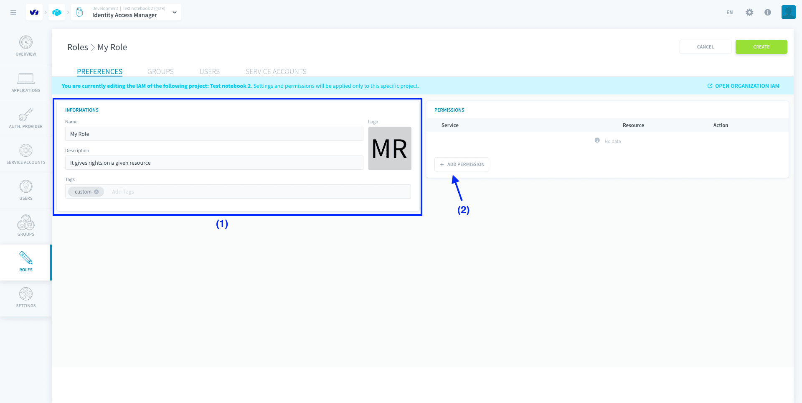

Permissions are defined by specifying the following elements:
- the **service** and the **resource**, i.e the Project resource given access to by the permission (e.g in Data Processing Engine: actions, workflows, etc.)
- the **action**, i.e. which access is given to this service and resource (e.g. create, read, delete, etc.)

> The asterisk (*****) value means all services/resources/actions are selected

?> [Conditions](#conditions) on a property of the resource or user agent can be set during the binding of the role with a user or a group.

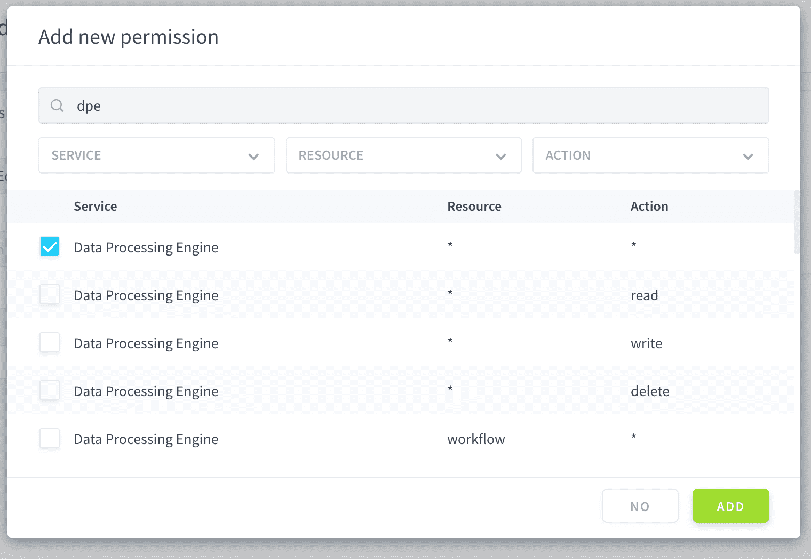

You can add as many permissions as you want to a role. For example, the role below will have full access to the Workflows in the DPE, as well as read-only access to all components of Machine Learning.

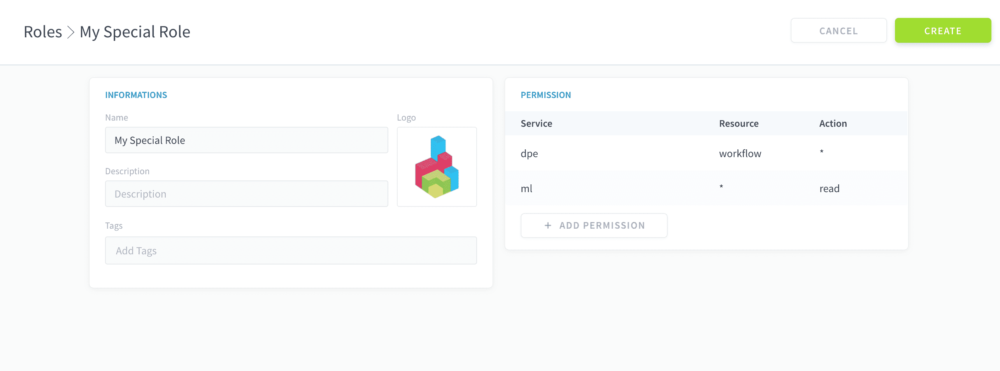

Finally, click on **Create** to save your role.


#### Using the API
```sh
# {permission} should be replaced by one or multiple permissions.
# A permission has the following format: "service:resource:action"
# e.g.:
# "iam:user:read": will give read-only access to the users list of a Project

curl --request POST \
  --url '/roles' \
  --header 'content-type: application/json' \
  --data '{
	"display_name": "My role",
	"permissions":[{permission}]
}'
```


### Bind a role to a user, service account or group

#### From the Identity Access Manager interface
The process is identical for users, service account, and groups. To bind a role to any of them, simply go to their respective tab in the Identity Access Manager.

Select the user/service account/group you want to modify, and click on the **Edit** ✏️ button at the end of the row.

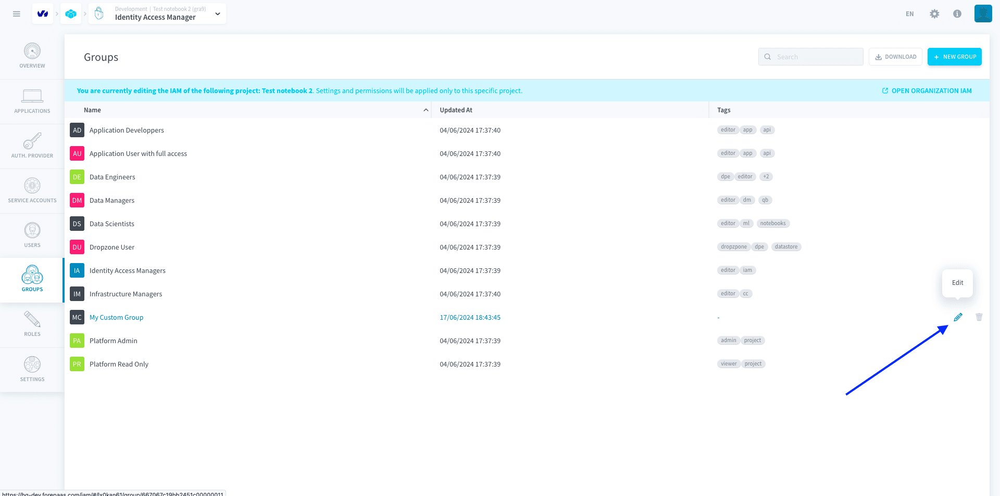

Click on **Add** in the Role Conditions box.

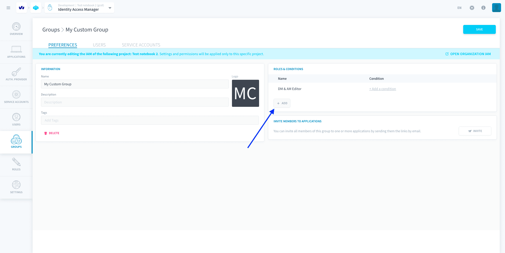

Choose the role you want to bind in the dropdown menu. You can also set a condition on the role binding (see below).

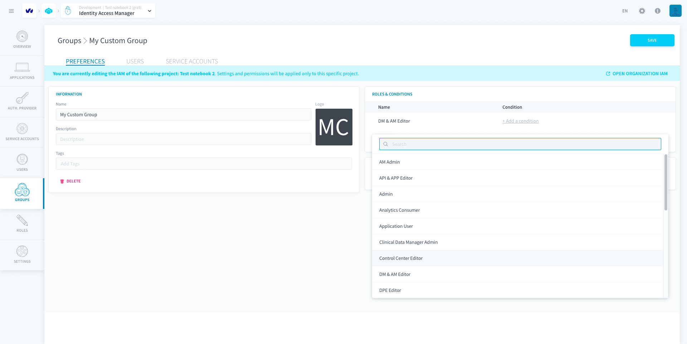

Click on **Create**, then on **Save**.

#### Using the API


```sh
# {type} should be replaced by "users", "service_accounts" or "groups"
# {id} should be replaced by the id of the user, service account or group you want to edit
# {roleId and anotherRoleId} should be the id of the roles to add

## REMEMBER that it will replace all the roles of the edited object. It won't keep other roles already there, so be careful not to remove existing roles.

curl --request PUT \
  --url '/{type}/{id}' \
  --header 'content-type: application/json' \
  --data '{
    "roles": [{
      "role":"{roleId}"
    },{
      "role":"{anotherRoleId}"
    }]
}'
```


---
## Conditions

Conditions are **filters that you can set on the permissions granted by a role** when you are [binding it](#bind-a-role-to-a-user-service-account-or-group) to a user / service account / group.
  
By default, roles are bound with no condition. Binding a role without setting a condition will give the full access with no restriction described by the permissions of this role. Adding a condition will filter the access provided by the permissions only to more specific resources, or for users validating specific properties.

> For example, if you bind a role with permission `cc:alert:write` without any condition to a user, they will be able to edit the whole list of Control Center alerts.  
However, if you add a condition such as `Name.contains("dev-")`, this role only gives the user editing-access to the alerts whose name contain _"dev-"_, and they won't be able to edit the other alerts.

2 models of conditions currently co-exist: [legacy JSON conditions](#legacy-json-conditions) and [new CEL conditions](#new-cel-conditions). It is impossible to create a legacy JSON condition on a role that now support new CEL conditions. See down below the compatibility info for each model.


### New CEL conditions

?> CEL conditions are currently unavailable for roles that contain permissions for the service *API*.

CEL conditions are expressed using [Common Expression Language (CEL)](https://github.com/google/cel-spec/blob/master/doc/langdef.md). They are made of **logic statements** that can be combined using boolean operators (AND, OR), each logic statement being constituted of the following elements:
- one attribute
- one operator (which can be a function applied on the attribute)
- a value

In general, CEL conditions can either be applied on the **resources** described by the role's permissions, on the **IAM principal** to which the role is granted (*coming soon!*), or on a combination of both. On top of this, conditions can also be applied on elements of the **permissions** granted by a role, in order to fully fine-grain the conditions to parts of the role only. See down the reference for all attributes and operators.

#### Condition attributes

The following conditions (i.e. condition's attributes) are currently available in the Identity Access Manager:
- **Conditions on the role's permissions**
  - Service (*CEL name:* `Service`): apply a condition on the Data Platform service containing the resource described by the permission (e.g. "Data Processing Engine", "Analytics Manager", etc.)
  - Resource (*CEL name:* `Resource`): apply a condition on the Data Platform resource described by the permission (e.g. "Workflows", "Dashboards", etc.)
  - Action (*CEL name:* `Action`): apply a condition on the access granted to the resource by the permission (e.g. "Read", "Write", etc.)
- **Conditions on the resources**
  - ID (*CEL name:* `Id`): apply a condition on the ID of the resource
  - Technical Name (*CEL name:* `Name`): apply a condition on the technical name of the 
resource
  - Path (*CEL name:* `Path`): apply a condition on the path of the resource
- **Conditions on the user/service account**: coming soon!

!> **WARNING**: conditions on a *read* permission are currently only enforced when getting an object from API - they are **not enforced** in the graphical interface when listing and opening objects. For example, with a role containing read-access to *IAM groups* bound with a condition on the *name of one IAM group*, a user will still be able to list, open and view all IAM groups in the GUI, but will only be able to call (GET) that one specific group by API.


#### Condition operators

The following conditions (i.e. condition's operators) are currently available in the Identity Access Manager.

?> Some operators are only available for specific attributes.

- Equals (CEL modelling: `attribute == ""`) 
- Not equals (CEL name: `attribute != ""`) 
- In (CEL name: `attribute in []`) 
- Not in (CEL name: `!(attribute in [])`) 
- Starts with (CEL name: `attribute.startsWith("")`) 
- Not starts with (CEL name: `!(attribute.startsWith(""))`) 
- Ends with (CEL name: `attribute.endsWith("")`) 
- Not ends with (CEL name: `!(attribute.endsWith(""))`) 
- Matches (CEL name: `attribute.matches("")`) 
- Not matches (CEL name: `!(attribute.matches(""))`) 
- Contains (CEL name: `attribute.contains("")`) 
- Not contains (CEL name: `!(attribute.contains(""))`) 


#### Examples

Here are some examples in Common Expression Language (CEL) of conditions:

1. Restrict access to only the resources named "demo":
```cel
Name == "demo"
```

2. Restrict access to only the workflows contained in the folder "my_folder", and full access to the other resources allowed by the role (provided the role initially gives access to workflows and other resources):
```cel
Resource != "workflow"
||
(
  Resource == "workflow"
  &&
  Path.contains("/my_folder")
)
```

3. Restrict access to only the bucket named "my_bucket" (related service name is *datastore*) and to the rest of the resources in other services as allowed by the role (provided the role initially gives at least access to buckets and to some resources in other services - note that this condition will block access to resources in *datastore* that are not buckets altogether):

```cel
Service != "datastore"
|| 
(
	Service == "datastore"
	&&
	Resource == "bucket"
	&&
	Name == "my-bucket" 
)
```

!> Through conditions, you cannot give access to resources/actions that were not initially permitted by the role. Conditions can only filter a role further.

#### Add a condition when binding a role


There are 2 ways to add a condition on a role binding.  
- The **visual builder** gives a point-and-click interface to specify conditions using a field, an operator and a value (e.g. *Resource name equals my_bucket*).  
- The **custom CEL editor** is a condition writer in [Common Expression Language (CEL)](https://github.com/google/cel-spec/blob/master/doc/langdef.md) to create similar conditions. 

{Tutorial: how to build a role condition on a specific bucket}(#/en/getting-further/iam/conditions.md)


### Legacy JSON conditions

The **legacy JSON editor** is a condition writer using a JSON format. JSON conditions are currently deprecated and will be migrated automatically to new [CEL conditions](#new-cel-conditions).

- [Add a role condition on specific data value(s)](#add-a-role-condition-on-specific-data-values)
- [Add a role condition on a specific Data Manager bucket](#add-a-role-condition-on-a-specific-bucket)

#### Add a role condition on specific data value(s)

?> This section relates to a legacy JSON condition. JSON conditions are currently deprecated and will be migrated automatically to new [CEL conditions](#new-cel-conditions).

To restrict access to specific data values in your application or your API, you must use the ***filter*** parameter on an ***API***-related permission.

First, create a role having access to `API * *`:

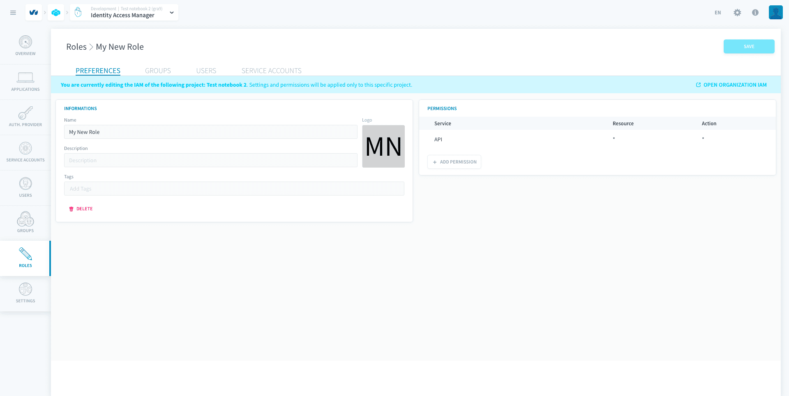

Then, [bind](#bind-a-role-to-a-user-service-account-or-group) this role to the group/user of your choice, and add a **role condition**.

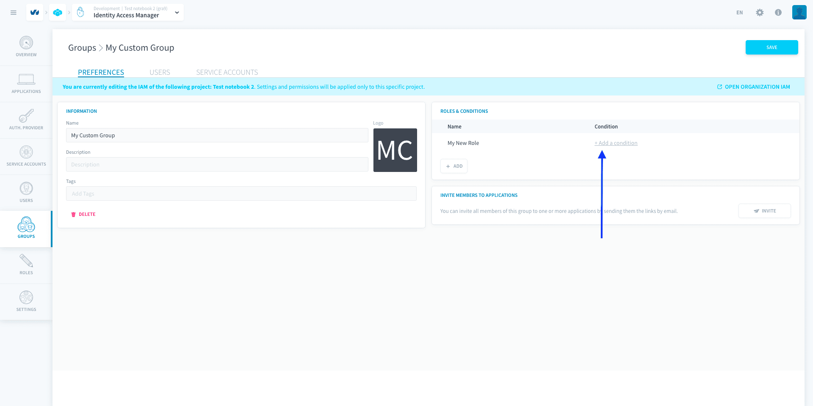

 Set the condition with the *filter* parameter to the binding. The *filter* parameter takes in a dictionary of attributes names and list of values for each attribute.

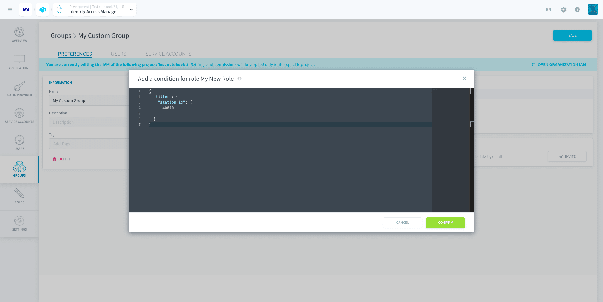

```json
{
  "filter": {
    "station_id": [
      40010
    ]
  }
}
```
You can enter several values in the *filter*, to filter on multiple attributes at once (AND operator) or on multiple values of an attribute (OR operator).


#### Add a role condition on a specific bucket

?> This section relates to a legacy JSON condition. JSON conditions are currently deprecated and will be migrated automatically to new [CEL conditions](#new-cel-conditions).

To restrict access to specific buckets in your [Lakehouse Manager](/en/product/lakehouse-manager/buckets/index), you must use the ***bucket_name*** parameter on an ***Data store***-related permission.

> Data Store is the original name of the buckets on Data Platform.

First, create a role having access to `datastore * *`.

Then, [bind](#bind-a-role-to-a-user-service-account-or-group) this role to the group/user of your choice, and add a **role condition** with the *bucket_name* parameter to the binding.

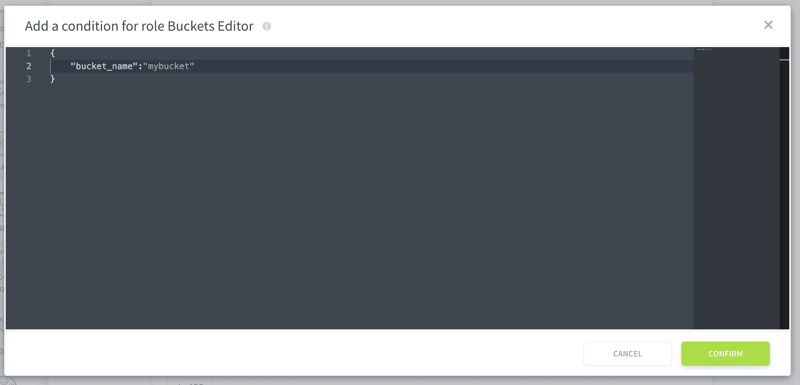

```json
{
  "bucket_name": "mybucket" 
}
```

---
##  Need help? 🆘

> At any step, you can ask for support by reaching out to us on the Data Platform Channel within the [Discord Server](https://discord.com/channels/850031577277792286/1163465539981672559). you can also find a step by step guide towards joining our discord server in the [support](/en/support/index.md) section.