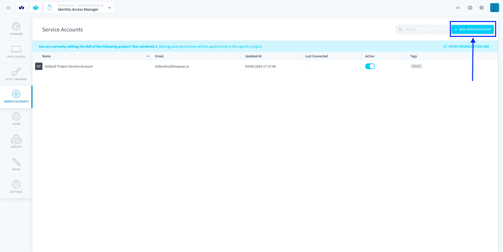

# Service Accounts

A service account is a special kind of account used by API consumers, remote server access, scripts, or other automated entities, rather than by a physical person. 

On Data Platform, service accounts are generally used for two reasons:
- **Externally**, to authenticate a remote entity that needs to access the Project through [API and secret keys](/en/getting-further/generate-api-key/api-secret-key)
- **Internally**, to authenticate Project jobs. For example, a service account can be attached to a [Data Processing Engine workflow](/en/product/dpe/workflows/index), so that when executed, the job can authenticate as the service account. The service account's [roles](/en/product/iam/users/roles) control which resources the job can access.

They will be found in the *Service Accounts* tab of the Identity Access Manager. On Data Platform, each service account is identified by their **technical name** which must be unique to them.

* [Manage your Project service accounts](#manage-your-project-service-accounts)
  * [Default Project Service Account](#default-service-account)
  * [Create a new service account](#create-a-new-service-account)
* [Use a service account internally for jobs](#use-a-service-account-internally-for-jobs)
* [Use a service account externally](#use-a-service-account-externally)

?> Note that Service Accounts **exist ONLY in the Project IAM**.

---
## Manage your Project service accounts

A **service account can be granted Project IAM** [**roles**](/en/product/iam/users/roles) that let any associated entity (whether external entities or internal jobs) access resources. The service account is used as the identity of the associated entity, and the service account's roles control which resources the entity can access. 

?> This makes service accounts fit to restrict the access level of a CRON-triggered Data Processing Engine job or a remote API that needs to access data on the Data Platform Platform, for example.

There are two types of service accounts:
- **Default Data Platform-originated service accounts**: they are generated at the [creation of the Project](/en/product/project/project_creation.md) so that basic services can run immediately, like the *Default Project Service Account*
- **User-managed service accounts**: they are created by Data Platform users

### Default service account

The *Default Project Service Account* is a Data Platform-originated service account that is generated automatically at the creation of the Project. It is used by default by all jobs in the [Data Processing Engine](/en/product/dpe/index) for authentication and access control. This service account cannot be deleted.

Any [user](/en/product/iam/users/users) from a Project can always impersonate this service account in the Data Processing Engine. 

!> It is impossible to restrict the impersonation of this service account by users that are authenticated in the Project's IAM. If you want to avoid a possible privilege escalation, you need to **[lower the role permissions](/en/product/iam/users/service-accounts?id=use-a-service-account-internally-for-jobs) given to this default service account**. 

By default, at the creation of the Project, the *Default Project Service Account* has **Admin access** in the Project. 

### Create a new service account

To add a service account in your Project, click on **New service account**.

Enter a name and an email address for the service account. 

!> The email address will be used to send over the [API and secret keys](/en/getting-further/generate-api-key/api-secret-key) necessary for the authentication of the remote entity.

> By default, new service accounts don't have any access right. You will need to either place them in [groups](/en/product/iam/users/groups) or assign them [roles](/en/product/iam/users/roles) directly.

{Add service accounts to a group}(#/en/product/iam/users/groups?id=assign-users-or-service-accounts-to-a-group)
{Assign a role to a service account}(#/en/product/iam/users/roles?id=bind-a-role-to-a-user-service-account-or-group)
 

---
## Use a service account internally for jobs

All jobs in [Data Processing Engine](/en/product/dpe/index) use service accounts for authentication and access control of the workload. As such, any user able to execute this job is essentially able to impersonate the service account (and get its access) through the executed workload.

?> The service account of a job currently cannot be changed. This feature is coming soon!

By default, jobs are configured to use the [Default Project Service Account](/en/product/iam/users/service-accounts?id=default-service-account). It is impossible to restrict impersonation of this service account by users, so to avoid a possible privilege escalation (in the case some of your users should not be able to access everything) you should make sure to remove unnecessary permissions on this service account.

To do so, open the Default Project Service Account page, remove all groups and roles bound to this service account, add the basic roles/groups needed for the service account, and save. The base permissions for a Data Processing Engine job to be able to run without errors are the following:
- `Data Manager | * | Read`
- `Data Processing Engine | * | Read`
  - `Data Processing Engine | * | Write` is optional and needed only if the update of metadata (such as number of rows in table) is wanted at the end of the job execution
- `Data Store | Bucket | Read`, with a [condition](/en/getting-further/iam/conditions) on bucket *dpe*

---
## Use a service account externally

Whenever you need to trigger specific jobs (such as launching workflows or machine learning pipelines) from outside of the Data Platform Platform, you will need to generate an API and a secret key to authenticate.

{Generate API & secret keys for service accounts}(#/en/getting-further/generate-api-key/api-secret-key.md)

---
##  Need help? 🆘

> At any step, you can ask for support by reaching out to us on the Data Platform Channel within the [Discord Server](https://discord.com/channels/850031577277792286/1163465539981672559). you can also find a step by step guide towards joining our discord server in the [support](/en/support/index.md) section.