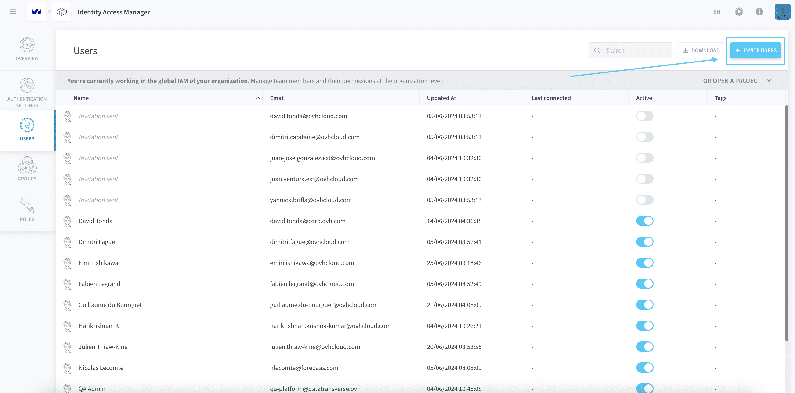
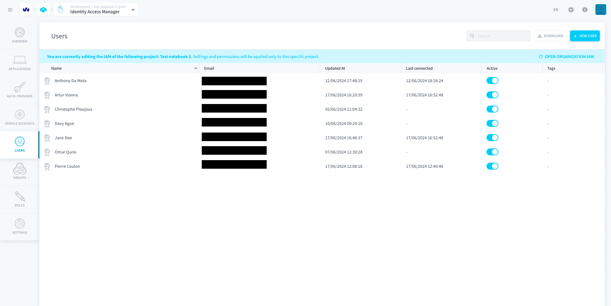
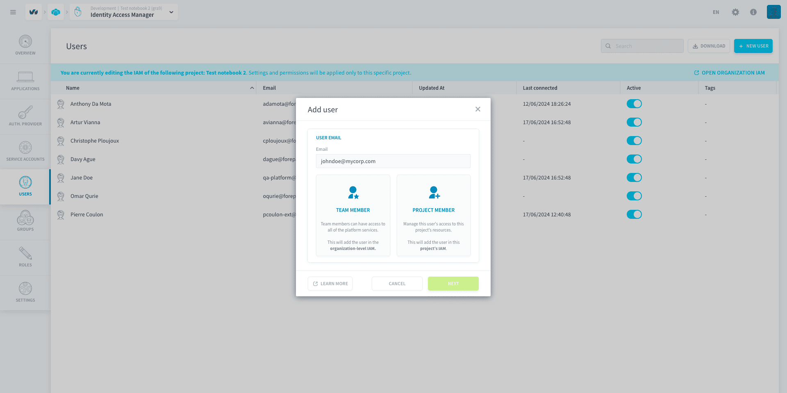
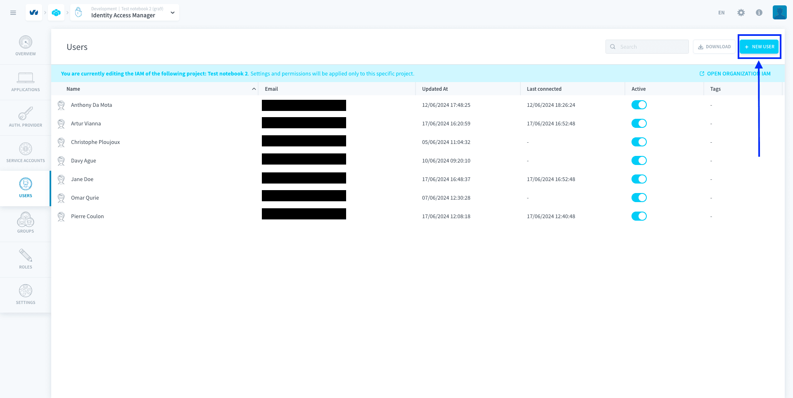
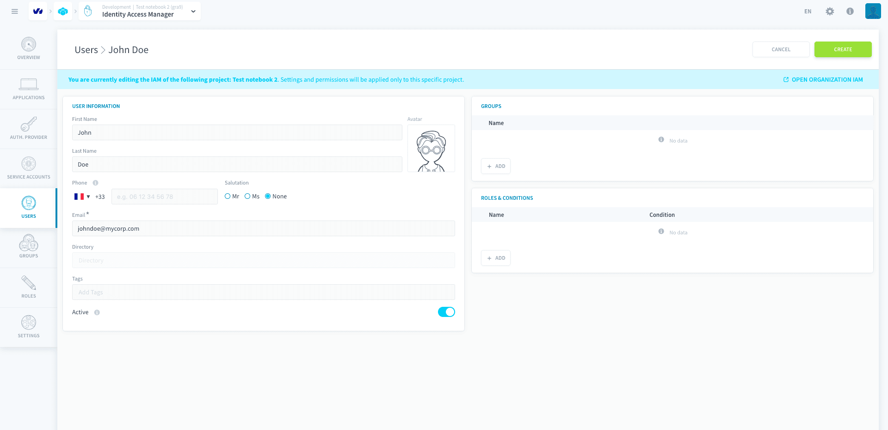

# Users

When a person is registered in a Project either as a **team member** (i.e. connected using their Data Platform account and part of your organization) or as an **application end-user** (i.e. connected via the embedded authentication service of the Project), they will be found in the *Users* tab of the Identity Access Manager. 

On Data Platform, each user is identified by their **email address**, which must be unique to them.

* [Organization IAM users vs. Project IAM users](#organization-iam-users-vs-project-iam-users)
  * [Manage your Organization users](#manage-organization-iam-users)
  * [Manage your Project users](#manage-project-iam-users)
* [Generate and API & secret key for a user](#generate-an-api-amp-secret-key-for-a-user)

---

## Organization IAM users vs. Project IAM users

The users in the Organization IAM correspond to all your team members who have access to the platform and who can potentially access the organization's resources. These users are managed in the same way as the Project IAM users, with the sole difference that there is no distinction between team member users and end-users. All users in the Organization IAM are team members with access to Data Platform.

On the other hands, users in the Project IAM can be either team members with access to the services/resources within a project ([Data Processing Engine](/en/product/dpe/index.md), [Analytics Manager](/en/product/am/index.md), etc) or end-users who only have access to the applications and dashboards. End-users are not a part of the organization, hence they do not exist in the Organization IAM and do not have access to the platform itself.

As a rule of thumb:
- If you want to add a team member to work with you on Data Platform: **add them in the Organization IAM**. Then make sure to grant permissions either at organization-level or project-level through roles and groups.
- If you want to grant access to an app or a dashboard to a end-user, **add them in the Project IAM**. 

### Manage Organization IAM users

All team members that need to work on Data Platform **MUST be added** in the Organization's IAM.

To add someone in the Organization's IAM, head to the *Users* tab of the Organization IAM, and click on **Invite users**.

> Make sure to grant permissions to the new user by binding them a role or adding them to a group.

{Add users to a group}(#/en/product/iam/users/groups?id=assign-users-or-service-accounts-to-a-group)
{Assign a role to a user}(#/en/product/iam/orga-iam/index?id=resources-managed-by-the-organization-iam)

### Manage Project IAM users

The *Users* tab of the Project IAM lists all users that can get access to your Project. These are either:
* [Team members](#team-members) from your organization
* [End-users](#application-end-users) that can open your applications

#### Team members

Your team members are the people with whom you work on data Projects in the Project. They must [have a Data Platform account](/en/product/organisations/create-account)  and [be part of your organization](/en/product/organisations/index.md) to open and edit the Project (i.e. they must exist in the users list of the Organization IAM).

To add a new team member in your Project:
1. Click on **+ New User**
2. Type their email
3. Choose the *Team Member* option

Click on *Next* and follow the instructions to add the new team member. This will automatically [add the user in the Organization IAM](#manage-organization-iam-users) first.

> Members that are *Admin* in an organization will also have full *Admin* rights in the Identity Access Managers of all Projects in this organization. Members that are added as *User* in an organization will need to have their permissions added manually, either by placing them in a [group](/en/product/iam/users/groups) or by assigning them a [role](/en/product/iam/users/roles) directly. Furthermore, if a user is added as *Project Admin* in the Organization IAM, they will be added as *Admin* in the *Project IAM*.

{Add users to a group}(#/en/product/iam/users/groups?id=assign-users-or-service-accounts-to-a-group)
{Assign a role to a user}(#/en/product/iam/users/roles?id=bind-a-role-to-a-user-service-account-or-group)

#### Application end-users

The end-users that you are building the application for don't need a Data Platform account to connect. Your Project comes with an [internal authentication service](/en/product/iam/project-iam/auth-provider/index?id=project) that uses an email and password.

To add an end-user in your Project, click on **New User**.

You must enter an email for the end-user, as it will be their default authentication method.

?> All information entered in the Identity Access Manager, including phone number and email address, is securely stored in the Project and cannot be accessed by Data Platform. It is for your own internal usage and will never be used for marketing purposes.

> By default, new end-users don't have any access right. You will need to either place them in [groups](/en/product/iam/users/groups) or assign them [roles](/en/product/iam/users/roles) directly.

{Add users to a group}(#/en/product/iam/users/groups?id=assign-users-or-service-accounts-to-a-group)
{Assign a role to a user}(#/en/product/iam/users/roles?id=bind-a-role-to-a-user-service-account-or-group)

---
## Generate an API & secret key for a user

Whenever you need to trigger specific jobs (such as launching workflows or machine learning pipelines) from outside of the Data Platform Platform, you will need to generate an API and a secret key to authenticate.

{Generate API & secret keys for users}(#/en/getting-further/generate-api-key/api-secret-key.md)

---
##  Need help? 🆘

> At any step, you can ask for support by reaching out to us on the Data Platform Channel within the [Discord Server](https://discord.com/channels/850031577277792286/1163465539981672559). you can also find a step by step guide towards joining our discord server in the [support](/en/support/index.md) section.