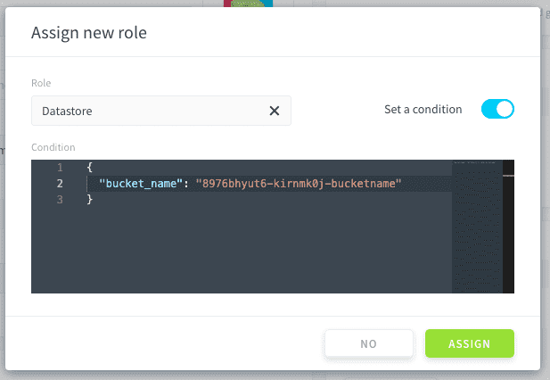

# Version 4.0 Changes (2020-12-23)

The new IAM version is mostly the same as the previous version. This page lists all significant changes.

---
## 1. Configuration Migration

If you were using the previous version of the IAM, all of your configurations (users, groups, ACLs, settings, email templates, etc.) have been migrated automatically - you don't have to worry about it !

---
## 2. Introducing "Roles"


The “Team Management” component has been re-imagined into “Roles” and is the primary reason for the upgrade to version 4.0, bringing extended functionality and greater control over permissions.

Access to your Project components is now managed entirely through the IAM, rather than on both Team Management and IAM v3.0 (for certain custom ACLs). Several roles are created by default, that contain pre-set access rights to dataplant components dependant on the “role”. For example, the API & APP Manager role has full access to all resources with all actions in the appservice (`appservice  * *`)


---
## 3. Introducing "Service accounts"


 
Service accounts, new to v4.0,  aims to act in a similar manner to “user accounts” except for non-human users such as API consumers, remote server access, scripts, and other automated entities.

Due to the nature of the “accounts”, additional features are provided:
- Project access through API-key authentication type
- Belongs to no directory 


---
## 4. ACL management

The ACL management has changed to allow better customization: ACL are now called **role conditions**.

### 4A. Role condition on specific Data value(s)

You first need to create a role having access to `API * *`, as such that:


Then you need to attach this role to the group(s) or user(s) of your choice, and enable a ***role condition*** to it.


Entering a JSON such as this:

```json
{
  "filter": {
    "station_id": [
      40010
    ]
  }
}
```
> 💡 You can enter several values in the filter.


### 4B. Role condition on a specific Datastore bucket

You need to assign the role *datastore* (which has the authorization `datastore * *`) to the group or user you want.

Then, add a **role condition** to indicate which bucket you want to restrict access to: 

```json
{
  "bucket_name": "name-of-the-bucket" 
}
```
It should eventually look like this:



---
## 5. Permissions on Applications

Due to potential for misuse of this feature, and because of the restructuring of the component, the management of **'permissions' for each application** is no longer available.

> If you need a secure way to block access to some APIs or APPs for some users, please send us a note on our [roadmap page](https://hq.forepaas.io/#/features)!

---
## 6. Users management

### 6A. Email addresses must now be unique per user

Two different users cannot have the same email address anymore.
Note, login were already unique.

### 6B. Migration of users and merge warning 

During the migration, 2 or more users having the same email have now the following elements merged into one user :
- API keys
- groups 
- ACL 
- Others

the attributes such as firstname, lastname, etc.. are kept from the last created user.


### 6C. Multiple repositories

A user can now be linked to multiple repositories so you don't have to create one user for each repository anymore. This will enable you to manage the access rights for each user more efficiently.

---
## 7. Default directories naming change on new dataplants

Here are 2 naming changes about the default directories:

| Old IAM v3 Naming | New IAM 4.0 Naming |
|          ---        |          ---          |
| King |the Platform|
|the Platform| Project |


---
##  Need help? 🆘

At any step, you can ask for support by sending us a request directly from the platform, going to the *Support* tab. You can also send us an email on support@forepaas.com.