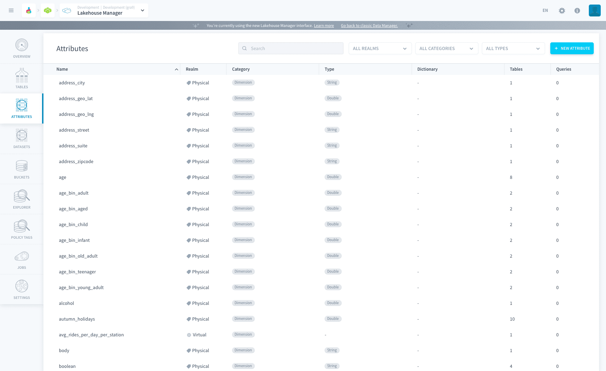
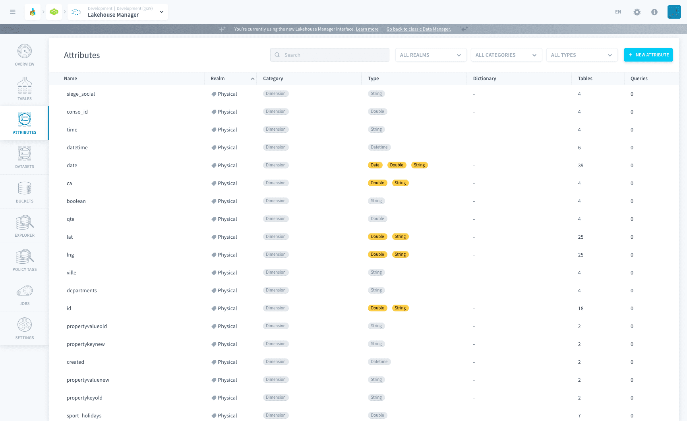
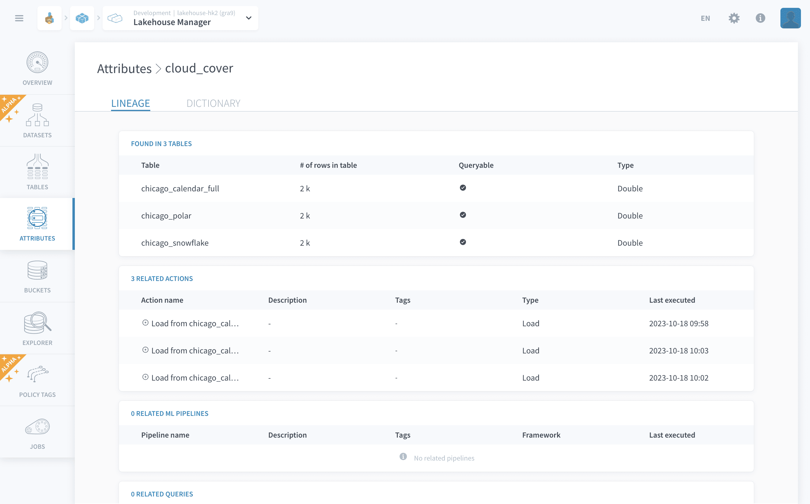
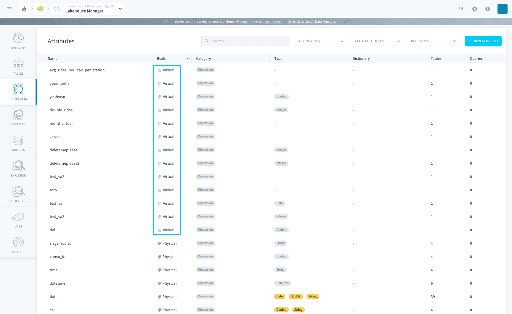
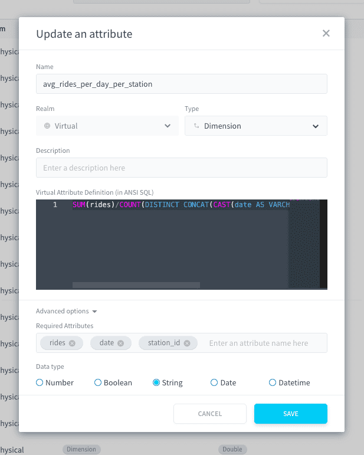

# Attributes

The Attributes page groups all the attributes in your lakehouse Manager by **unique attribute names**. Each of those attributes are part of a realm: *physical* or *virtual*.

- [Physical attributes](#physical-attributes)
- [Virtual attributes](#virtual-attributes)
  - [Virtual attribute formula](#virtual-attribute-formula)
  - [Virtual attribute options](#virtual-attribute-options)

---
## Physical attributes

Physical attributes are the attributes physically stored in [Lakehouse Manager tables](/en/product/lakehouse-manager/tables/index). You can edit their category, type, and other information at the level of the table.

They are grouped by name on the Attributes page, letting you watch at a glance the different categories and types each attribute takes across all of your data warehouse / data lake.

Each attribute can be expanded in order to get full lineage over the objects in your Project that use this attribute:
- Lakehouse Manager [tables](/en/product/lakehouse-manager/tables/index)
- Data Processing Engine [actions](/en/product/dpe/actions/index)
- Machine Learning Manager [pipelines](/en/product/ml/pipelines/index)
- Analytics Manager [queries](/en/product/am/queries/index)

Some attributes can be a key for a **dictionary**. In that case, another attribute is used as a label for this attribute, to be automatically displayed in applications instead of the key.

Labels can be set at the level of a table (containing the dictionary key as its primary key) in the [Tables](/en/product/lakehouse-manager/tables/index) screen.

---
## Virtual attributes

Virtual attributes are used to compute new formulas on your data. They are not stored in the database but are computed on the fly for a [query](/en/product/am/index) or a dashboard/restitution chart. 

### Virtual attribute formula
The most important element of a virtual attribute is its SQL definition. 

Write a formula which contains a combination of SQL keywords and [physical attributes](#physical-attributes).

?> The formula should be written using **ANSI-compliant** SQL syntax to ensure the portability of your Project. Engine-specific syntax is not supported by ForePaaS.

#### Example of virtual attribute formula
`SUM(rides)/COUNT(DISTINCT CONCAT(CAST(date AS VARCHAR), CAST(station_id AS VARCHAR)))`

Here, *rides*, *date*, and *station_id* are physical attributes coming from a Data Manager table.the Platform will automatically detect them, along with the most relevant table to query from (if it is not explicitly defined in your formula).

### Virtual attribute options

#### Required attributes
the platform automatically detects the [physical attributes](#physical-attributes) required to run the virtual attribute formula. 

You can edit them in the advanced options of the virtual attribute. Reasons for editing the type include (but are not limited to): a physical attribute in the formula is detected as a SQL keyword instead of a required attribute, or the vice-versa.

#### Type
The type of the virtual attribute is automatically inferred when you create it. This type allows the platform to automate the planning of [queries](/en/product/am/queries/index) which use the virtual attribute. 

You can edit it in the advanced options of the virtual attribute. Reasons for editing the type include (but are not limited to): filter values based on a virtual attribute are automatically converted to another type resulting queries to fail in the [Analytics Manager](/en/product/am/queries/index).

---
###  Need help? 🆘

> At any step, you can ask for support by reaching out to us on the Data Platform Channel within the [Discord Server](https://discord.com/channels/850031577277792286/1163465539981672559). you can also find a step by step guide towards joining our discord server in the [support](/en/support/index.md) section.