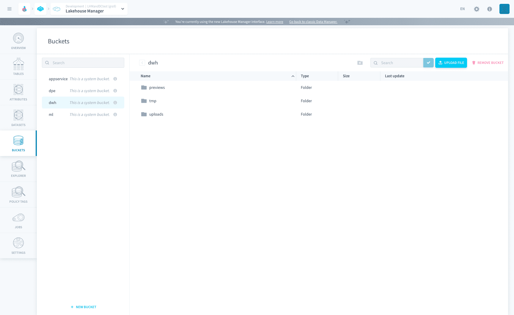
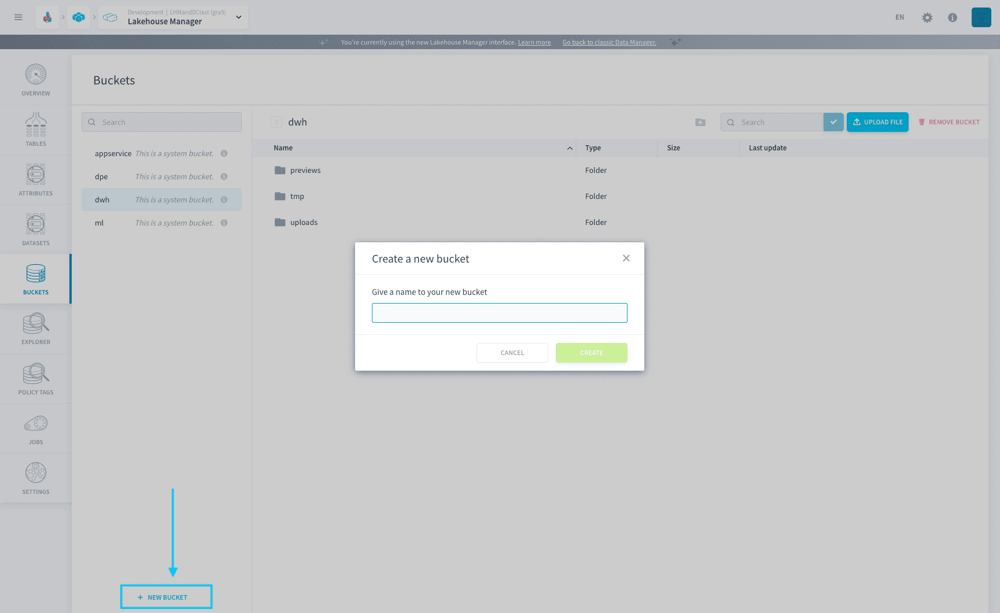
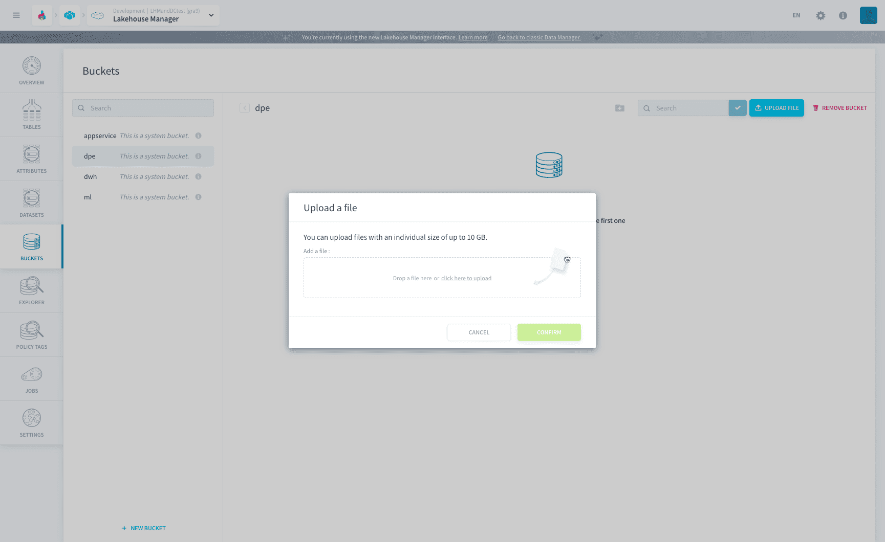
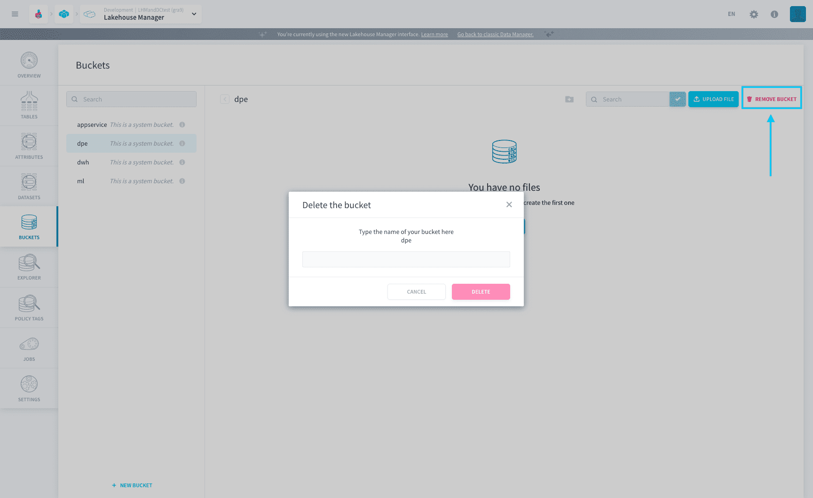

# Buckets

the platform Buckets are **S3 compatible object stores** which allow you to store any unstructured data. Think of buckets as different workspaces, for instance, a specific machine learning Project or a repository of photos or videos.

* [Create a bucket](#create-a-bucket)
* [Upload files](#upload-files)
* [Delete a bucket](#delete-a-bucket)
* [Manage permissions on buckets](#manage-permissions-on-buckets)

---
## Create a bucket

To create a new bucket, click on the _+ New Bucket_ button on the bottom left side of the screen.

Then, name your bucket and click on _Confirm_.

---
## Upload files

Once you have created your bucket, you will see a _+ Upload file_ button. Just click on it and drag-and-drop your file to upload it.

!> There is a **10 GB size limit** on files handled bythe PlatformBuckets.

---
## Delete a bucket

To delete a bucket, click on _Remove Bucket_ on the top righ-hand corner of the screen. Then you will have to write the input the name of the bucket and click on _Confirm_ to delete the bucket.

---
## Manage permissions on buckets 

You can also manage how each user is allowed to interact with the buckets. These permissions are managed on the [Identity Access Manager](/en/product/iam/index). 

For details refer to the following article:
- [Roles and conditions: Add a role condition to a specific bucket](/en/product/iam/users/roles?id=add-a-role-condition-on-a-specific-bucket)

---
###  Need help? 🆘

> At any step, you can ask for support by reaching out to us on the Data Platform Channel within the [Discord Server](https://discord.com/channels/850031577277792286/1163465539981672559). you can also find a step by step guide towards joining our discord server in the [support](/en/support/index.md) section.