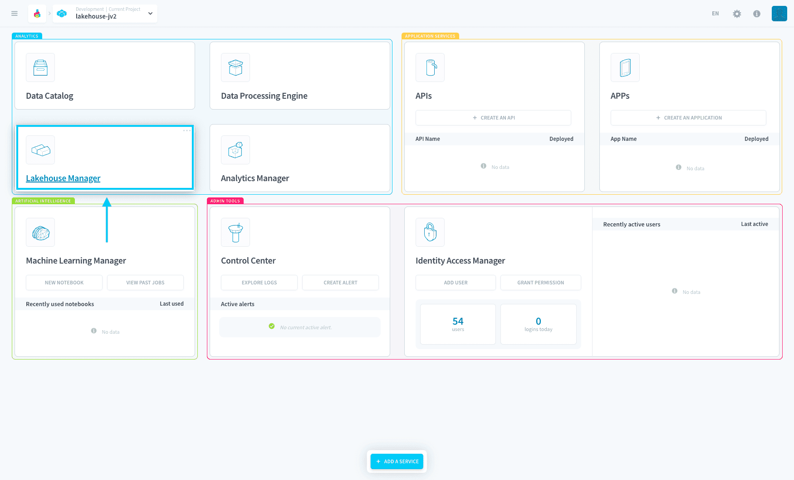

# Lakehouse Manager

Lakehouse Manager is a **serverless data warehouse used to store and organize any dataset**. Easily create [Datasets](en/product/lakehouse-manager/datasets/index) to organize your [tables](en/product/lakehouse-manager/tables/index), upload and store non-structured data with [buckets](en/product/lakehouse-manager/buckets/index), get a hands-on view of your data through the [explorer](en/product/lakehouse-manager/explorer/index) and get fine-grained access control over your data using [policy tags](en/product/lakehouse-manager/policy-tags/index).

The lakehouse manager is also the *storage engine* for this service. Completely serverless, unifying data lake & date warehouse into one service. It's based on [Apache Iceberg](https://iceberg.apache.org/) which brings the open table format for huge analytic datasets.

As the Lakehouse Manager is one of the main components and has vast features, it can be a little difficult for first-timers to understand its full usage well. 

Fortunately, we have prepared a detailed tutorial explaining each sub-component!

{Check-out the Lakehouse Manager's key concepts}(#/en/product/lakehouse-manager/understanding-lakehouse-manager-further.md)

---

###  Need help? 🆘

> At any step, you can create a ticket to raise an incident or if you need support at the [OVHcloud Help Centre](https://help.ovhcloud.com/csm/fr-home?id=csm_index). Additionally, you can ask for support by reaching out to us on the Data Platform Channel within the [Discord Server](https://discord.com/channels/850031577277792286/1163465539981672559). There is a step-by-step guide in the [support](/en/support/index.md) section.