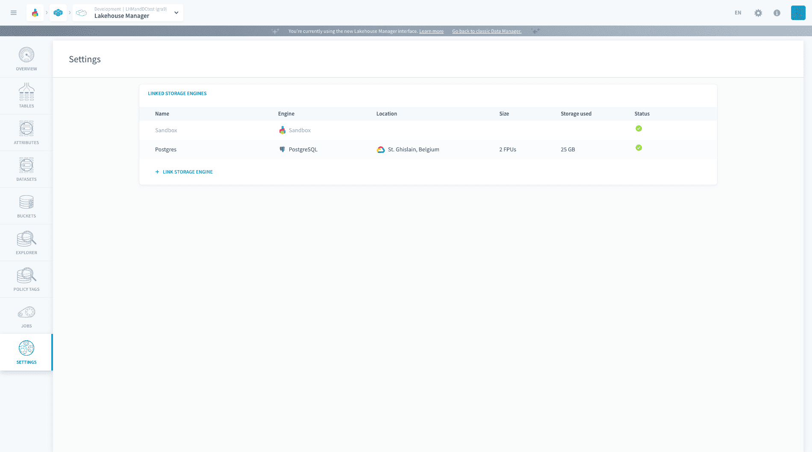
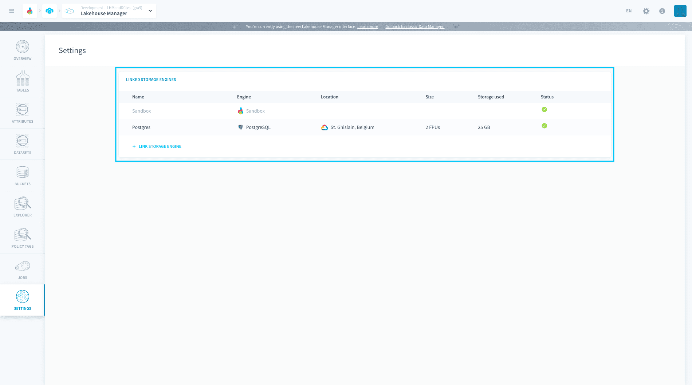
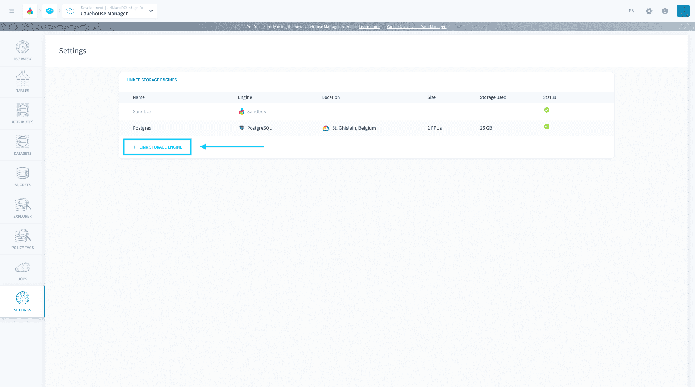
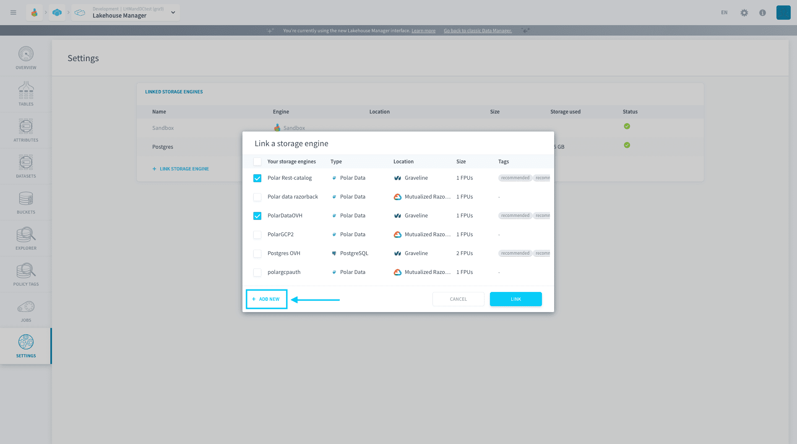
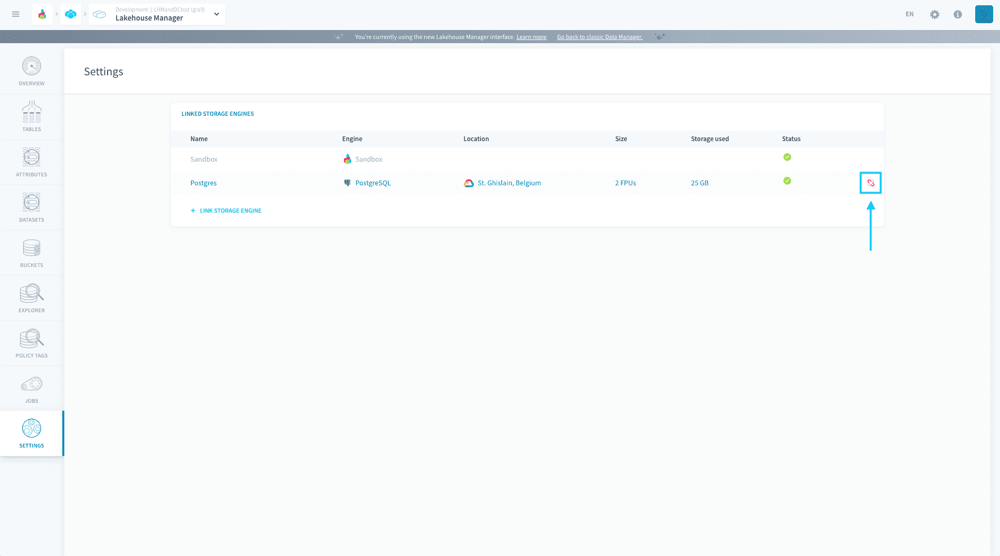

# Settings

The Lakehouse Manager settings let you manage the [storage engine(s)](/en/product/dataplant/storage-engine/index) linked to your Project, i.e. the system storing all the structured data you bring in your Project. 

- [Link / unlink a storage engine](#link-unlink-a-storage-engine)
---
## Link / unlink a storage engine

A storage engine is said to be **linked** to a Project if the Project is able to connect to it (through an automated generation of credentials). 

The list of storage engines currently linked to a Project are displayed in the "Linked storage engines" table:

The possible status for a linked storage engine are:
- *linking*: the storage engine instance is currently being linked to the Project
- *unlinking*: the storage engine instance is currently being unlinked from the Project
- *failed*: the storage engine instance has failed to link to the Project. Please delink it and link it again
- *updating*: the storage engine instance is linked but is currently being updated (for ex: horizontal or vertical resizing). Availability may be reduced
* *terminated*: the storage engine instance is being deleted
- green checkmark: the storage engine instance is successfully linked to the Project and fully available

### Link a storage engine

You can only link storage engines that are part of your [organization](/en/product/organisations/index). To link a new storage engine, click on **Link storage engine**

You will see the list of non-linked storage engines that are in your organization. Select one or more, and press **Link** to link them to the Project.

> The linking process can take up to a minute.

You can also [create a new storage engine](/en/product/dataplant/storage-engine/index?id=create-a-storage-engine) by pressing **Add new**. They will be added to the list of storage engines of your organization.

### Unlink a storage engine

!> You can only unlink a storage engine if no [table](en/product/lakehouse-manager/tables/index) is using it.

To unlink an engine, press the **unlink** icon next to the engine.

---
###  Need help? 🆘

> At any step, you can ask for support by reaching out to us on the Data Platform Channel within the [Discord Server](https://discord.com/channels/850031577277792286/1163465539981672559). you can also find a step by step guide towards joining our discord server in the [support](/en/support/index.md) section.