# Tables

*Tables* give you **full control over your data lake / data warehouse** (tables and attributes) by providing a visual and logical structure of tables within datasets on a single screen. 

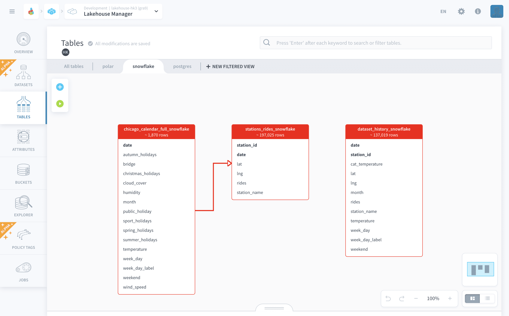

When you access the Tables tab, you will be in the [Canvas view-mode](#discover-the-canvas-mode), selected by default. This view-mode is designed to provide a visual depiction of your data. However, this representation can be overwhelming if there are too many tables. That is why we also provide the **List view-mode**.

> Note that some features are only available on one of the view-modes. For instance, [linking tables of external datasets](#link-parent-and-children-tables) is only doable in Canvas-view.

* [Create a table](#create-a-table)
* [Tables](#forepaas-tables)
  * [Link parent and children tables](#link-parent-and-children-tables)
* [Discover the canvas mode](#discover-the-canvas-mode)
  * [Filtered views](#filtered-views)
  * [Interact with a table](#interact-with-a-table)
  * [Interact with an attribute](#interact-with-an-attribute)

---
## Create a table

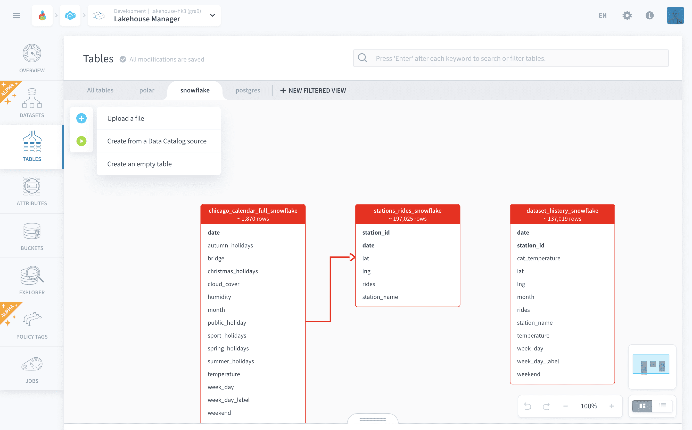

Hover over the *+* icon (or the *New table* button if you are in list mode) to see the options for creating a new table on the schema: 
- **Create a table by uploading a file**
- **Create a table from source**
- **Create an empty table**

The [getting started tutorial](/en/getting-started/index) contains the step-by-step guide to creating a table from source and creating an empty table. Here, let's see the how create a table by uploading a file:

1. Click on ➕ and select - Upload a file
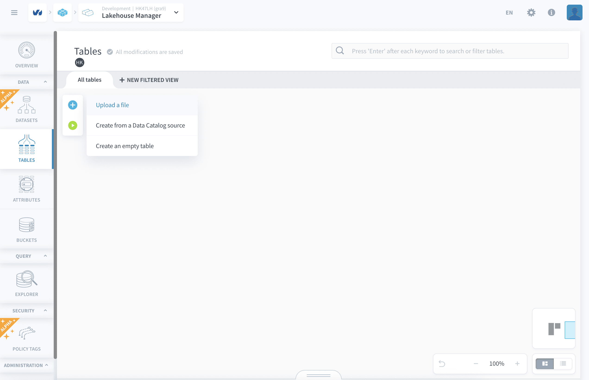

2. Upload the file using the options shown on the screen. (Currently support is present for CSV and XLSX files)
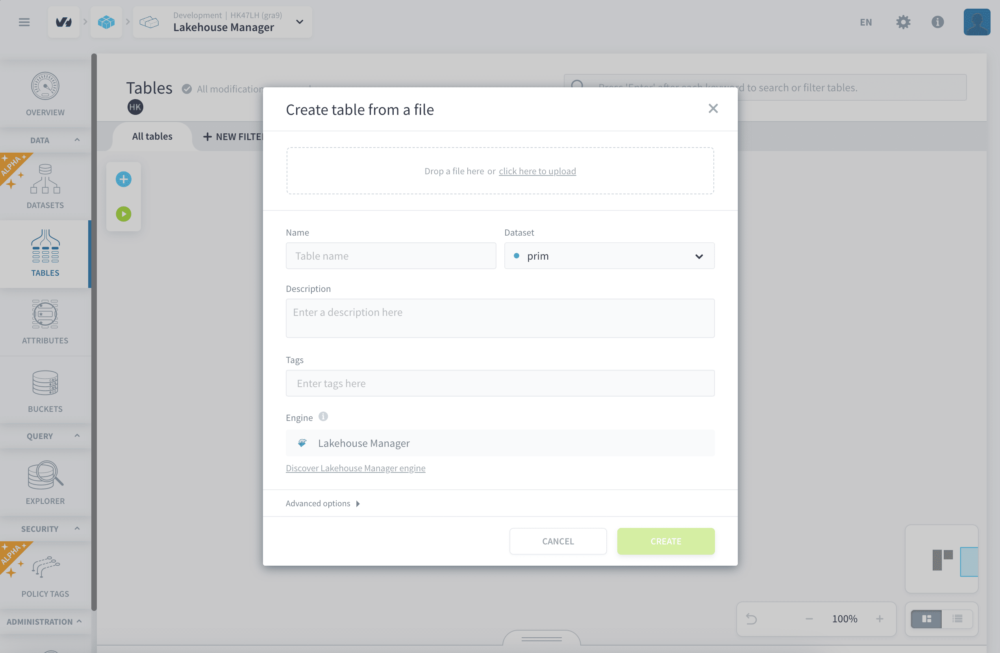

3. Set the name and other parameters for the table and click and create.
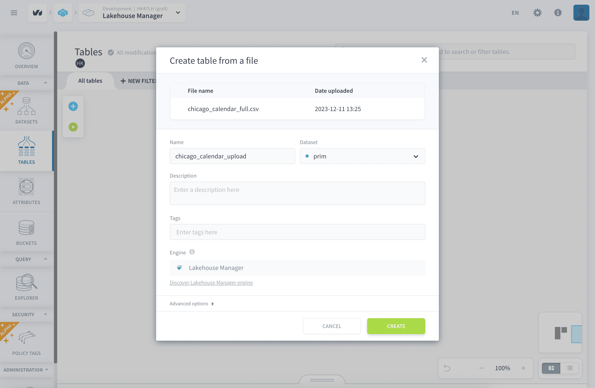

Now the uploaded file will go through the analyzer and a meta extract process and a job will be triggered which will build the table and load it with data.
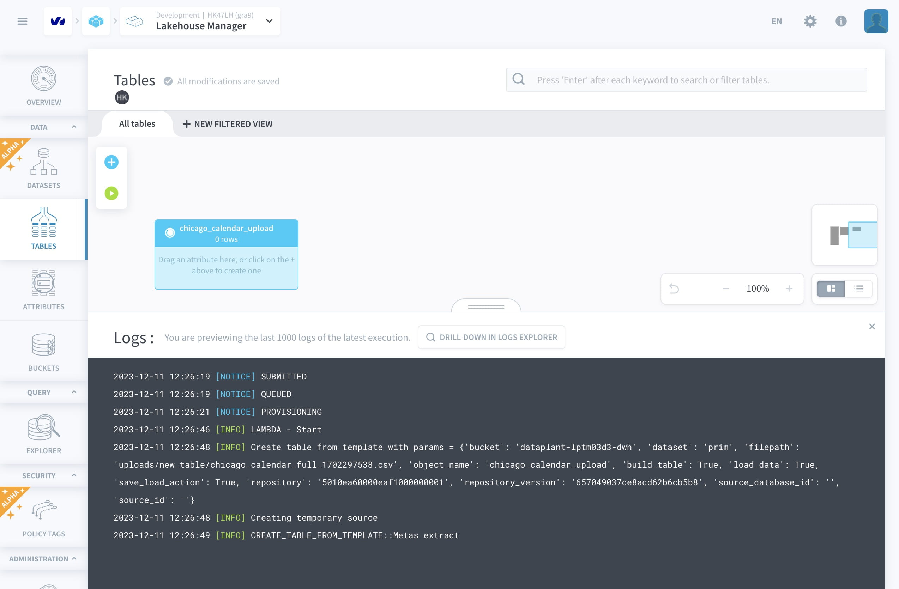
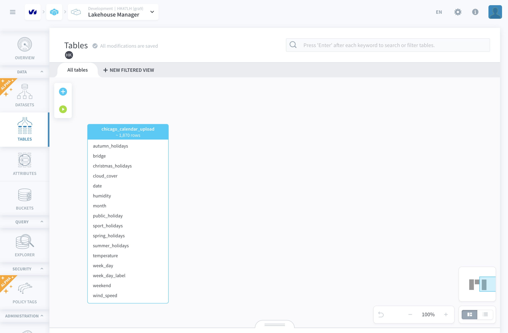

---
## Tables

Lakehouse Manager was built with the mindset of encouraging users to adopt the best practices regarding data management. Tables in Lakehouse Manager are almost the same as your regular SQL-database tables (in fact they are implemented using SQL). 

On Lakehouse Manager interface, when you hover over a table (List-view) or click on it (Canvas-view) you will see that a series of buttons are displayed. You can use them to interact with the table; some common interactions are :

* ➕ - [add](/en/product/lakehouse-manager/tables/table-interactions?id=add-a-new-attribute) an attribute (can be a dimension or measure).

* 🔍 - preview the table within [Explorer](/en/product/lakehouse-manager/explorer/index.md). 

* ✏️ - [edit](/en/product/lakehouse-manager/tables/table-interactions?id=edit-table) the table.

* ▶️ - [build](/en/product/lakehouse-manager/tables/table-interactions?id=build-table) the table.

* 🗑  - [delete](/en/product/lakehouse-manager/tables/table-interactions?id=delete) the table.

{Check out the complete detailed documentation here}(#/en/product/lakehouse-manager/tables/table-interactions.md)

### Link parent and children tables

> This feature is only available in the [canvas mode](#discover-the-canvas-mode).

!> Linking tables is on possible for tables of external datasets

Lakehouse Manager allows you to link a table (the parent) to other tables (children tables) in order to model an 'inheritance-like' system for the information in your data warehouse.

Concretely, this allows you to centralize information in one single referential table - the parent table - which in turn is referenced in many other children table via IDs. Linking tables allows to automate the configuration of [Aggregate actions](/en/product/dpe/actions/aggregate/index) (which allow you to join multiple tables into a single aggregated table when you execute them) when you create them in the [Data Processing Engine](/en/product/dpe/index)

The primary key(s) of the parent table must be present in the children table - if they're not, they will be automatically created as you link both tables.

?> For example, if you are representing a news article in with your data. There is a table called `articles` with fields for *article_id*, *headline*, *content*, *date* and *author*. But instead of placing a name in the author field, you could have the *ID* value of a user in a separate `authors` table with fields such as *author_id*, *first_name*, and *last_name*. Therefore, if you need to update an author’s name, you only need to do so in the `authors` table (parent); because the `articles` table (child) only contains the ID of the corresponding author record.

Link a **parent table** to a **child table** by clicking on the white circle at the bottom of the parent table (1) and dragging the arrow to the child table (2).

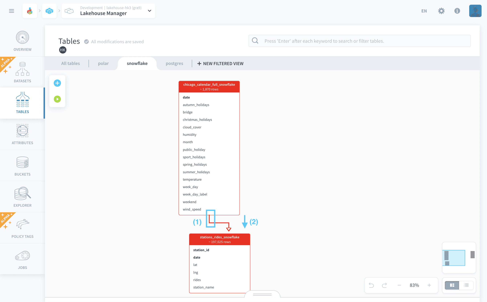

As a rule of thumb, you want to start from the table which contains all the reference data, a link it into a table which only has an ID referencing that initial table. 

---
## Discover the canvas mode

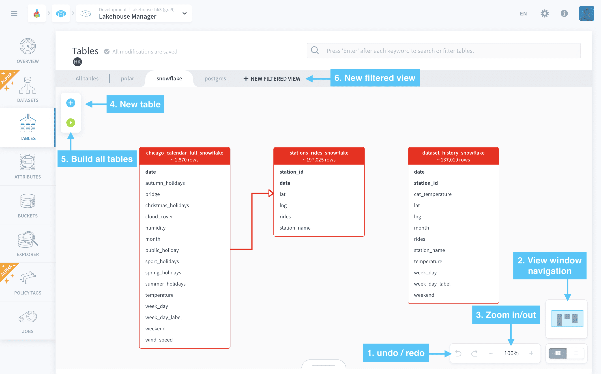

You can navigate the schema by clicking on any blank space in the schema and then moving your cursor. If there are a lot of tables, you can move the view window navigation (indicated by 2) by clicking on it and moving your cursor. Additionally, you can zoom in/out on your data schema (indicated by 3). 

At any point of organizing your tables, Lakehouse Manager autosaves all the visual modifications of your data schema.

?> Use the undo-redo options (indicated by 1) to move back/forward on any change you just made in the schema. You will go back/forward to an immediate previous state of your work.

### Filtered views
the platform allows you to choose to work on a selected set of tables (which could be specific to a team or Project within your organization). You can add a New Filtered View for doing this (indicated by 6).

?> Note - The default view has All Tables with All Users. 💡

### Interact with a table

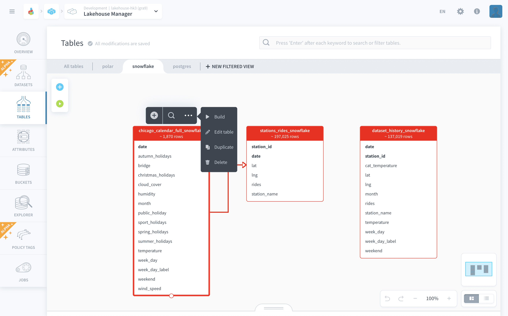

Hover your mouse over a table to display some table interactions and hover over the *...* icon to display the rest.

Access our [table interactions documentation](en/product/lakehouse-manager/tables/table-interactions.md) to find out more about actions available on a table.

### Interact with an attribute

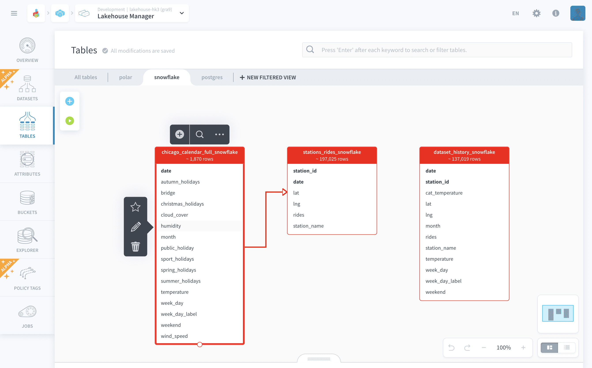

In the Canvas view-mode you can also easily manipulate the attributes of each table. Hovering your cursor over an attribute will display **attribute interactions**:

* Set it as a **Primary key** by clicking on ⭐️ (*only available for tables in external datasets*)

* Edit the attribute by clicking on ✏️

* Delete the attribute 🗑

---
###  Need help? 🆘

> At any step, you can ask for support by reaching out to us on the Data Platform Channel within the [Discord Server](https://discord.com/channels/850031577277792286/1163465539981672559). you can also find a step by step guide towards joining our discord server in the [support](/en/support/index.md) section.
