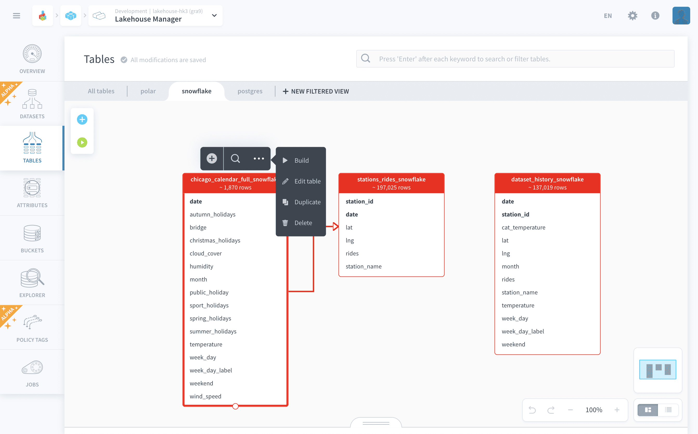
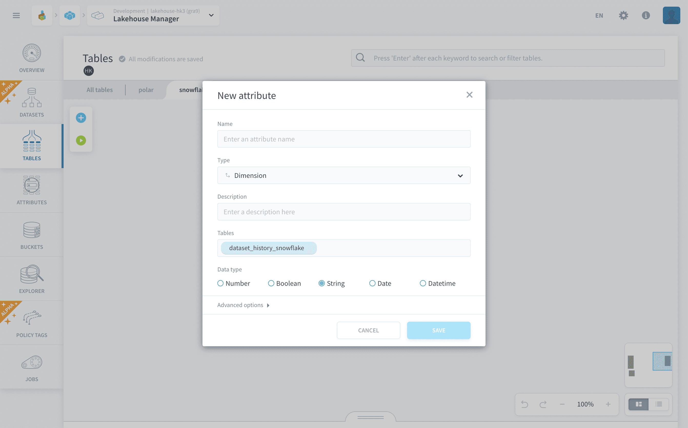
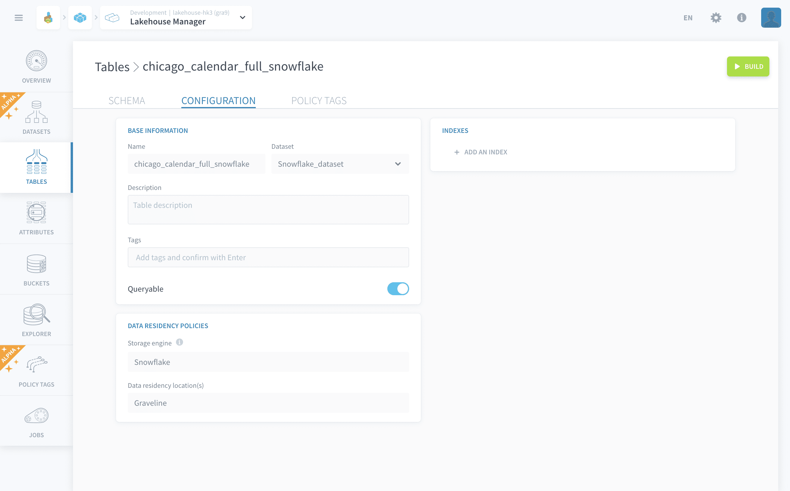
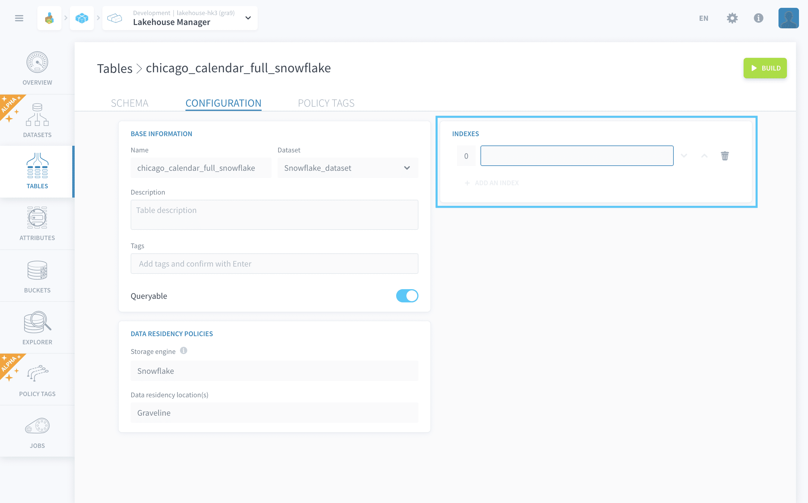
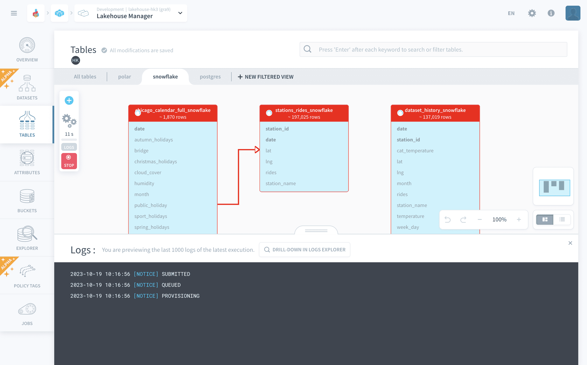

# Manage a table in Lakehouse Manager

There are six table interactions in total. When in Canvas-view, display the first three options by clicking on a table and, display the other three, by clicking on the '**...**' icon after clicking on the table. In List-view, just scroll over the table to display all available interactions.

* ➕ [Add a new attribute](#add-a-new-attribute)
* ✏️ [Edit table](#edit-table)
  * [Basic actions](#basic-actions)
  * [Labeling and indexing](#labeling-and-indexing)
* ▶️/⏹️ [Build table/Stop building table](#build-table)
* 📑 [Duplicate](#duplicate)
* 🗑 [Delete](#delete)

---
## Add a new attribute

?> Represented by the symbol ➕.

Adds a new attribute to the target table by opening the attribute creation window, shown below.

---

## Edit table

?> Represented by the symbol ✏️.

Allows the editing of the table's schema and configuration.

### Basic actions

You can change the following basic configurations :
- Name of the table
- Table type
- Table's description
- Table tags (used to easily search for it)
- Queryable (if a table isn't set as queryable, it won't be detected by the automated visual query builders of Analytics Manager and Lakehouse Manager Explorer)

### Labeling and Indexing

When editing a table you can further add:

* A **label** 
* One or several **partition keys/indexes** (*under advanced options*)

#### Labels

You can choose one of the table’s attributes as an optional **label** for the primary key of this table. 

This turns the table into a *dictionary* which is going to be stored in the cache of the [APIs](/en/product/api-manager/index) that you deploy in your Project. The API will enforce the translation in the queries using this dictionary, and the label will automatically be displayed in your applications instead of the primary key.

?> **Pro Tip:** By defining labels, you don't have to store heavy additional data in aggregated tables.💡

#### Indexes

Further, you can set **indexes** or **partition keys** to quickly locate data without having to search every row in a table.

?> **Pro tip:** Defining indexes improves the speed of data retrieval operations on a table at the cost of additional writes and storage space to maintain the index structure.💡   

---
## Build table

?> Represented by the symbol ▶️ if clicking to build, or ⏹️ if stopping build.

Click to start or stop build job for the target table. This job corresponds to physically building your tables in the database and is **required for loading and accessing your data** in the platform. 

Starting the build job will automatically open the job logs that you can monitor the job status:

---

## Duplicate

?> Represented by the symbol 📑.

Creates a copy of the target table that has to be built separately.

---
## Delete

?> Represented by the symbol 🗑.

Removes the target table from the logic data schema.
Removes its physically built counterpart as well if the table has already been built.

---
###  Need help? 🆘

> At any step, you can ask for support by reaching out to us on the Data Platform Channel within the [Discord Server](https://discord.com/channels/850031577277792286/1163465539981672559). you can also find a step by step guide towards joining our discord server in the [support](/en/support/index.md) section.

