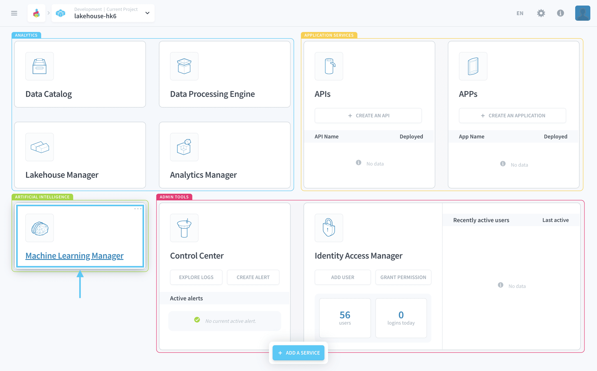
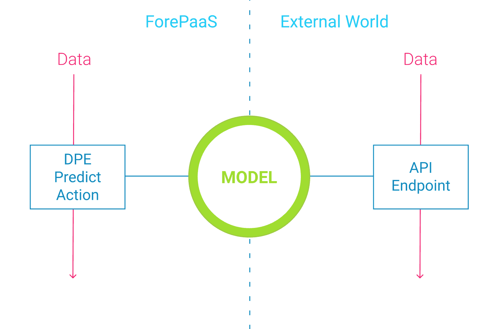

# Machine Learning Manager

>**Please note:** This service is only available on the *Legacy ForePaaS Platform and ML is not accessible to to OVHcloud Data Platform users*.

The Machine Learning Manager lets you **train and deploy AI models into production**. It offers different ways to get started with machine learning. You can either start by experimenting on [notebooks](en/product/ml/notebooks/index), train prediction models from scratch in [pipelines](en/product/ml/pipelines/index), or even deploy an externally trained [model](/en/product/ml/models/index) file.

---
## Component overview

The Machine Learning Manager enables you to **put models into production for AI-powered applications**. Like all other components on ForePaaS, it is based on the containers and micro-services technology. This means that individual ML jobs including training, scoring and predictions can be scaled to adapt to a large volume of processed data and high-frequency data throughput. 

Once it is created, any model can either be used:
* in the **Data Processing Engine (DPE)** to write predictions in your ForePaaS data model.
* as an **external API**.

Inside the Machine Learning Manager you will be able to perform the following actions:
* [Create notebooks](en/product/ml/notebooks/index) and use them to explore your data
* [Set up pipelines to train new ML models](en/product/ml/pipelines/index) from scratch
* [Compare & deploy models](/en/product/ml/models/index) as well as uploading and sharing existing models leveraging a public/private marketplace

---
## Quickstart tutorial

Getting started with machine learning can be a little tedious for first-timers. Fortunately, we have prepared a simple step-by-step tutorial with sample data to learn how to use our ML Manager!

{Check-out the ML 🤖 tutorial!}(#/en/getting-started/ml/index)

---
## Three ways to get started in the Machine Learning Manager

### Notebooks

Discover our integration of Jupyter notebooks which lets you deep-dive in your data without having to bother for the computing performances.

{Create Jupyter notebooks on ForePaaS}(#/en/product/ml/pipelines/index.md)

### Pipelines

Use pipelines to design and deploy a machine learning model from scratch. From the data preparation to the validation, everything is made simple for you to focus on the business results!

{Train models with pipelines}(#/en/product/ml/pipelines/index.md)

### Models

If you already have trained models on hand 🦾 and want to use ForePaaS' technology to maintain them in a versioned production environment, check out the link below:

{Deploy 🚀 trained models with ForePaaS}(#/en/product/ml/models/index.md)

---
## Need help? 🆘

> Feel free to reach out to us by sending us a request via *support* on the ForePaaS platform and we make sure to help you out with the best solution 😊  

{You can even send your questions directly by clicking here 👨🏻‍💻}(mailto:support.forepaas.com)