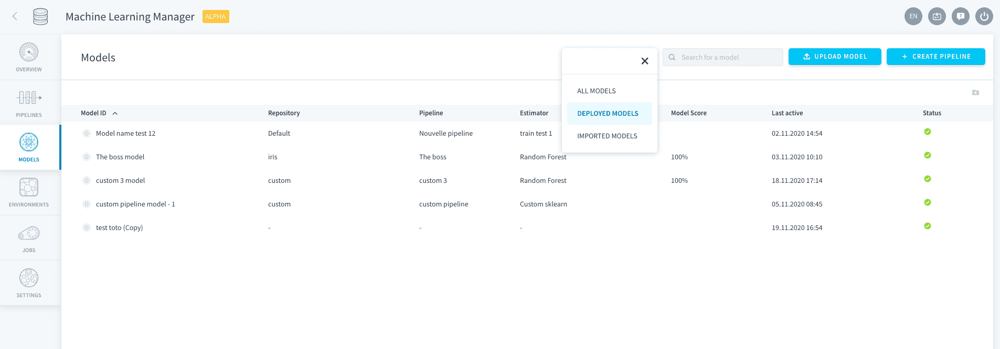
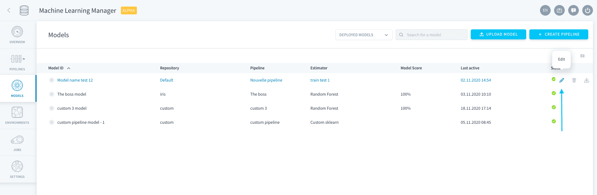
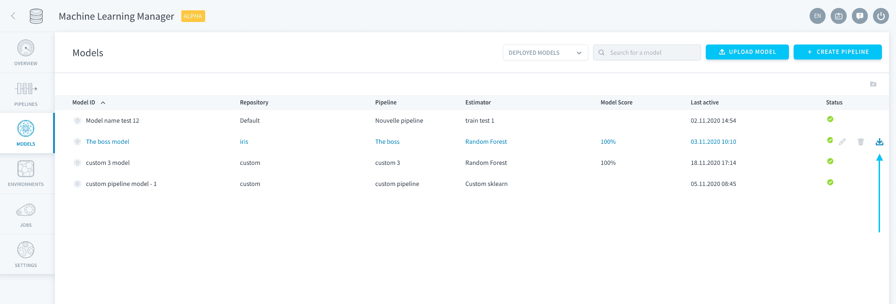
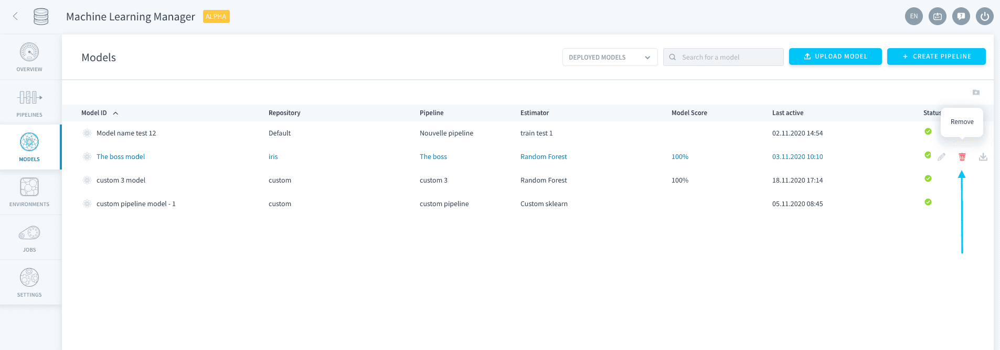

# Models

>**Please note:** This service is only available on the *Legacy ForePaaS Platform*.

The **Models page** is where you will find the full list of models that exist in all the ML Projects (i.e. repositories) of your Project. It is by default filtered on *deployed models only* but you can also choose to display *all models*.

On the ForePaaS Platform, we call **_model_** the combo of two elements: an *estimator and its parameters* fitted on *training data*. There are two types of models you can find on ForePaaS:
- Models created through a ForePaaS pipeline: **ForePaaS models**
- Models either imported externally or that belonged to an erased pipeline: **standalone models**

---
## Import an external model

If you already have a model that you trained outside of ForePaaS but you'd like to use our deployment technology to use it in production, you have the possibility to do so. Check out the link below to learn how.

{Import 📥 a trained model}(#/en/product/ml/models/import/index.md)

> To design and train your own model on ForePaaS, you need to [go through a pipeline](en/product/ml/pipelines/index). Either go to the **Pipelines tab** in the sidebar or use the shortcut '**Create pipeline**' at the top-right of the Models page.

---
## Manage your models

The Models page is a control center from where you can pilot all your models.

If you want to modify your model, simply click the **Edit 🖋 icon**. If your model was made through a ForePaaS pipeline, this will let you edit the pipeline. If your model is a standalone model, this will open its configuration page.

You can also download a model file onto your computer by clicking the **Download 📥 icon**.

Finally, you can erase a model by clicking the **Trash 🗑 icon**. 

!> Erasing a **ForePaaS model** does not erase its mother pipeline. This means you can still run the pipeline to generate a new version of the model.  
An erased **standalone model** cannot be recovered unless you import it again.

---
###  Need help? 🆘

> If you are logging-in with an OVHcloud account, you can create a ticket to raise an incident or if you need support at the [OVHcloud Help Centre](https://help.ovhcloud.com/csm/fr-home?id=csm_index). Additionally, you can ask for support by reaching out to us on the Data Platform Channel within the [Discord Server](https://discord.com/channels/850031577277792286/1163465539981672559). There is a step-by-step guide in the [support](/en/support/index.md).