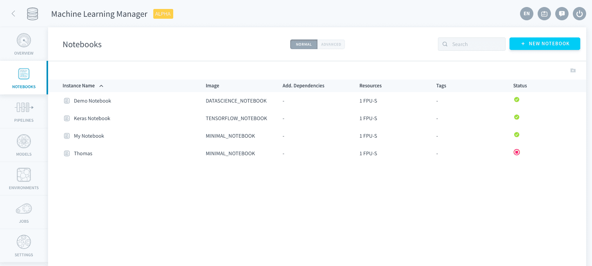
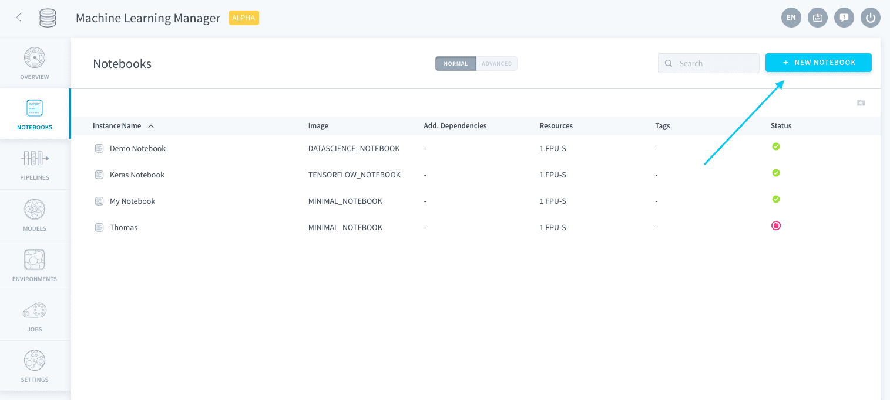
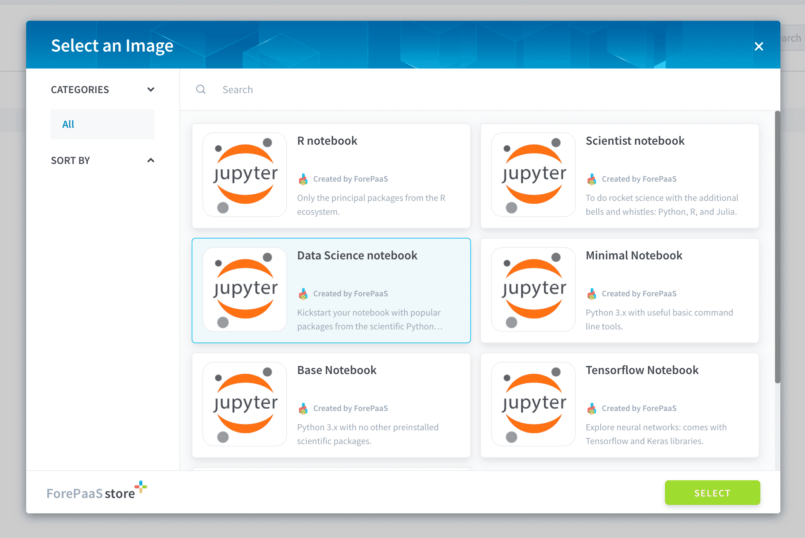
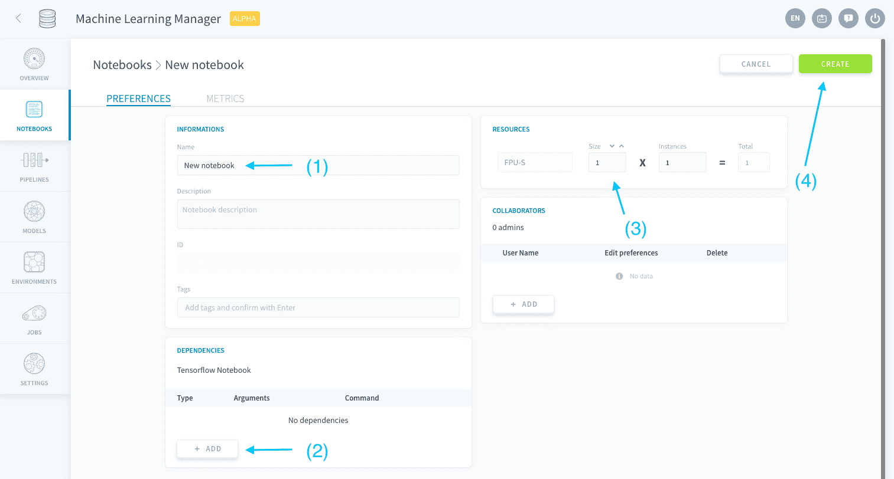
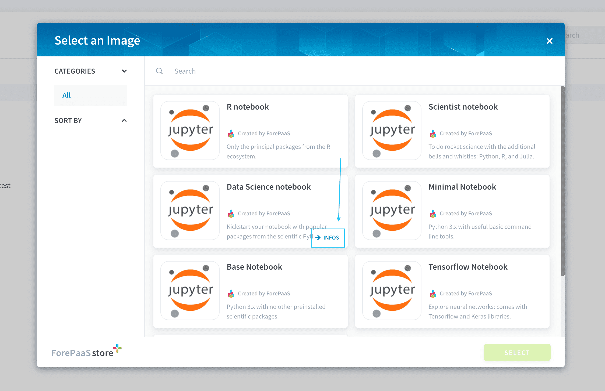
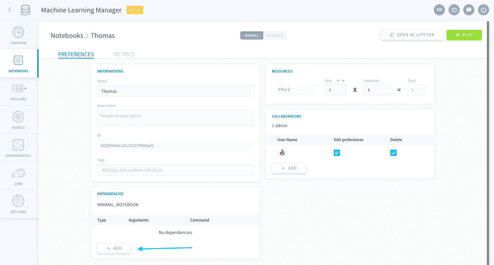
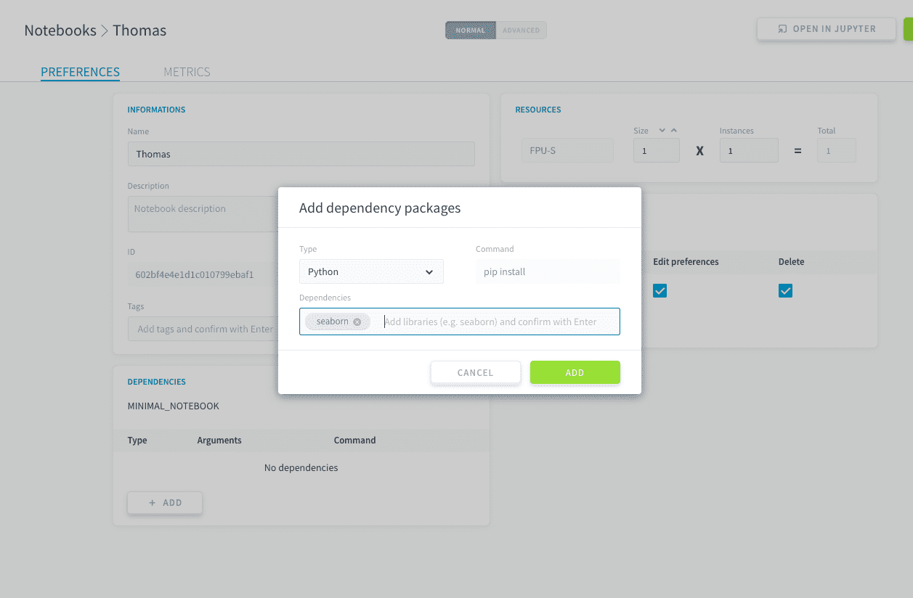
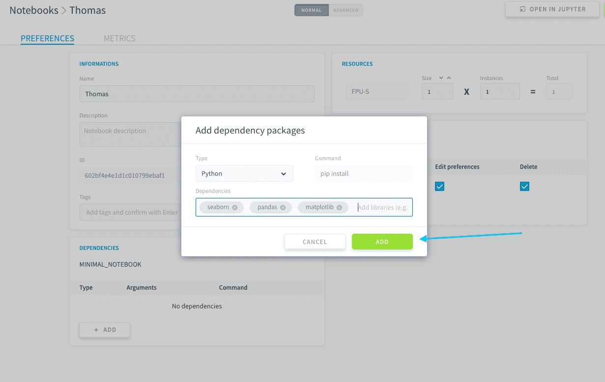

# Create a notebook

>**Please note:** This service is only available on the *Legacy ForePaaS Platform*.

To create a notebook instance, head to the **Notebook** section of the Machine Learning Manager.

Click on **New notebook** in the top-right.

You have to choose a [container image](https://jupyter-docker-stacks.readthedocs.io/en/latest/using/selecting.html) for your Jupyter environment, i.e. the set of packages and dependencies you want to have for your new notebook. ForePaaS features several ready-to-run images which contain the most popular libraries for data analysis and data science. 

> If you are new at creating notebooks, we recommend starting off with a *Data Science notebook*. It contains all the basic Python libraries for data exploration such as pandas, scipy, scikit-learn, matplotlib and much more!

You can then configure your notebook further before it is created (and it is still possible to change those settings later on). Once you press **Create**, the server for the notebook will be initialized - with its specific environment and dedicated computing resources.

The two main aspects to configure are:
* [Additional dependencies](/en/product/ml/notebooks/create.md?id=notebook-dependencies)
* [Resources](/en/product/ml/notebooks/create.md?id=notebook-resources)

---
## Notebook dependencies

Your notebook's image already comes with some default packages, which you can individually check in the image description in the marketplace. 

You can specify additional dependencies by clicking on the **Add** button in the *Dependencies* panel.

Simply choose the type of dependency and enter the name of the package to install in the server.

You can add several packages at once by pressing *Enter* every time, like tags.

---
## Notebook resources

Check out the dedicated sections to learn how to configure your new notebook's resources. It is suggested to configure them before confirming the creation of the notebook.

{Configure a notebook's resources}(#/en/product/ml/notebooks/index.md?id=edit-resources)