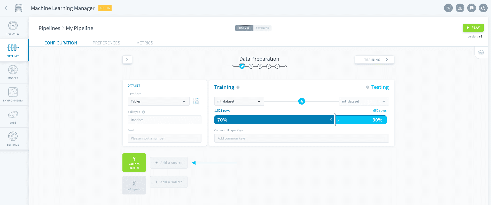
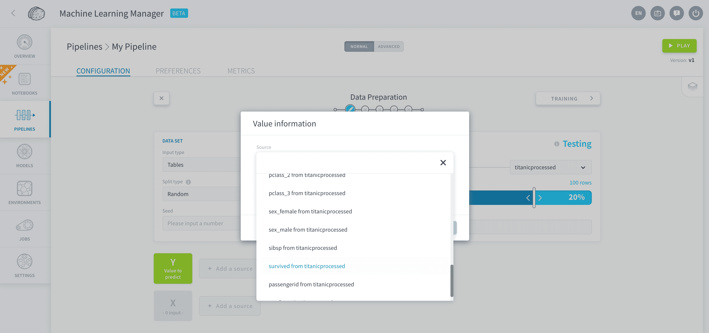
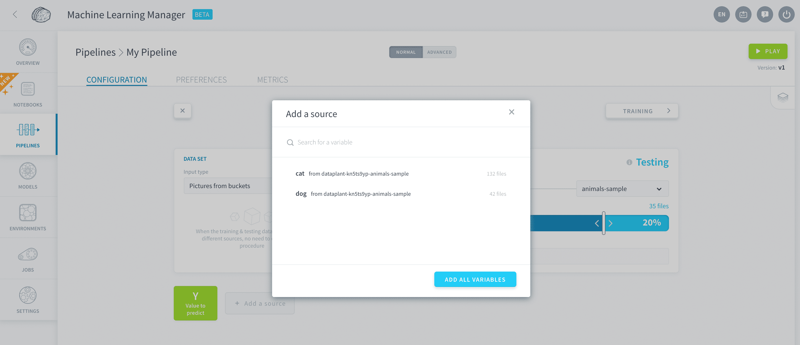
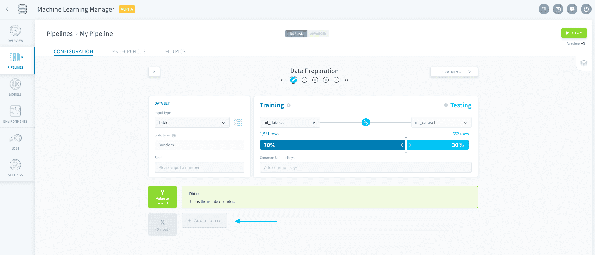

# Feature engineering

ForePaaS enables you to fully specify which variables to select for your model.

---
## Add a value-to-predict

The value you want to predict (i.e. the label) is saved in the *Y dataset*. To add a value-to-predict, click on **Add a source** next to Y.

Choose the source based on the **input type** you specified when [generating your dataset](en/product/ml/pipelines/configure/dataset/input.md?id=choose-a-data-input) and save.

#### When the input type is *Tables*

You will be able to select one attribute from the training table.

#### When the input type is *Pictures from buckets*

You will be able to select [one or several folders](/en/product/ml/pipelines/configure/dataset/input?id=pictures-from-buckets) from the training bucket.

---
## Add features

The features, or variables, that are used to make a prediction are saved in the *X dataset*. To add features to your structured data model, click on **Add a source** next to X.

Choose as many variables as you want from the source based on the input type you specified when [generating your dataset](en/product/ml/pipelines/configure/dataset/input.md?id=choose-a-data-input) and save.

> Shortcut tip: you have the option to *add all variables* in one go: this will add all the variables from the source **except** the one you chose as the value-to-predict.

---
## Pre-processing

Advanced feature engineering should be carried out in the [Data Processing Engine (DPE)](en/product/dpe/index) on your source itself.

---
###  Need help? 🆘

> If you are logging-in with an OVHcloud account, you can create a ticket to raise an incident or if you need support at the [OVHcloud Help Centre](https://help.ovhcloud.com/csm/fr-home?id=csm_index). Additionally, you can ask for support by reaching out to us on the Data Platform Channel within the [Discord Server](https://discord.com/channels/850031577277792286/1163465539981672559). There is a step-by-step guide in the [support](/en/support/index.md).