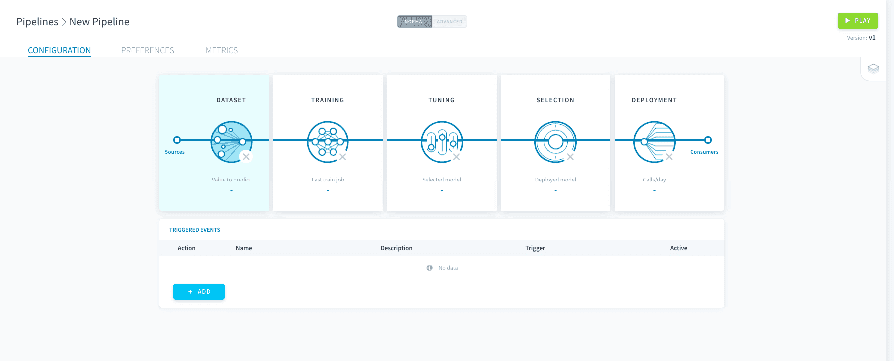

# Data preparation

Data preparation is the first step to any machine learning process. It is the step during which you will **specify your data source and the rules according to which it is turned into ML datasets**.  
ML datasets are modeled and stored as [tables that are automatically created in the Data Manager](/en/product/data-manager/tables/index) and fed with data from the source specified at the entry of your pipeline. Specifying the rows and columns of these tables is the gist of the data preparation step.

!> In order to better orchestrate data versioning, data can only be added to an ML dataset. You have the option to manually reset your ML datasets in your [pipeline preferences](en/product/ml/pipelines/execute/preferences.md?id=reset-datasets).

Data preparation is usually the first step you need to parametrize since the rest of the pipeline should be designed according to this choice. To enter data preparation, click on **Dataset** on your pipeline's main page.

---
## Dataset generation

You can connect data from multiple sources - either within or outside of ForePaaS - at the entry point of your pipeline. This data must then be split into a train and a test dataset for the model to be fitted and evaluated.

{Manage source and train-test split}(#/en/product/ml/pipelines/configure/dataset/input.md)

---
## Feature engineering

Good data preparation means selecting the correct features for your model. Learn how to add variables to your X and Y sets, and how to execute basic checks on the data content.

{Manage your features}(#/en/product/ml/pipelines/configure/dataset/features.md)

---
###  Need help? 🆘

> If you are logging-in with an OVHcloud account, you can create a ticket to raise an incident or if you need support at the [OVHcloud Help Centre](https://help.ovhcloud.com/csm/fr-home?id=csm_index). Additionally, you can ask for support by reaching out to us on the Data Platform Channel within the [Discord Server](https://discord.com/channels/850031577277792286/1163465539981672559). There is a step-by-step guide in the [support](/en/support/index.md).