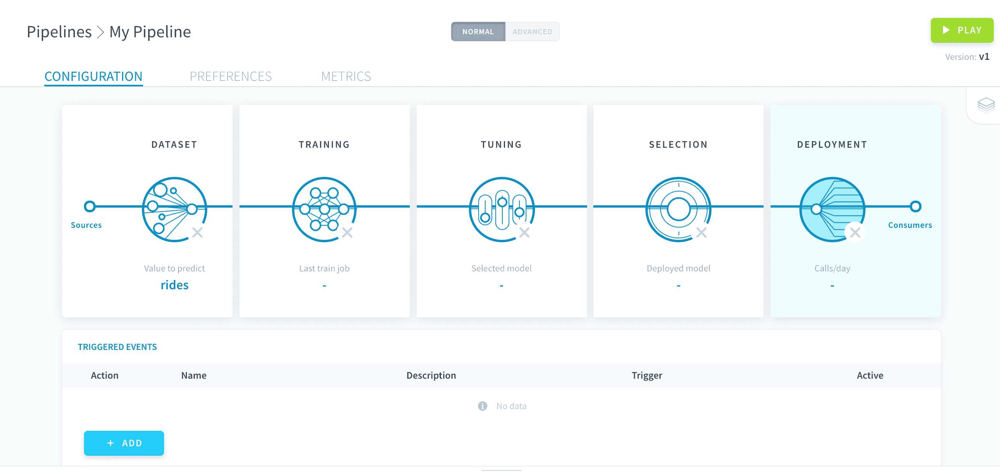
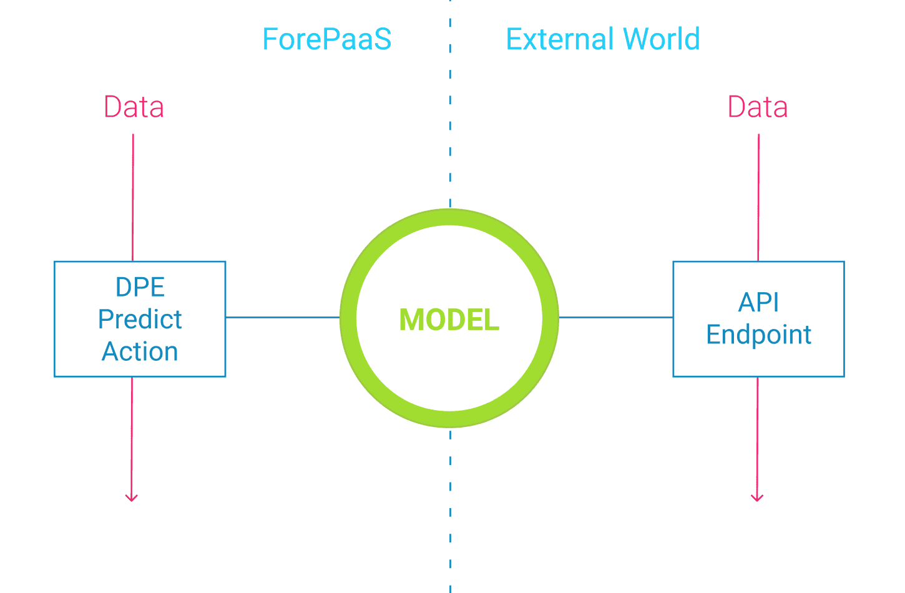
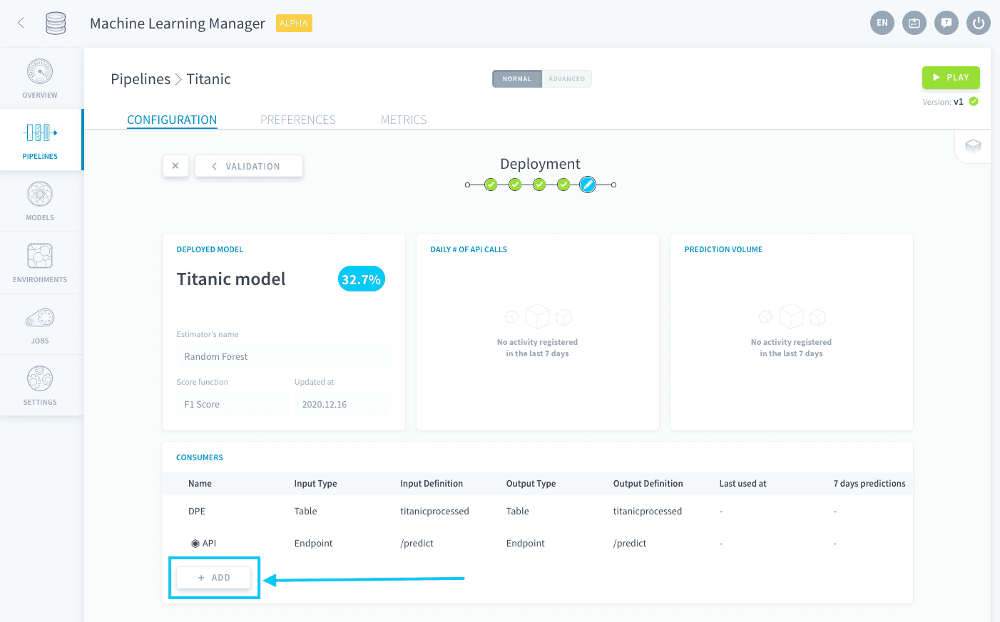
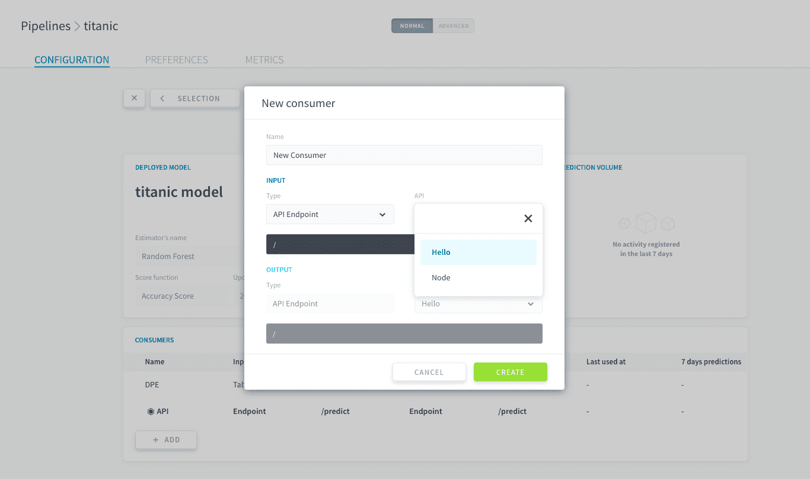
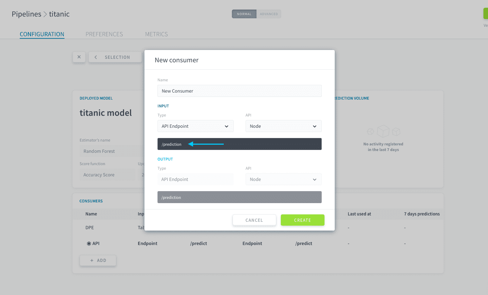
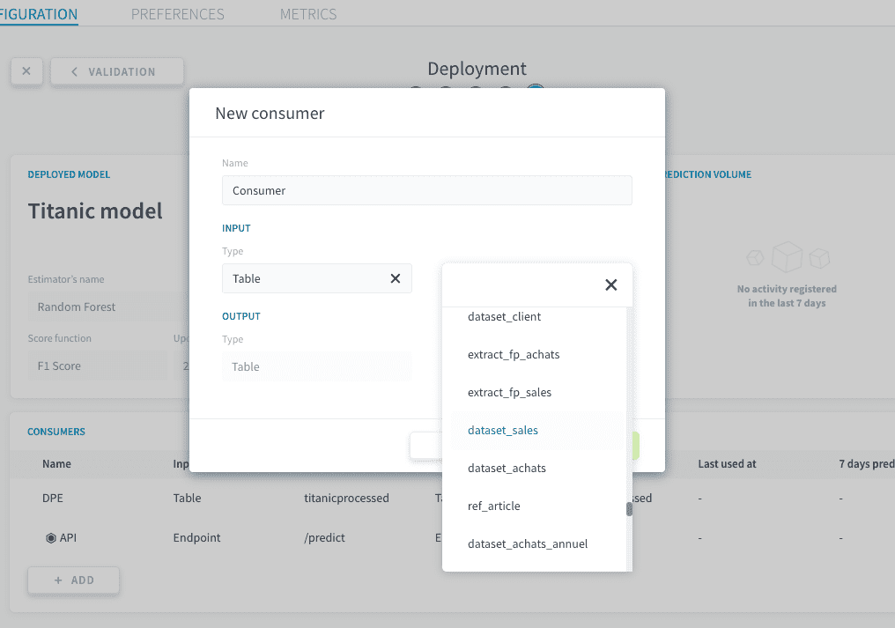
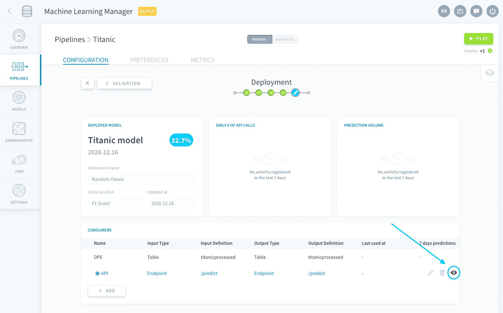
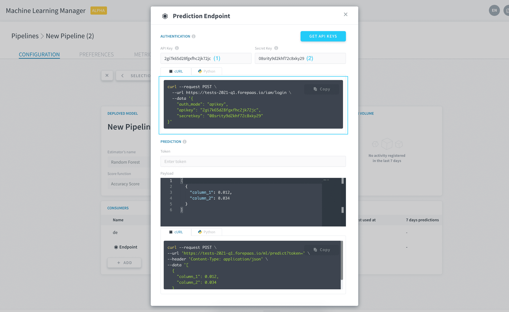
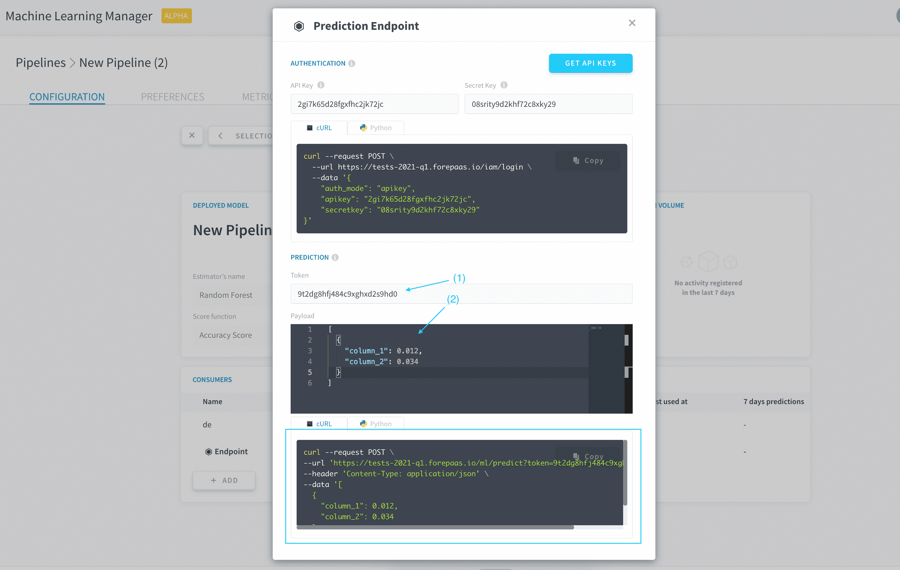
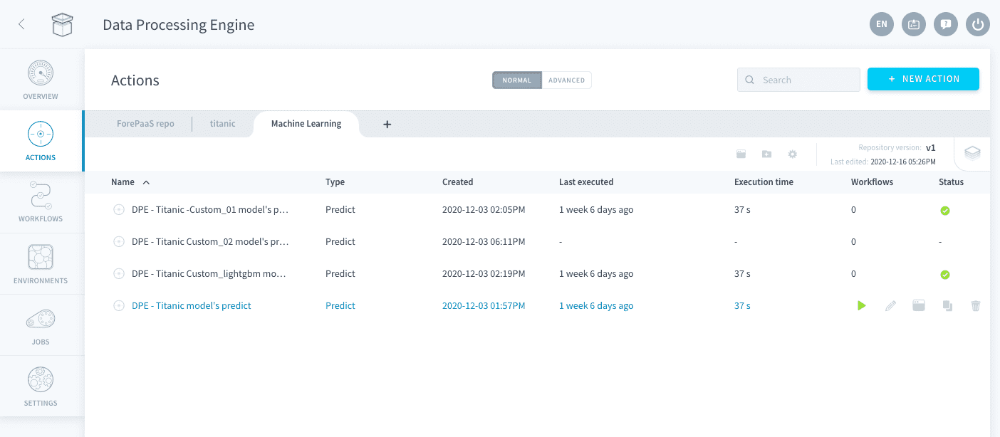

# Deployment settings

Setting up the deployment is the last step needed to configure a pipeline: this is where you decide how to operationally use the models it produces.

All the configuration is done through what is called **consumers**. They are entities plugged into the output of your pipeline in order to access its deployed model. They can then be fed with data in order to produce predictions. A single pipeline can have several consumers which makes it possible to use its deployed model in multiple ways at once. 

Thanks to consumers, you can call your deployed model both **externally** and **internally** to your Project.

* External calls use an endpoint from one of your Project's APIs, requiring an authentication
* Internal calls use the Data Processing Engine (DPE) to load and write data in your Data Manager

* [Create a consumer](en/product/ml/pipelines/configure/deployment/index.md?id=create-a-consumer)
* [Use a consumer to make predictions](en/product/ml/pipelines/configure/deployment/index.md?id=use-a-consumer-to-make-predictions)

---
## Create a consumer
To create a new consumer, click on *Add* in the consumers panel.

You then need to choose an **input** and an **output**. The input represents the way to pass on data to the consumer while the output represents the way predictions are returned. 

### **Input options**

ForePaaS lets you choose from the following options for the input of the consumer:

|            Input Type            |        Description         | 
| :------------------------------: | -------------------------- | 
|            **API Endpoint**      | The endpoint to send data points to.  | 
|            **Table**             | The Data Manager table used to provide data points. | 
|            **Bucket**            | The Data Store bucket used to provide data files. |

#### API Endpoint input

You must have a deployed [Project API](/en/product/api-manager/index) to be able to create a prediction endpoint. When creating the consumer, specify the Project API you want to use.

Then, specify the name of the endpoint to create.

!> You cannot use an endpoint that already exists, even in another pipeline

#### Table input

When creating the consumer, specify one of your Data Manager tables.

> The attributes of your Data Manager table don't need to have the same names as your model's features: the mapping can be customized in the [generated Predict Action](/en/product/ml/pipelines/configure/deployment/index.md?id=use-a-dpe-predict-action). However, all of your model's features need to exist in one form or another in the input table.

#### Bucket input

When creating the consumer, specify one of your Data Store buckets. The consequently [generated Predict Action](/en/product/ml/pipelines/configure/deployment/index.md?id=use-a-dpe-predict-action) will try to make a prediction for **all** the files that are stored in the bucket, provided your model has been trained on unstructured data.

### **Output options**
 
ForePaaS lets you choose from the following options for the output of the consumer:

|            Input Type       |        Description         | 
| :-------------------------: | -------------------------- | 
|       **API Endpoint**      | The endpoint to receive predictions from.  | 
|       **Table**             | The Data Manager table in which predictions are written. | 

#### API Endpoint output

This option is automatically selected when you choose an *API endpoint* as the input. The endpoint is the same as the input.

#### Table output

This option is automatically selected when you choose either *Bucket* or *Table* as the input. You can choose either the same table as the input or another one.

> The attribute of your Data Manager table doesn't need to have the same name as your model's value-to-predict: the mapping can be customized in the [generated Predict Action](/en/product/ml/pipelines/configure/deployment/index.md?id=use-a-dpe-predict-action).

---
## Use a consumer to make predictions

Once a consumer has been created, it can be used to make predictions. 

* Using *API Endpoint* as either the input or the output of a consumer creates an [API endpoint which can be called](en/product/ml/pipelines/configure/deployment/index.md?id=use-an-api-endpoint)  
* Using *Table* as either the input or the output of a consumer automatically generates a Data Processing Engine [Predict Action which can be executed](en/product/ml/pipelines/configure/deployment/index.md?id=use-a-dpe-predict-action)
* Using *Bucket* as the input of a consumer automatically generates a [DPE Predict Action which can be executed](en/product/ml/pipelines/configure/deployment/index.md?id=use-a-dpe-predict-action)

### Use an API endpoint
#### For structured data

Open the API control panel by clicking the **eye 👁️ icon**.

To make a prediction from an API endpoint, you have to [generate an authentication token](en/product/iam/users/api-secret-key.md?id=generating-authentication-token) first. You can easily generate this token by entering your [API & secret keys](en/product/iam/users/api-secret-key) and running the command specified in the API control panel.

To launch a prediction job, you can run the sample command provided in the API control panel. You will need to enter two parameters in the request: the **authentication token** you just generated, as well as the **data on which to make predictions**. Each data point is represented by a dictionary containing the model's features and their values. Multiple data points can be predicted at once by including several dictionaries in the array.

> The control panel is pre-populated with a template data payload to show you how variable names and values must be entered.

#### For unstructured data

When an unstructured-data model is used for predictions, you are supposed to feed it the actual unstructured objects (images, etc.). The platform automatically 'numpyfies', standardizes and normalizes them.

To get predictions on an [unstructured data model](en/product/ml/pipelines/configure/dataset/input?id=pictures-from-buckets), make a POST request to the endpoint containing the files with the content-type set to `multipart/form-data`.

### Use a DPE Predict action

The Predict action associated with a consumer is by default generated in the Data Processing Engine, in the *Machine Learning* repository of the Actions menu. 

{Learn how to configure and run Predict actions}(#/en/product/dpe/actions/predict/index.md)

---
##  Need help? 🆘

> You didn't find what you were looking for on this page? You can ask for help by sending a request directly from the platform, going to the *Support* page. You can also send us an email at support@forepaas.com.