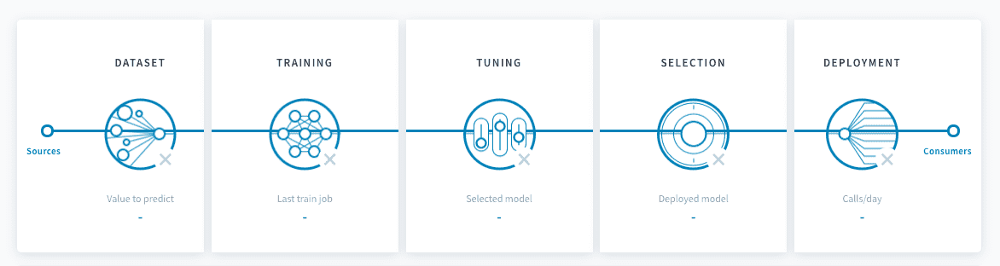

# Configure a pipeline

Each pipeline can be configured from the data input to the deployment options in order to create accurate production-grade prediction models. 

---
## The five configuration steps

There are five core steps to setting up a pipeline on ForePaaS.

   
1

   <a class="landing-link" href="#/en/product/ml/pipelines/configure/dataset/index.md">
      
      

         <h2>Dataset preparation</h2>
         
Specify everything related to the train and test datasets of your model.

      

   </a>

   
2

   <a class="landing-link" href="#/en/product/ml/pipelines/configure/training/index.md">
      
      

         <h2>Training procedure</h2>
         
Set up the estimator at the basis of your model as well as the scoring and validation options needed to fine-tune it.

      

   </a>

   
3

   <a class="landing-link" href="#/en/product/ml/pipelines/configure/tuning/index.md">
      
      

         <h2>Hyper-parameter tuning</h2>
         
Fine-tune the hyper-parameters of your estimator using our intuitive and insightful studio.

      

   </a>

   
4

   <a class="landing-link" href="#/en/product/ml/pipelines/configure/validation/index.md">
      
      

         <h2>Model selection</h2>
         
Compare models that have been trained since the creation of your pipeline and decide which to deploy.

      

   </a>

   
5

   <a class="landing-link" href="#/en/product/ml/pipelines/configure/deployment/index.md">
      
      

         <h2>Deployment settings</h2>
         
Specify the various settings for your production-grade inference service

      

   </a>

---
## Manage execution options

Once a pipeline is set up, you can manage various execution options to ensure a reliable life-cycle of your models in a production environment. Learn more about the execution of a pipeline and the life-cycle of a model below:

{Manage a pipeline's execution}(#/en/product/ml/pipelines/execute/index.md)

---
###  Need help? 🆘

> If you are logging-in with an OVHcloud account, you can create a ticket to raise an incident or if you need support at the [OVHcloud Help Centre](https://help.ovhcloud.com/csm/fr-home?id=csm_index). Additionally, you can ask for support by reaching out to us on the Data Platform Channel within the [Discord Server](https://discord.com/channels/850031577277792286/1163465539981672559). There is a step-by-step guide in the [support](/en/support/index.md).