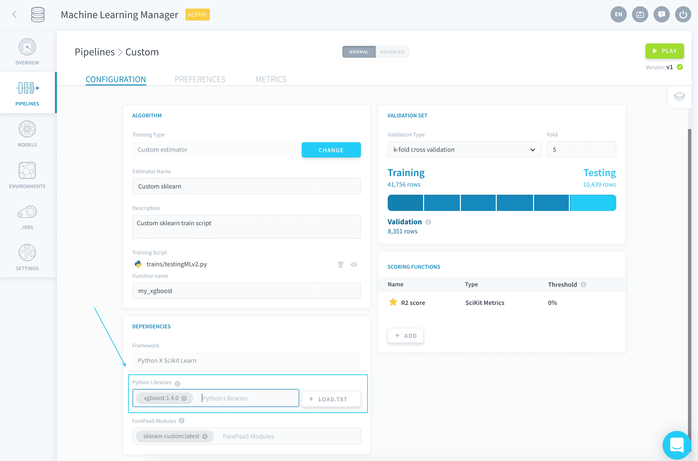
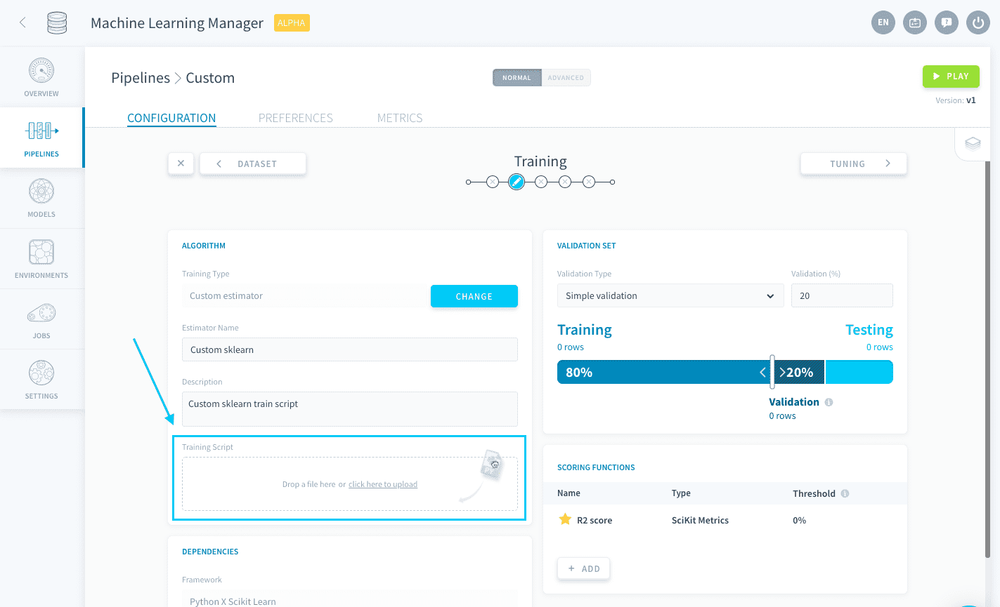
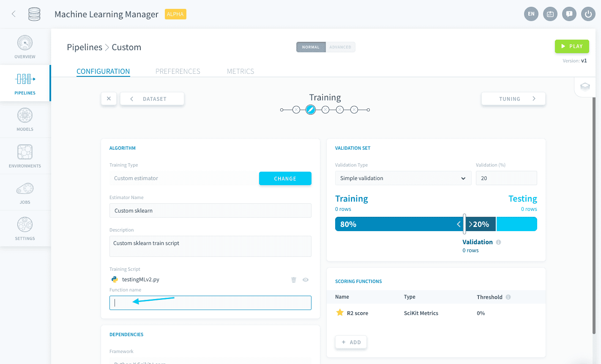

# Import a custom Keras script

The Keras framework allows you to upload a Python *.py* file containing a Keras sequential model **compatible with the Keras library**. 

When you select this framework, some packages are imported by default in the pipeline's environment:
- Keras
- Tensorflow
- the libraries [that come out of the box with ForePaaS' SDK](https://forepaas-sdk.readthedocs.io/en/latest/index.html)

Any other library used by your custom script has to be specified in the **Python libraries** field of the [Dependencies panel](/en/product/ml/pipelines/configure/training/dependencies) (along with its version, if you wish to not use the latest one).



> 💡 You have the possibility to load a *requirements.txt* file in order to [add all necessary libraries in one go](/en/product/ml/pipelines/configure/training/dependencies.md?id=import-a-requirementstxt-file).

By default, new pipelines will be using **Python 3.9.9**.

- [Upload a custom Keras model](/en/product/ml/pipelines/configure/training/custom-keras?id=upload-a-custom-model)
- [Use Keras for unstructured data training](/en/product/ml/pipelines/configure/training/custom-keras?id=use-keras-for-unstructured-data-training)

---
## Upload a custom model
To upload a custom model, either drag your *.py* file into the Training Script box or click the box to open the file explorer.



When a [Training job is launched](/en/product/ml/pipelines/execute/index.md?id=training-jobs), this *.py* file is the file that will be executed. It must contain a function that has the following two requirements: 
* It must have `event` as its first argument
* It must return a fitted and compiled sequential model based on the training dataset

This function's name must be written down in the *function name* box.



Below is a sample code of a basic custom Keras model using *my_keras_model* as the **function name**:

```py
from tensorflow.keras.models import Sequential
from tensorflow.keras.layers import Dense
from forepaas.ml import get_train_dataset


def my_keras_model(event):
    # Retrieve train dataset.
    x, y = get_train_dataset()

    model = Sequential()
    model.add(Dense(60,input_dim=60,activation="relu"))
    model.add(Dense(1,activation="sigmoid"))
    
    model.compile(loss="binary_crossentropy",
     optimizer='rmsprop',
     metrics=["accuracy"])

    model.fit(x, y, batch_size=5, epochs=1, verbose=1)
    return model
```

!> Due to the way the imports of libraries is handled by the platform, it is required to prefix imports from the ```keras``` library by ```tensorflow```.

While the previous code will not be able to use any of the configurations made in the Training and Tuning steps, you have the possibility to connect to other parts of your pipeline configuration from your model thanks to the [ForePaaS SDK](/en/technical/sdk/dpe/index). This allows you to use all the features provided by ForePaaS pipelines with your custom estimator. 

The following configurations can be integrated:

* [Use a validation configuration from the Training step](/en/product/ml/pipelines/configure/training/custom-estimator.md?id=use-a-validation-configuration)
* [Use a validation score function from the Training step](/en/product/ml/pipelines/configure/training/custom-estimator.md?id=use-a-validation-score-function)
* [Use hyper-parameters specified in the Tuning step](/en/product/ml/pipelines/configure/training/custom-estimator.md?id=use-hyper-parameters)

!>
Since only the custom *.py* script is executed during Training jobs, failing to integrate the aforementioned configurations into the Python script will result in any respective interface-originated modification to be ignored by the pipeline.

---
## Use Keras for unstructured data training

The Machine Learning Manager supports images for classification in training and predictions of Keras models. 

### Data preparation 
To enable unstructured data training, the images must first be uploaded to the Data Store **in a folder named after each class**. 

{Learn how to carry out unstructured data preparation}(#/en/product/ml/pipelines/configure/dataset/input.md?id=pictures-from-buckets)

### Training

During training, the SDK methods `get_train_dataset` and `get_test_dataset` **behave differently than with structured data**. They both return two one-column DataFrames containing paths to the training images and associated labels (as .txt files). The column names for the images and labels are `input` and `output` respectively. 

!> Labels are returned as integers based on the order they appear in the bucket starting from 0. For most cases, this will be alphabetical.

As such it is necessary to load and process the images and labels, as shown below in the sample code:

```py
def example_process_data():
    x_df, y_df = get_train_dataset()
    x, y = list(),list()
    for f, l in zip(x_df["input"], y_df["output"]):
        img = load_img(f, target_size=(28, 28))
        img = img_to_array(img) / 255
        x.append(img)
        with open(l, "r") as f:
            _label = f.read()
            y.append(int(_label))

    x = np.array(x)
    y = np.array(y)
    return x, y
  
```

!> When an unstructured-data model is [used for predictions](/en/product/ml/pipelines/configure/deployment/index?id=use-a-consumer-to-make-predictions) later on, you are supposed to feed it the actual unstructured objects (images, etc.). The platform automatically 'numpyfies' them and applies standardization/normalization on them. As such, **you must normalize the data entering the input layer of your neural network script too**. 


The rest of the Keras model can then be added with `event` as the only argument to the method:

```py
def my_model(event):
    # Retrieve train dataset from earlier defined function.
    x,y = example_process_data()

    model = Sequential()
    model.add(layers.Conv2D(32, (3, 3), activation='relu', 
     input_shape=(28, 28, 3)))
    model.add(Dense(1,activation="sigmoid"))
    
    model.compile(loss="binary_crossentropy", 
     optimizer=optimizers.RMSprop(lr=1e-5),
     metrics=["acc"])

    model.fit(x, y, batch_size=5, epochs=1, verbose=1)
    return model
  
```

> 💡 Multiple methods can be included in the custom *.py*, only the one specified in the `function name` field via the UI will be executed.

Neural network training can be **accelerated by using GPUs** in your ForePaaS pipeline. Check out the link below to learn more.

{Use GPU for your ML processing}(#/en/product/ml/pipelines/execute/resources?id=use-gpu-for-your-processing)
