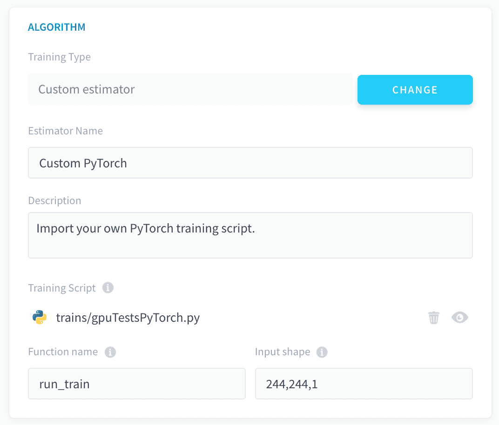

# Import a custom PyTorch script

The PyTorch framework allows you to upload a Python *.py* file containing a PyTorch model **compatible with the PyTorch library**. 

When you select this framework, some packages are imported by default in the pipeline's environment:
- Torch and Torchvision
- Pillow
- the libraries [that come out of the box with ForePaaS' SDK](https://forepaas-sdk.readthedocs.io/en/latest/index.html)

Any other library used by your custom script has to be specified in the **Python libraries** field of the [Dependencies panel](/en/product/ml/pipelines/configure/training/dependencies) (along with its version, if you wish to not use the latest one).


> 💡 You have the possibility to load a *requirements.txt* file in order to [add all necessary libraries in one go](/en/product/ml/pipelines/configure/training/dependencies.md?id=import-a-requirementstxt-file).

By default, new pipelines will be using **Python 3.9.9**.

- [Upload a custom PyTorch model](/en/product/ml/pipelines/configure/training/custom-pytorch?id=upload-a-custom-model)
- [Use PyTorch for unstructured data training](/en/product/ml/pipelines/configure/training/custom-pytorch?id=use-PyTorch-for-unstructured-data-training)

---
## Upload a custom model
To upload a custom model, either drag your *.py* file into the Training Script box or click the box to open the file explorer.


When a [Training job is launched](/en/product/ml/pipelines/execute/index.md?id=training-jobs), this *.py* file is the file that will be executed. It must contain a function that has the following two requirements: 
* It must have `event` as its first argument
* It must return a fitted and pytorch model based on the training dataset

This function's name must be written down in the *function name* box.


Additionally, and unique to the ForePaaS PyTorch framework, the PyTorch **base classes for models and dataset have to be included in the script**, and cannot be nested within other functions or classes:
- `torch.utils.data.Dataset`
- `nn.Module`

The names of the child class have limitations, the only restrictions are that the parent class must be those previously mentioned. Both should be included to avoid failures. 

Finally, the expected dimensions of the input layer must be provided alongside the function name to run, in the overview page:




Below is sample code of a custom PyTorch model used with the [Getting Started tutorial dataset](/en/getting-started/ml/dataset), an important note is the structure of the code:

```py
import numpy as np
import pandas as pd
import torch
import torch.nn as nn
import torch.nn.functional as F
from torch.utils.data import Dataset, DataLoader

from logging import getLogger

logger = getLogger(__name__)


device = 'cuda' if torch.cuda.is_available() else 'cpu'

batch_size = 64
epochs = 5

# define structured dataset class
class TabularDataset(Dataset):
  def __init__(self, data, input_cols=None, output_col=None):
    self.n = data.shape[0]
    if output_col:
      self.y = data[output_col].astype(np.float32).values.reshape(-1, 1)
    else:
      self.y =  np.zeros((self.n, 1))
    if input_cols:
        self.x = data[input_cols].astype(np.float32).values
    else:
        input_cols = [col for col in data.columns if col != output_col]
        self.x = data[input_cols].astype(np.float32).values

  def __len__(self):
    return self.n

  def __getitem__(self, idx):
    return [self.y[idx], self.x[idx]]

# define model class
class Model(nn.Module):
    def __init__(self, in_features=13, h1=32, h2=8, out_features=1):
        # how many layers?
        super().__init__()
        self.fc1 = nn.Linear(in_features, h1)
        self.fc2 = nn.Linear(h1, h2)
        self.out = nn.Linear(h2, out_features)
    
    def forward(self, x):
        x = F.relu(self.fc1(x))
        x = F.relu(self.fc2(x))
        x = self.out(x)
        return x


def pytorch_model_train(event):
    # forepaas get data
    x_df, y_df = get_train_dataset()
    
    data = pd.concat([x_df,y_df], axis=1)
    output_feature = "is_overcrowded"
    # get data
    train_data = TabularDataset(data=data,input_cols=None,output_col=output_feature)
    train_loader = DataLoader(dataset = train_data, batch_size=batch_size, shuffle=True )
    logger.info(len(train_data))

    model = Model().to(device)
    model.train()

    # some additional params
    criterion = nn.BCEWithLogitsLoss()
    optimizer = torch.optim.Adam(model.parameters(), lr=0.1)

    for epoch in range(epochs):
        epoch_loss = 0
        epoch_accuracy = 0 
        for y, x in train_loader:
            x = x.to(device)
            y  = y.to(device)
            # Forward Pass
            preds = model(x)
            loss = criterion(preds, y)
            # Backward Pass and Optimization
            optimizer.zero_grad()
            loss.backward()
            optimizer.step()
            
            acc = ((preds.argmax(dim=1) == y).float().mean())
            epoch_accuracy += acc/len(train_loader)
            epoch_loss += loss/len(train_loader)
        logger.info('Epoch : {}, train accuracy : {}, train loss : {}'.format(epoch+1, epoch_accuracy,epoch_loss))

    return model
```

> With the above code, you would have to specify *pytorch_model_train* as the **function name** and *13,1* as the **input_shape**.

While the previous code will not be able to use any of the configurations made in the Training and Tuning steps, you have the possibility to connect to other parts of your pipeline configuration from your model thanks to the [ForePaaS SDK](/en/technical/sdk/dpe/index). This allows you to use all the features provided by ForePaaS pipelines with your custom estimator. 

The following configurations can be integrated:

* [Use a validation configuration from the Training step](/en/product/ml/pipelines/configure/training/custom-estimator.md?id=use-a-validation-configuration)
* [Use a validation score function from the Training step](/en/product/ml/pipelines/configure/training/custom-estimator.md?id=use-a-validation-score-function)
* [Use hyper-parameters specified in the Tuning step](/en/product/ml/pipelines/configure/training/custom-estimator.md?id=use-hyper-parameters)

!>
Since only the custom *.py* script is executed during Training jobs, failing to integrate the aforementioned configurations into the Python script will result in any respective interface-originated modification to be ignored by the pipeline.

---
## Use PyTorch for unstructured data training

The Machine Learning Manager supports images for classification in training and predictions of PyTorch models. 

### Data preparation 
To enable unstructured data training, the images must first be uploaded to the Data Store **in a folder named after each class**. 

{Learn how to carry out unstructured data preparation}(#/en/product/ml/pipelines/configure/dataset/input.md?id=pictures-from-buckets)

### Training

During training, the SDK methods `get_train_dataset` and `get_test_dataset` **behave differently than with structured data**. They both return two one-column DataFrames containing paths to the training images and associated labels (as .txt files). The column names for the images and labels are `input` and `output` respectively. 

!> Labels are returned as integers based on the order they appear in the bucket starting from 0. For most cases, this will be alphabetical.

As such it is necessary to load and process the images and labels within the pytorch dataset class, as shown below in the sample code:

```py
train_transforms =  transforms.Compose([
        transforms.Resize(150),
        transforms.RandomResizedCrop(150),
        transforms.ToTensor(),
    ])

class dataset(torch.utils.data.Dataset):
    def __init__(self,image_list,label_list,transform=None):
        self.file_list_df = image_list
        self.label_list_df = label_list
        self.transform = transform
        
    def __len__(self):
        self.filelength = len(self.file_list_df)
        return self.filelength
    
    def __getitem__(self,idx):
        file_list = self.file_list_df["input"].values.tolist()
        img_path = file_list[idx]
        img = Image.open(img_path)
        resized_img = img.resize((vertical_px, horizontal_px))
        img = resized_img.convert(mode='L')
        image_2_npArray_2_tensor = transforms.ToTensor()(img)
        label_list = self.label_list_df["output"].values.tolist()
        with open(label_list[idx],'r') as file:
            label = int(file.read())
        return image_2_npArray_2_tensor,torch.tensor(label)

...


def pytorch_train(event):
    # forepaas get data
    x_df, y_df = get_train_dataset()
    train_feature,val_feature,train_label,val_label= train_test_split(x_df, y_df, test_size=0.2)

    # get data
    train_data = dataset(train_feature,train_label)
    val_data = dataset(val_feature,val_label, transform=test_transforms)
    ...
  
```

!> When an unstructured-data model is [used for predictions](/en/product/ml/pipelines/configure/deployment/index?id=use-a-consumer-to-make-predictions) later on, you are supposed to feed it the actual unstructured objects (images, etc.). The platform automatically 'numpyfies' them and applies standardization/normalization on them. As such, **you must normalize the data entering the input layer of your neural network script too**. 


The rest of the PyTorch model can then be added with `event` as the only argument to the method:

> 💡 Multiple methods can be included in the custom *.py*, only the one specified in the `function name` field via the UI will be executed.

Neural network training can be **accelerated by using GPUs** in your ForePaaS pipeline. Check out the link below to learn more.

{Use GPU for your ML processing}(#/en/product/ml/pipelines/execute/resources?id=use-gpu-for-your-processing)
