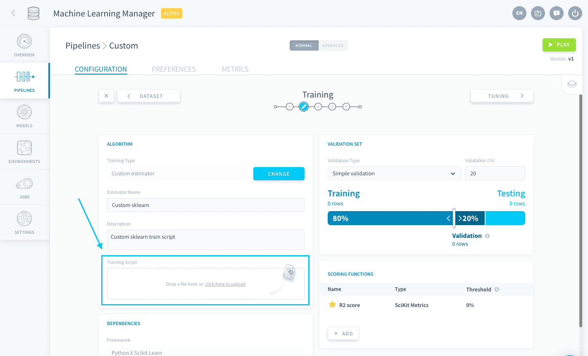
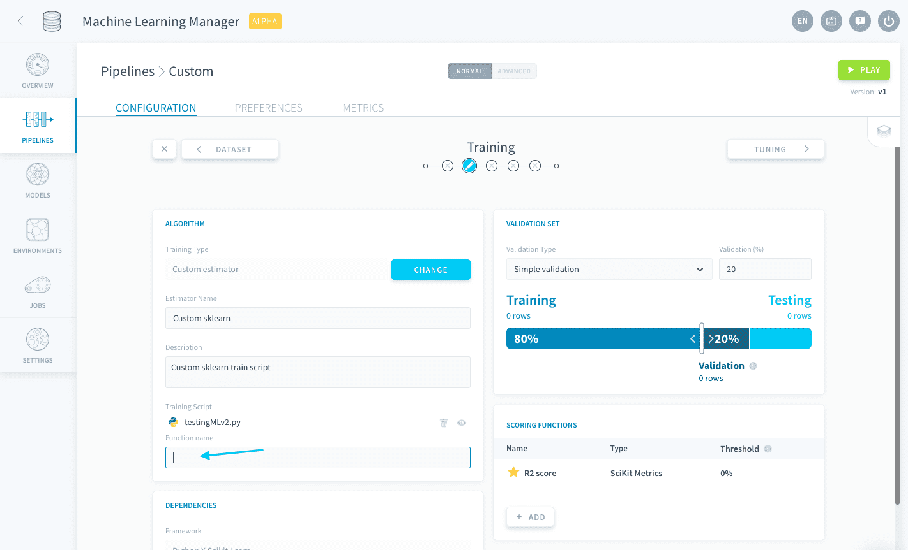

# Import a custom Scikit Learn script

The Scikit Learn framework allows you to upload a Python *.py* file containing an estimator **compatible with the Scikit Learn library**. The supported libraries typically include (but aren't restricted to): [Scikit Learn](https://scikit-learn.org/), [XGBoost](https://xgboost.readthedocs.io/en/latest/), [lightgbm](https://lightgbm.readthedocs.io/en/latest/), ...

When you select this framework, some packages are imported by default in the pipeline's environment:
- scikit-learn
- the libraries [that come out of the box with ForePaaS' SDK](https://forepaas-sdk.readthedocs.io/en/latest/index.html)

Any other library used by your custom script has to be specified in the **Python libraries** field of the [Dependencies panel](/en/product/ml/pipelines/configure/training/dependencies) (along with its version, if you wish to not use the latest one).


> 💡 You have the possibility to load a *requirements.txt* file in order to [add all necessary libraries in one go](/en/product/ml/pipelines/configure/training/dependencies.md?id=import-a-requirementstxt-file).

By default, new pipelines will be using **Python 3.9.9**.

### Upload a custom estimator
To upload a custom estimator, either drag your *.py* file into the Training Script box or click the box to open the file explorer.



When a [Training job is launched](/en/product/ml/pipelines/execute/index.md?id=training-jobs), this *.py* file is the file that will be executed. It must contain a function that has the following two requirements: 
* It must have `event` as its first argument
* It must return a fitted estimator based on the training dataset

This function's name must be written down in the *function name* box.



Below is a sample code of a basic custom Scikit Learn estimator:

```py
from sklearn.ensemble import RandomForestClassifier
from forepaas.ml import get_train_dataset


def my_random_forest(event):
    # Retrieve train dataset.
    x, y = get_train_dataset()

    # Fit estimator.
    clf = RandomForestClassifier(n_estimators=200, max_depth=9)
    clf.fit(x, y)

    # Return fitted estimator.
    return clf
```
> With the above code, you would have to specify *my_random_forest* as the **function name**.

While the previous code will not be able to use any of the configurations made in the Training and Tuning steps, you have the possibility to connect to other parts of your pipeline configuration from your estimator thanks to the [ForePaaS SDK](/en/technical/sdk/dpe/index). This allows you to use all the features provided by ForePaaS pipelines with your custom estimator. 

The following configurations can be integrated:

* [Use a validation configuration from the Training step](/en/product/ml/pipelines/configure/training/custom-estimator.md?id=use-a-validation-configuration)
* [Use a validation score function from the Training step](/en/product/ml/pipelines/configure/training/custom-estimator.md?id=use-a-validation-score-function)
* [Use hyper-parameters specified in the Tuning step](/en/product/ml/pipelines/configure/training/custom-estimator.md?id=use-hyper-parameters)

!>
Since only the custom *.py* script is executed during Training jobs, failing to integrate the aforementioned configurations into the Python script will result in any respective interface-originated modification to be ignored by the pipeline.


### Sample code
This example combines all three aforementioned connectors:

```py
from sklearn.ensemble import RandomForestClassifier
from sklearn.model_selection import GridSearchCV
from sklearn.metrics import make_scorer
from forepaas.core.settings import ML_CONFIG
from forepaas.ml import get_train_dataset, get_hyper_parameters, get_train_scoring_function


def my_random_forest(event):
    # Retrieve train dataset. No need to split it since it will be done by cross validation
    x, y = get_train_dataset()

    # Retrieve validation settings.
    cv = ML_CONFIG["train"]["execution_options"]["cross_validation"]
    if not cv:
        cv = get_shuffle_split(x, y)

    # Retrieve scoring function used for the validation score, and make it compatible with scikit's gridSearchCV
    scoring_function = get_train_scoring_function()
    scoring = make_scorer(scoring_function["func"])
 
    # Retrieve hyper parameters.
    hyper_parameters = get_hyper_parameters()

    # Start grid search with cross validation
    clf = RandomForestClassifier()
    grid_search = GridSearchCV(clf, hyper_parameters, scoring=scoring, cv=cv, return_train_score=True)
    grid_search.fit(x, y)
    return grid_search


def get_shuffle_split(x, y):
    from sklearn.model_selection import ShuffleSplit

    ratio = ML_CONFIG["train"]["ratio"]

    rs = ShuffleSplit(n_splits=1, test_size=ratio)
    return rs.split(x)
```

> With the above code, you would have to specify *my_random_forest* as the **function name**.