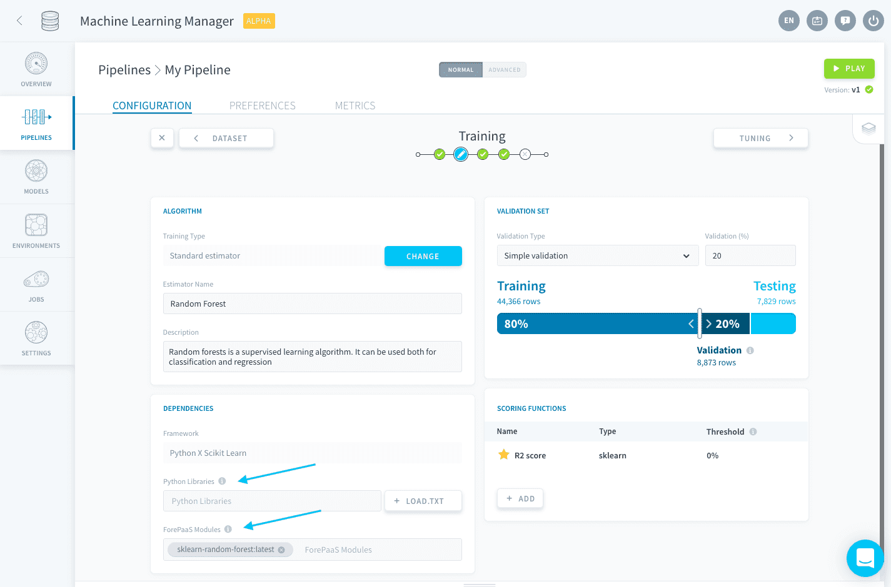
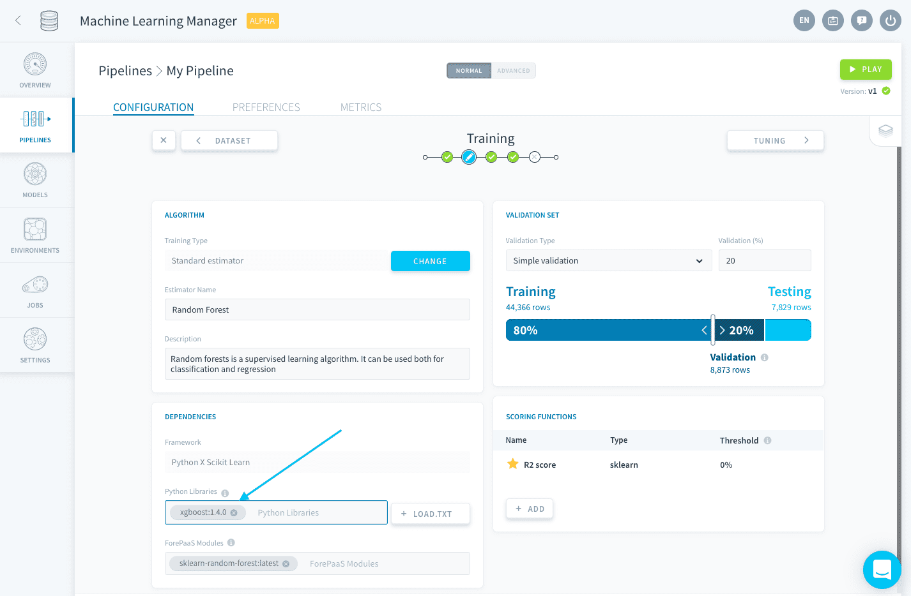
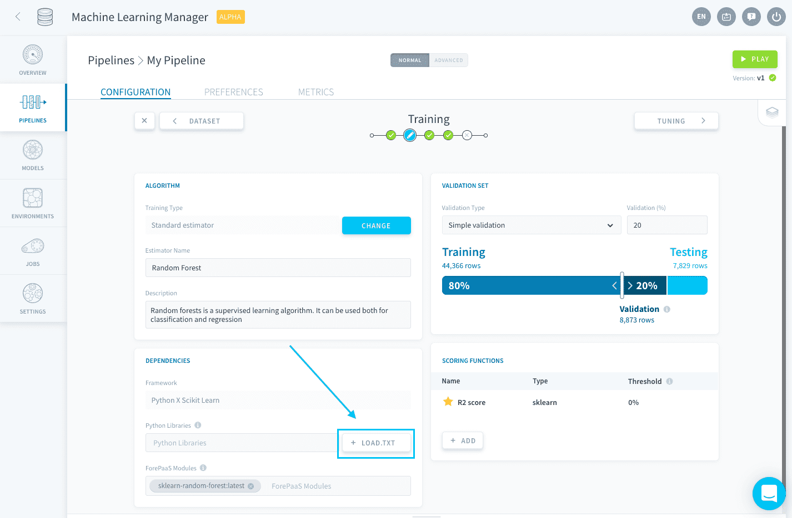

# Manage libraries and dependencies

The Dependencies panel lets you manage the language version and all the packages requirements for the execution of your pipeline. There are two kinds of dependencies:

- **ForePaaS modules**: they are prepared by ForePaaS and already contain all the libraries required to run a standard estimator.
- **Python libraries**: they are the libraries used in your estimator script that aren't already contained in a ForePaaS module. They only need to be added when you are using a [custom estimator](/en/product/ml/pipelines/configure/training/custom-estimator.md).



When using a standard estimator, **all dependencies are automatically configured to reflect your choice**. No need to scratch your head handling the library requirements, we are taking care of this for you!

On top of that, if you are using a [custom estimator](/en/product/ml/pipelines/configure/training/custom-estimator.md), you can also choose the Python version with which to run the pipeline. You can choose amongst the following:

- Python 3.11
- Python 3.9 *(default option)*

?> We are regularly updating the available versions to provide you with a best-practice development framework. Your existing work is not migrated to a new version as long as its language version is still supported. 

---
## Import libraries

You can either specify your libraries [one by one](/en/product/ml/pipelines/configure/training/dependencies.md?id=import-a-single-library), or import them [all in one go](/en/product/ml/pipelines/configure/training/dependencies.md?id=import-a-requirementstxt-file) using a *requirements.txt* file.

### Import a single library

To specify a single library, spell the package name in the **Python libraries** field.


You can also specify the version as such: *library:version*.



### Import a requirements.txt file

You can bulk-import all the libraries needed for your Project using a text file formatted like the output of a `pip freeze`[command](https://pip.pypa.io/en/stable/reference/pip_freeze/). 

Click on *Load .txt* to upload the text file.



Here is the expected requirements format:

```txt
docutils==0.11
Jinja2==2.7.2
MarkupSafe==0.19
Pygments==1.6
Sphinx==1.2.2
```

---
###  Need help? 🆘

> If you are logging-in with an OVHcloud account, you can create a ticket to raise an incident or if you need support at the [OVHcloud Help Centre](https://help.ovhcloud.com/csm/fr-home?id=csm_index). Additionally, you can ask for support by reaching out to us on the Data Platform Channel within the [Discord Server](https://discord.com/channels/850031577277792286/1163465539981672559). There is a step-by-step guide in the [support](/en/support/index.md).