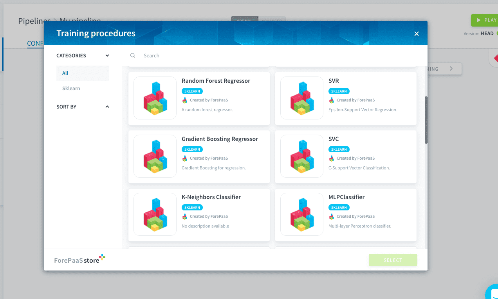
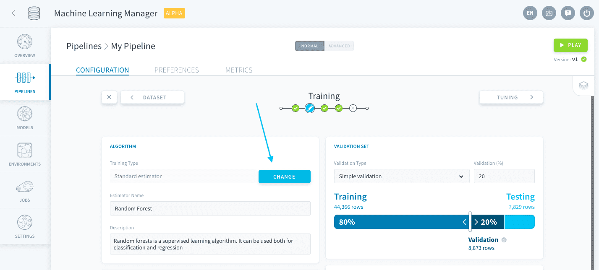

# Standard estimators
Pipelines let you choose from the most popular machine learning algorithms in the industry. ForePaaS currently supports the following frameworks:

* [Scikit Learn](https://scikit-learn.org/stable/index.html)
* Keras *(coming soon!)*

> If you cannot find the algorithm of your choice among the standard estimators, you can also upload your own script using the **custom estimator** option.  
[Learn more about custom estimators.](/en/product/ml/pipelines/configure/training/custom-estimator.md)

---
## Add a standard estimator

Selecting *Standard estimator* will open the store catalog where you can choose the algorithm you want to use for your model.

Depending on your use case, you need to choose between a [classifier](https://en.wikipedia.org/wiki/Statistical_classification) and a [regressor](https://en.wikipedia.org/wiki/Regression_analysis). You can know what category is each algorithm by looking at their tags.

---
## Change your pipeline's estimator

You can change the estimator at the core of your pipeline by clicking the **Change** button on the Training page.

!> Changing the estimator of your pipeline will completely erase the configuration for the [Training](/en/ml/pipelines/configure/training/index) and [Tuning](/en/ml/pipelines/configure/tuning/index) steps, including all previous hyper-parameter combinations generated in the studio. It will **not** delete saved models generated by the previous estimator.

---
## Manage libraries and dependencies

The Dependencies panel lets you manage all packages requirements for the execution of your pipeline. 

{Libraries and dependencies}(#/en/product/ml/pipelines/configure/training/dependencies.md)

---
## Configure scoring and validation

After choosing the base algorithm at the core of your model, you need to be able to evaluate it in an unbiased fashion. Learn how to set validation and scoring functions:

{Configure scoring and validation}(#/en/product/ml/pipelines/configure/training/validation.md)

---
##  Need help? 🆘

> You didn't find what you were looking for on this page? You can ask for help by sending a request directly from the platform, going to the *Support* page. You can also send us an email at support@forepaas.com.

{Send your questions to support 🤔}(https://support.forepaas.com/hc/en-us/requests)