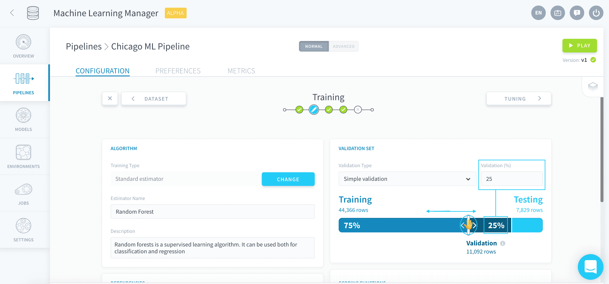
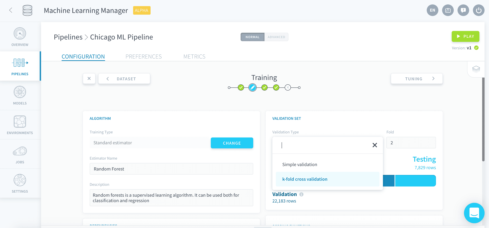

# Scoring and validation

To evaluate the performances of the models you train in your pipelines, it is advised to **score them in an unbiased fashion**. The score result is always dependent on the dataset on which the model is scored.

?> Scoring a model on a given dataset consists of using the model to make predictions for each data point in the set, and then quantifying the discrepancy between the predictions and the true values using a basis scoring function. 

You can score a model on the dataset of your choice. However it is usually not advisable to do it on data that was used to train the model because you want to evaluate the ability of your model to generalize to new data. **ForePaaS pipelines let you score models on two different datasets**: the [testing dataset](en/product/ml/pipelines/configure/dataset/input.md?id=train-test-split) and the [validation dataset](en/product/ml/pipelines/configure/training/validation.md?id=validation). 

* [Specify a validation set](en/product/ml/pipelines/configure/training/validation.md?id=validation)
  * [Simple validation](en/product/ml/pipelines/configure/training/validation.md?id=simple-validation)
  * [Cross-validation](en/product/ml/pipelines/configure/training/validation.md?id=cross-validation)
* [Choose one or several scoring functions](en/product/ml/pipelines/configure/training/validation.md?id=scoring)
  * [Standard scoring function](en/product/ml/pipelines/configure/training/validation.md?id=standard-scoring-function)
  * [Custom scoring function](en/product/ml/pipelines/configure/training/validation.md?id=custom-scoring-function)


---
## Validation

?> Validation is a method in machine learning where a subset is extracted from the initial training set and is used to score all trained models in order to [select the best one](en/product/ml/pipelines/configure/validation/index). The extracted subset is called the *validation set*. This set provides an unbiased evaluation of models which are trained on the remainder of the initial training set. It also ensures that the testing dataset remains isolated in order to perform the final model assessment, i.e. quantifying the generalization error.  
[Learn more about validation.](https://en.wikipedia.org/wiki/Training,_validation,_and_test_sets)

In a pipeline, you can either perform:
* [Simple validation](en/product/ml/pipelines/configure/training/validation.md?id=simple-validation)
* [Cross-validation](en/product/ml/pipelines/configure/training/validation.md?id=cross-validation)

### Simple validation
Simple validation consists of extracting a subset of the initial training set to be used as the validation set. To use it, select *Simple validation* as the validation type:


Select the size of the validation set as a **share of the initial training set**, either by moving the slider around or entering the desired percentage in the validation field:



> Choosing *0* as the validation size will disable validation in your pipeline.

When a training job [is launched](en/product/ml/pipelines/execute/index?id=training-jobs), the pipeline will **automatically score the produced model on the validation set**. The resulting score is called the *validation score* in the rest of the pipeline. There is only one scoring function used to compute the validation score per training job: it is the scoring function entered in the Visual Options panel of the [Tuning step](en/product/ml/pipelines/configure/tuning).


### Cross-validation
[Cross-validation](https://en.wikipedia.org/wiki/Cross-validation_(statistics)) consists of splitting the initial training set in a given number of subsets, called the *number of folds*. A [simple validation](en/product/ml/pipelines/configure/training/validation.md?id=simple-validation) is then performed that many times, successively using each subset as a simple validation set. This method ensures that no data point in the initial training set is left unused.

!> Because training a model is repeated as many times as the chosen number of folds, **using cross-validation can be very resource-consuming**.

To use it, select *k-fold cross validation* as the validation type:



Enter the chosen number of folds in **Fold**:


When a training job [is launched](en/product/ml/pipelines/execute/index?id=training-jobs), the pipeline will **automatically score the produced model on each successive fold**. The resulting scores are then **averaged** to produce the *validation score* displayed in the rest of the pipeline. 

There is only one scoring function used to compute the validation score per training job: it is the scoring function entered in the Visual Options panel of the [Tuning step](en/product/ml/pipelines/configure/tuning).


---
## Scoring

Whenever you choose an estimator at the beginning of the Training step, a default scoring function is automatically added to the list. This default score depends on whether the estimator is a [classifier](https://en.wikipedia.org/wiki/Statistical_classification) or a [regressor](https://en.wikipedia.org/wiki/Regression_analysis).


When a testing job [is launched](en/product/ml/pipelines/execute/index?id=testing-jobs), **all scores in the list are computed on the *testing set* simultaneously**.

Each scoring function is associated with a **threshold**: it is the minimum score that models have to reach on both the validation and the testing set in order to be saved.
* During a training job: if the chosen score doesn't reach its threshold on the validation set, the model will not be saved. 
* During a testing job: if **any** score doesn't reach its respective threshold, the model will not be saved.

A scoring function can be set as primary by clicking on the **star** ⭐ icon next to it, meaning it will be the score displayed by default in the rest of the pipeline.


When adding a new scoring function, you can either choose a [standard scoring function](en/product/ml/pipelines/configure/training/validation.md?id=standard-scoring-function) among a curated catalog of the most popular scores, or upload your own [custom scoring script](en/product/ml/pipelines/configure/training/validation.md?id=custom-scoring-function).

### Standard scoring function
To add a standard scoring function, click on **Add**. 


Choose the desired standard estimator in the store and press **Select**.


A default threshold is automatically configured for your new score. To change it, click on the **edit** ✏️  icon on the row of the new score.


You can then enter the new chosen threshold as a percentage.


### Custom scoring function

To add your own custom scoring script, click on **Add**. 


Choose *Custom score* in the store and press **Select**.


Enter the name and threshold, then upload your custom Python scoring script in the dedicated box. This *.py* script must contain a function that takes in two arrays - representing respectively the predictions and true values - and return a numeric
value representing the score.


Write the name of the aforementioned function in **Code function name**:


#### Custom script template

Here is a template of a custom scoring script:

```py
import logging

logger = logging.getLogger(__name__)


def customfunc(y, y_pred, **kwargs):

    logger.info("BEGIN function customfunc")

    # Function goes in here
    print(y, y_pred)
    logger.info("END function customfunc")
    return 0.8
```

---
###  Need help? 🆘

> If you are logging-in with an OVHcloud account, you can create a ticket to raise an incident or if you need support at the [OVHcloud Help Centre](https://help.ovhcloud.com/csm/fr-home?id=csm_index). Additionally, you can ask for support by reaching out to us on the Data Platform Channel within the [Discord Server](https://discord.com/channels/850031577277792286/1163465539981672559). There is a step-by-step guide in the [support](/en/support/index.md).