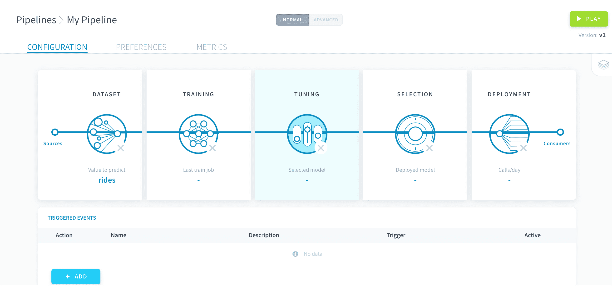
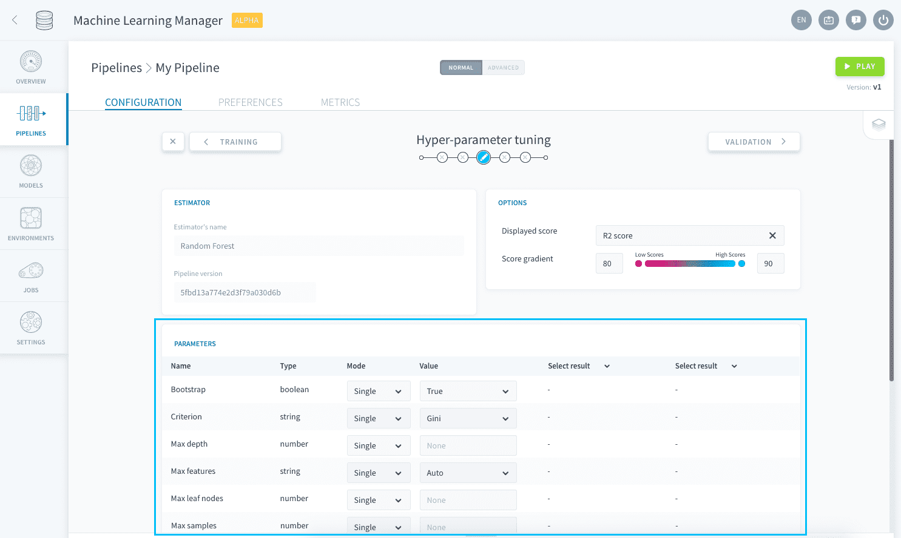
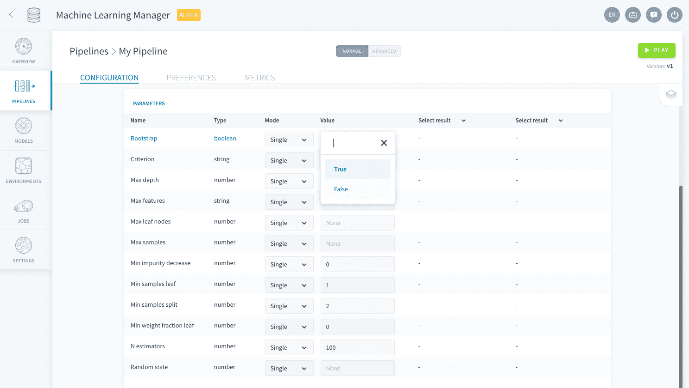
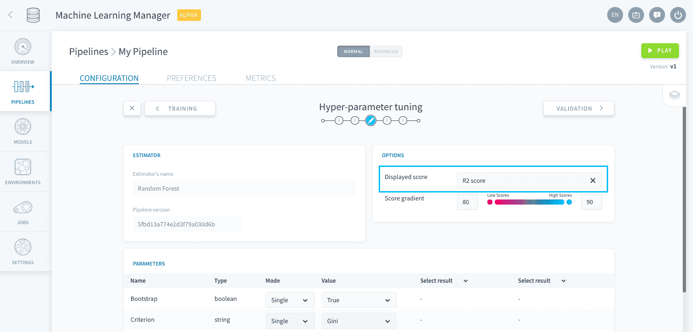
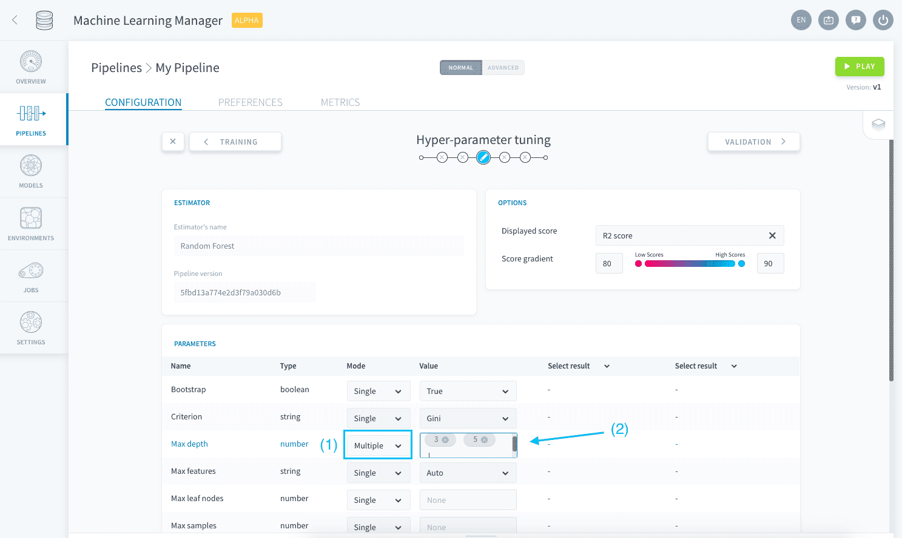

# Hyper-parameter tuning

Hyper-parameter tuning is a pipeline configuration step closely linked to the [training step](/en/product/ml/pipelines/configure/training/index) where you can fine-tune the estimator implemented in a pipeline.

?> Hyper-parameters are the core variables of any machine learning estimator that are not learned using the training data. They have to be hard-coded while configuring a model and are needed for the training jobs. For more details about hyper-parameters, check out the associated [Wikipedia page]().

---
## Set specific hyper-parameter values
The tuning studio lists all the hyper-parameters associated to the estimator chosen during the [training configuration](/en/product/ml/pipelines/configure/training/index). 

Each of them has a default value already entered. To modify the value set for a specific hyper-parameter, edit it in the *Value* column. 

When your pipeline [is executed](/en/product/ml/pipelines/execute/index), training jobs will use the resulting hyper-parameter configuration for the ML estimator. The scoring function used for the validation method can be set in the Visual Options panel.

---
## Explore different values
If you don't know how to configure it, ForePaaS also lets you explore the impact of different hyper-parameters values on the score of the resulting model in the studio.

Select the *Multiple* value for the **Mode** column and enter all the values that you want to explore for any hyper-parameter. 

This will create a grid of combinations that will all be trained and scored (using the function specified in the Visual Options panel) on the validation set every time the pipeline [is executed](/en/product/ml/pipelines/execute/index.md?id=Training_jobs). 

!> Exploring a grid of hyper-parameters can quickly be **very time and resource-consuming** since all generated model combinations need to be trained and evaluated - especially when you have [cross-validation](/en/product/ml/pipelines/configure/training/validation.md) activated.

When a pipeline [is executed](/en/product/ml/pipelines/execute/index.md?id=Training-jobs) with multiple hyper-parameter combinations, while all resulting validation scores are displayed in the studio **only the model with the highest validation score is saved for deployment**. This saved model will then be listed in the [model selection step](/en/product/ml/pipelines/configure/validation/index).

{Select a model to deploy}(/#/en/product/ml/pipelines/configure/validation/index.md)