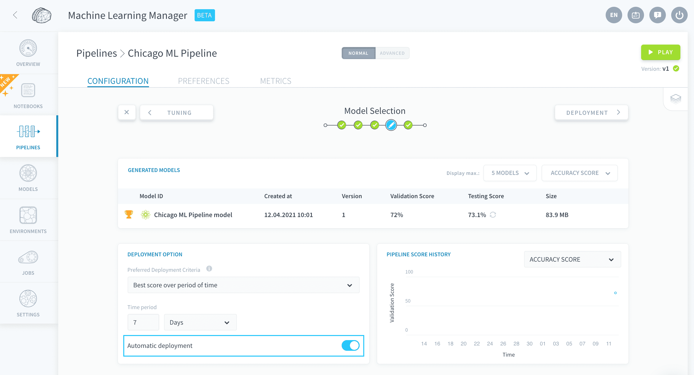

# Automatic deployment of models

This feature automates everything you can manually do at the Model Selection step: deploying your favorite model among all versions, based on scores and runtimes.

It is activated in the Deployment Option panel, by turning on **Automatic Deployment**. 

Once this is activated, the pipeline will check against the *Preferred Deployment Criteria* every time a model is generated or scored, and automatically deploy a new model if applicable.

> If Automatic Deployment isn't activated, the preferred deployment criteria is used when [manually playing a pipeline, for the Deployment job](/en/product/ml/pipelines/execute/index?id=deployment-jobs).

You need to specify the *Preferred Deployment Criteria* used to select the model to deploy. ForePaaS has a curated list of criteria from which to choose:

* [Best score over period of time](en/product/ml/pipelines/configure/validation/auto-deploy.md?id=best-score-over-period-of-time)
* [Best prediction time over period of time](en/product/ml/pipelines/configure/validation/auto-deploy.md?id=best-prediction-time-over-period-of-time)

### Best score over period of time

**Parameter**: *Time period*

The model with the best **testing score** over the past [*time period*] will be automatically deployed. 

### Best prediction time over period of time

🚧 Coming soon!

**Parameter**: *Time period*

The model with the best **prediction time** over the past [*time period*] will be automatically deployed. 

--- 
## Need more options?

ForePaaS is actively adding & updating automation options. If we are missing something critical for your Project, please reach out and drop us a line on [our Roadmap Portal](https://hq.forepaas.io/#/features) 💡!  

You can also ask for help by sending a request on the *Support* page or via email at support@forepaas.com.