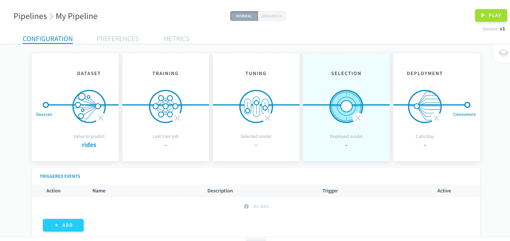
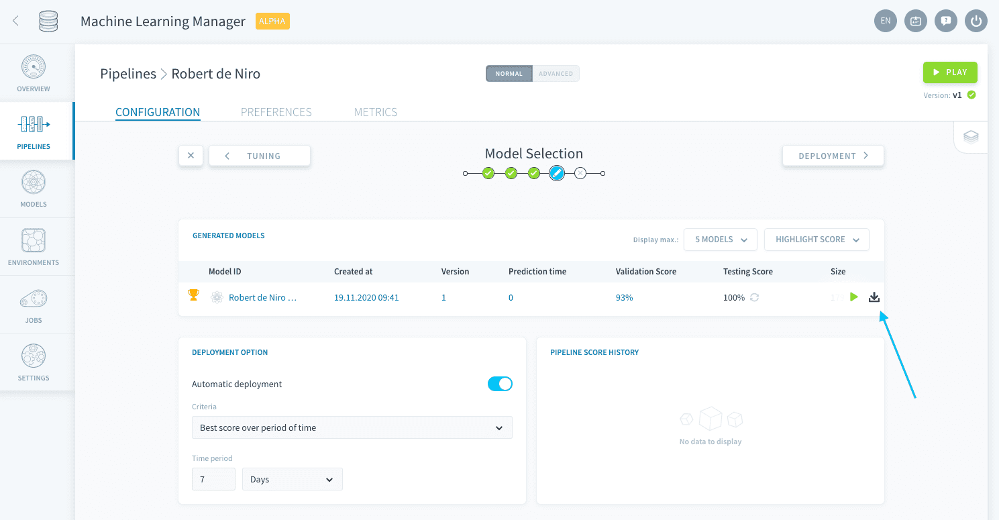
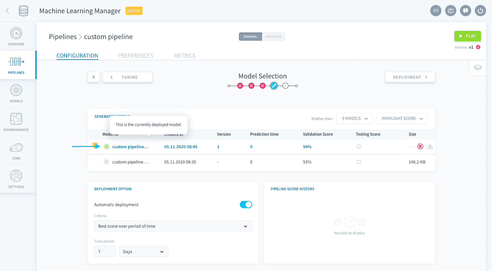
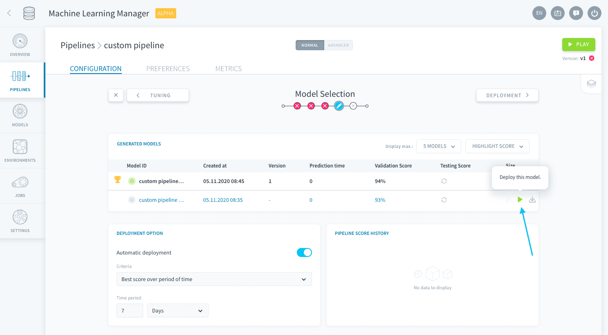
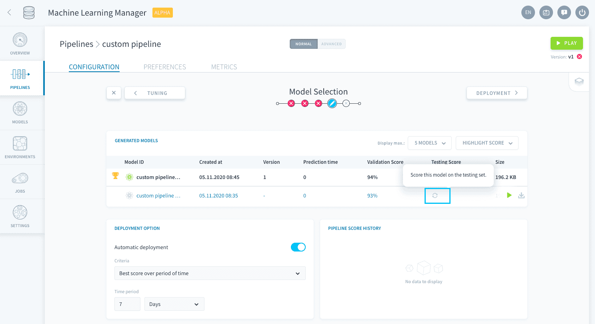
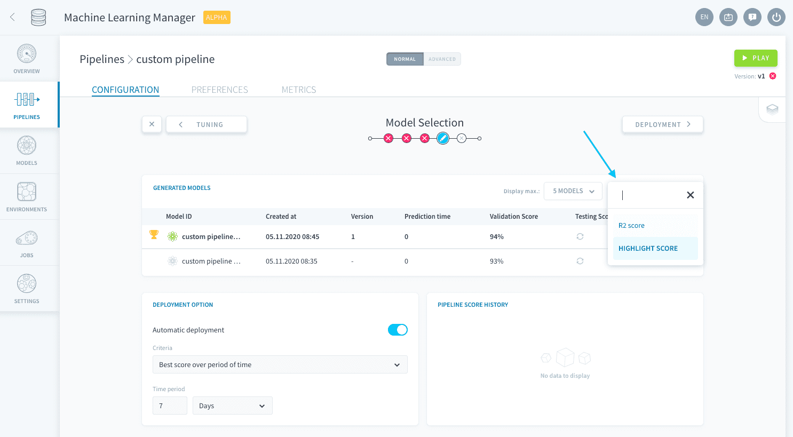
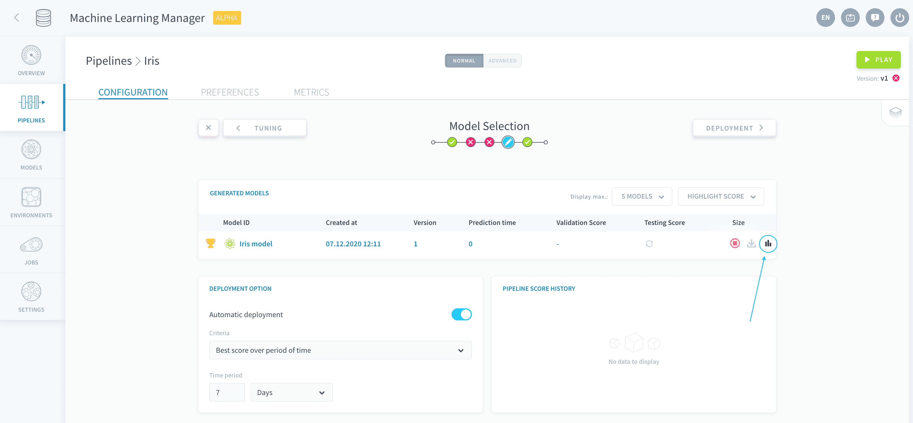

# Model selection

Model selection is the step in which you can **compare all trained models in the pipeline, especially over time**, and choose which one you want to deploy to production. The word **_model_** always refers to the combo of two elements: an *estimator and its parameters* fitted on *training data*. 

Think of this step as a control center where you can come back at any time to monitor how well your deployed model is doing over time. If needed, you can switch it for another more accurate or efficient model.

!> A pipeline can store several trained models (they are all displayed on the Model Selection page) but only one can be deployed for predictions.

Here, you can:
* [Manage model versions](en/product/ml/pipelines/configure/validation/index.md?id=manage-versions)
* [Deploy a model](en/product/ml/pipelines/configure/validation/index.md?id=deploy-model)
* [Compare scores](en/product/ml/pipelines/configure/validation/index.md?id=scores)
* [Set up automatic deployment of models](en/product/ml/pipelines/configure/validation/index.md?id=set-up-automatic-deployment-of-models)

---
## Manage trained models

The main focus of this page is the **Generated models board**. It lists all models that have been fitted since the creation of the pipeline.  

> Remember that not all combinations from the [hyper-parameter tuning step](en/product/ml/pipelines/configure/tuning/index) are saved but only the one with the best validation score.

### Manage versions

For the moment, models' versions are identical to the version of the pipeline whose configuration was used to generate it. This ensures you have traceability over how every one of your predictions was made. 

All model versions that were saved over time are listed in the table. You can choose to download a specific model version by clicking the 📥 icon. 

### Deploy model

The model at the top with the green atom ⚛️ icon is the model that is currently deployed in your pipeline. This means that it is the model used to make inferences, using the specifications (i.e. consumers) listed in the [Deployment options step](en/product/ml/pipelines/configure/deployment/index).  

You can choose to manually deploy another model of your choice by clicking on the **Play ▶️ button** at the end of its line.

### Scores

The Generated models list also display both the **validation score** (evaluated on the [Validation set](en/product/ml/pipelines/configure/training/validation)) and the **testing score** (evaluated on the [Testing set](en/product/ml/pipelines/configure/dataset/input.md?id=train-test-split)). By default, the testing score isn't calculated in order to minimize the resources used. You can choose to compute it manually by clicking on the **Refresh 🔄 button** in the *Testing Score* column.

> There is a cup 🏆 symbol next to the model with the best validation score to help you spot it more easily!

The default **scoring function** used in both columns is the *Highlight score*: it is the scoring function [you highlighted ⭐ in the Training step](en/product/ml/pipelines/configure/training/validation). To display the results with another scoring function, click on the dropdown menu at the top-right of the table and select a function among those you added in the Training step.

Finally, you can also compare the scores of several functions side by side for a specific model on its **details page**. Simply click on the **Stats 📊 icon** at the end of the model's row to open it.

---
## Set up automatic deployment of models

A key feature of the Model Selection step is the ability to configure the auto-deployment of models based on certain criteria. 

{Learn how to auto-deploy models}(#en/product/ml/pipelines/configure/validation/auto-deploy.md)

---
###  Need help? 🆘

> If you are logging-in with an OVHcloud account, you can create a ticket to raise an incident or if you need support at the [OVHcloud Help Centre](https://help.ovhcloud.com/csm/fr-home?id=csm_index). Additionally, you can ask for support by reaching out to us on the Data Platform Channel within the [Discord Server](https://discord.com/channels/850031577277792286/1163465539981672559). There is a step-by-step guide in the [support](/en/support/index.md).